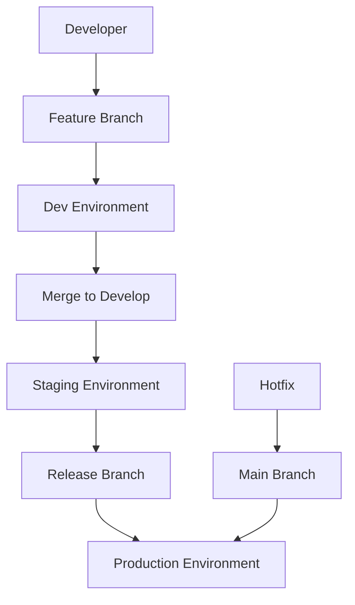

# CI/CD Pipeline Guide

This document provides comprehensive guidance for implementing Continuous Integration and Continuous Deployment (CI/CD) pipelines for the AWS Terraform infrastructure.

## Table of Contents

- [CI/CD Overview](#cicd-overview)
- [Pipeline Architecture](#pipeline-architecture)
- [GitHub Actions Setup](#github-actions-setup)
- [AWS CodePipeline Setup](#aws-codepipeline-setup)
- [GitLab CI Setup](#gitlab-ci-setup)
- [Testing Strategy](#testing-strategy)
- [Security Integration](#security-integration)
- [Multi-Environment Deployment](#multi-environment-deployment)
- [Monitoring and Notifications](#monitoring-and-notifications)
- [Best Practices](#best-practices)

## CI/CD Overview

### Pipeline Objectives

1. **Automated Testing**: Validate Terraform configurations before deployment
2. **Security Scanning**: Check for security vulnerabilities and compliance
3. **Infrastructure Validation**: Ensure infrastructure deployments are successful
4. **Multi-Environment Management**: Deploy across dev, staging, and production
5. **Rollback Capabilities**: Quick rollback in case of issues
6. **Audit Trail**: Complete deployment history and change tracking

### Pipeline Stages

```mermaid
graph LR
    A[Code Commit] --> B[Linting & Validation]
    B --> C[Security Scanning]
    C --> D[Unit Tests]
    D --> E[Plan Generation]
    E --> F[Manual Approval]
    F --> G[Deploy to Dev]
    G --> H[Integration Tests]
    H --> I[Deploy to Staging]
    I --> J[E2E Tests]
    J --> K[Deploy to Production]
    K --> L[Post-Deployment Validation]
```



## Pipeline Architecture

### Multi-Branch Strategy

**Branch Structure:**
```
main/master     # Production-ready code
├── develop     # Integration branch
├── feature/*   # Feature development
├── hotfix/*    # Critical fixes
└── release/*   # Release preparation
```

**Deployment Strategy:**
- **Feature Branches**: Deploy to ephemeral environments
- **Develop Branch**: Deploy to shared development environment
- **Release Branches**: Deploy to staging environment
- **Main Branch**: Deploy to production environment

### Environment Promotion



## GitHub Actions Setup

### Workflow Configuration

**.github/workflows/terraform.yml:**
```yaml
name: Terraform CI/CD Pipeline

on:
  push:
    branches: [ main, develop ]
    paths: 
      - 'terraform-infra-aws/**'
      - '.github/workflows/**'
  pull_request:
    branches: [ main, develop ]
    paths: 
      - 'terraform-infra-aws/**'

env:
  AWS_DEFAULT_REGION: us-east-1
  TF_VERSION: 1.5.7
  TFLINT_VERSION: v0.47.0
  TFSEC_VERSION: v1.28.1

jobs:
  # ===============================
  # Code Quality and Validation
  # ===============================
  validate:
    name: Validate Terraform
    runs-on: ubuntu-latest
    
    steps:
    - name: Checkout Code
      uses: actions/checkout@v4
      
    - name: Setup Terraform
      uses: hashicorp/setup-terraform@v2
      with:
        terraform_version: ${{ env.TF_VERSION }}
        
    - name: Terraform Format Check
      run: |
        cd terraform-infra-aws
        terraform fmt -check -recursive
        
    - name: Terraform Validate
      run: |
        cd terraform-infra-aws
        find . -name "*.tf" -exec dirname {} \; | sort -u | while read dir; do
          echo "Validating $dir"
          (cd "$dir" && terraform init -backend=false && terraform validate)
        done

  lint:
    name: Lint with TFLint
    runs-on: ubuntu-latest
    
    steps:
    - name: Checkout Code
      uses: actions/checkout@v4
      
    - name: Setup TFLint
      uses: terraform-linters/setup-tflint@v3
      with:
        tflint_version: ${{ env.TFLINT_VERSION }}
        
    - name: Initialize TFLint
      run: tflint --init
      
    - name: Run TFLint
      run: |
        cd terraform-infra-aws
        tflint --recursive --format=github_actions

  security-scan:
    name: Security Scan with tfsec
    runs-on: ubuntu-latest
    
    steps:
    - name: Checkout Code
      uses: actions/checkout@v4
      
    - name: Run tfsec
      uses: aquasecurity/tfsec-action@v1.0.3
      with:
        working_directory: terraform-infra-aws
        format: sarif
        
    - name: Upload SARIF file
      uses: github/codeql-action/upload-sarif@v2
      if: success() || failure()
      with:
        sarif_file: tfsec.sarif

  # ===============================
  # Infrastructure Planning
  # ===============================
  plan:
    name: Terraform Plan
    needs: [validate, lint, security-scan]
    runs-on: ubuntu-latest
    if: github.event_name == 'pull_request'
    
    strategy:
      matrix:
        environment: [dev, staging]
        
    steps:
    - name: Checkout Code
      uses: actions/checkout@v4
      
    - name: Configure AWS Credentials
      uses: aws-actions/configure-aws-credentials@v4
      with:
        role-to-assume: ${{ secrets.AWS_ROLE_ARN }}
        aws-region: ${{ env.AWS_DEFAULT_REGION }}
        
    - name: Setup Terraform
      uses: hashicorp/setup-terraform@v2
      with:
        terraform_version: ${{ env.TF_VERSION }}
        
    - name: Terraform Init
      run: |
        cd terraform-infra-aws
        terraform init -backend-config=environments/${{ matrix.environment }}/backend.conf
        
    - name: Terraform Plan
      run: |
        cd terraform-infra-aws
        terraform plan \
          -var-file=environments/${{ matrix.environment }}/terraform.tfvars \
          -out=${{ matrix.environment }}.tfplan \
          -detailed-exitcode
          
    - name: Upload Plan Artifact
      uses: actions/upload-artifact@v3
      with:
        name: tfplan-${{ matrix.environment }}
        path: terraform-infra-aws/${{ matrix.environment }}.tfplan
        retention-days: 30

  # ===============================
  # Development Deployment
  # ===============================
  deploy-dev:
    name: Deploy to Development
    needs: [validate, lint, security-scan]
    runs-on: ubuntu-latest
    if: github.ref == 'refs/heads/develop' && github.event_name == 'push'
    environment: development
    
    steps:
    - name: Checkout Code
      uses: actions/checkout@v4
      
    - name: Configure AWS Credentials
      uses: aws-actions/configure-aws-credentials@v4
      with:
        role-to-assume: ${{ secrets.AWS_ROLE_ARN_DEV }}
        aws-region: ${{ env.AWS_DEFAULT_REGION }}
        
    - name: Setup Terraform
      uses: hashicorp/setup-terraform@v2
      with:
        terraform_version: ${{ env.TF_VERSION }}
        
    - name: Terraform Init
      run: |
        cd terraform-infra-aws
        terraform init -backend-config=environments/dev/backend.conf
        
    - name: Terraform Apply
      run: |
        cd terraform-infra-aws
        terraform apply \
          -var-file=environments/dev/terraform.tfvars \
          -auto-approve
          
    - name: Post-Deployment Tests
      run: |
        # Run infrastructure tests
        ./scripts/test-infrastructure.sh dev

  # ===============================
  # Staging Deployment
  # ===============================
  deploy-staging:
    name: Deploy to Staging
    needs: [deploy-dev]
    runs-on: ubuntu-latest
    if: github.ref == 'refs/heads/main' && github.event_name == 'push'
    environment: staging
    
    steps:
    - name: Checkout Code
      uses: actions/checkout@v4
      
    - name: Configure AWS Credentials
      uses: aws-actions/configure-aws-credentials@v4
      with:
        role-to-assume: ${{ secrets.AWS_ROLE_ARN_STAGING }}
        aws-region: ${{ env.AWS_DEFAULT_REGION }}
        
    - name: Setup Terraform
      uses: hashicorp/setup-terraform@v2
      with:
        terraform_version: ${{ env.TF_VERSION }}
        
    - name: Terraform Init
      run: |
        cd terraform-infra-aws
        terraform init -backend-config=environments/staging/backend.conf
        
    - name: Terraform Apply
      run: |
        cd terraform-infra-aws
        terraform apply \
          -var-file=environments/staging/terraform.tfvars \
          -auto-approve

  # ===============================
  # Production Deployment
  # ===============================
  deploy-production:
    name: Deploy to Production
    needs: [deploy-staging]
    runs-on: ubuntu-latest
    if: github.ref == 'refs/heads/main' && github.event_name == 'push'
    environment: 
      name: production
      url: https://app.example.com
    
    steps:
    - name: Checkout Code
      uses: actions/checkout@v4
      
    - name: Configure AWS Credentials
      uses: aws-actions/configure-aws-credentials@v4
      with:
        role-to-assume: ${{ secrets.AWS_ROLE_ARN_PROD }}
        aws-region: ${{ env.AWS_DEFAULT_REGION }}
        
    - name: Setup Terraform
      uses: hashicorp/setup-terraform@v2
      with:
        terraform_version: ${{ env.TF_VERSION }}
        
    - name: Terraform Init
      run: |
        cd terraform-infra-aws
        terraform init -backend-config=environments/prod/backend.conf
        
    - name: Terraform Plan
      run: |
        cd terraform-infra-aws
        terraform plan \
          -var-file=environments/prod/terraform.tfvars \
          -out=prod.tfplan
          
    - name: Manual Approval Required
      uses: trstringer/manual-approval@v1
      with:
        secret: ${{ github.TOKEN }}
        approvers: platform-team
        minimum-approvals: 2
        issue-title: "Production Deployment Approval Required"
        
    - name: Terraform Apply
      run: |
        cd terraform-infra-aws
        terraform apply prod.tfplan
        
    - name: Post-Deployment Validation
      run: |
        ./scripts/validate-deployment.sh prod
        ./scripts/smoke-tests.sh prod
```

### Reusable Workflow Components

**.github/workflows/reusable-terraform.yml:**
```yaml
name: Reusable Terraform Workflow

on:
  workflow_call:
    inputs:
      environment:
        required: true
        type: string
      terraform_action:
        required: true
        type: string
        default: 'apply'
      auto_approve:
        required: false
        type: boolean
        default: false
    secrets:
      AWS_ROLE_ARN:
        required: true
      SLACK_WEBHOOK:
        required: false

jobs:
  terraform:
    name: Terraform ${{ inputs.terraform_action }} - ${{ inputs.environment }}
    runs-on: ubuntu-latest
    
    steps:
    - name: Checkout
      uses: actions/checkout@v4
      
    - name: Configure AWS Credentials
      uses: aws-actions/configure-aws-credentials@v4
      with:
        role-to-assume: ${{ secrets.AWS_ROLE_ARN }}
        aws-region: us-east-1
        
    - name: Setup Terraform
      uses: hashicorp/setup-terraform@v2
      with:
        terraform_version: 1.5.7
        
    - name: Terraform Init
      run: |
        cd terraform-infra-aws
        terraform init -backend-config=environments/${{ inputs.environment }}/backend.conf
        
    - name: Terraform Plan
      if: inputs.terraform_action == 'plan' || inputs.terraform_action == 'apply'
      run: |
        cd terraform-infra-aws
        terraform plan \
          -var-file=environments/${{ inputs.environment }}/terraform.tfvars \
          -out=${{ inputs.environment }}.tfplan
          
    - name: Terraform Apply
      if: inputs.terraform_action == 'apply'
      run: |
        cd terraform-infra-aws
        if [ "${{ inputs.auto_approve }}" == "true" ]; then
          terraform apply -auto-approve ${{ inputs.environment }}.tfplan
        else
          terraform apply ${{ inputs.environment }}.tfplan
        fi
        
    - name: Notify Slack
      if: secrets.SLACK_WEBHOOK && (success() || failure())
      run: |
        STATUS="${{ job.status }}"
        COLOR="good"
        if [ "$STATUS" != "success" ]; then
          COLOR="danger"
        fi
        
        curl -X POST -H 'Content-type: application/json' \
          --data "{
            \"attachments\": [
              {
                \"color\": \"$COLOR\",
                \"title\": \"Terraform ${{ inputs.terraform_action }} - ${{ inputs.environment }}\",
                \"text\": \"Status: $STATUS\nCommit: ${{ github.sha }}\nActor: ${{ github.actor }}\"
              }
            ]
          }" \
          ${{ secrets.SLACK_WEBHOOK }}
```

## AWS CodePipeline Setup

### Pipeline Configuration

**buildspec.yml:**
```yaml
version: 0.2

phases:
  install:
    runtime-versions:
      python: 3.9
    commands:
      - echo "Installing dependencies..."
      - curl -fsSL https://releases.hashicorp.com/terraform/1.5.7/terraform_1.5.7_linux_amd64.zip -o terraform.zip
      - unzip terraform.zip && mv terraform /usr/local/bin/
      - curl -fsSL https://github.com/terraform-linters/tflint/releases/download/v0.47.0/tflint_linux_amd64.zip -o tflint.zip
      - unzip tflint.zip && mv tflint /usr/local/bin/
      - curl -fsSL https://github.com/aquasecurity/tfsec/releases/download/v1.28.1/tfsec-linux-amd64 -o /usr/local/bin/tfsec
      - chmod +x /usr/local/bin/tfsec
      
  pre_build:
    commands:
      - echo "Running pre-build phase..."
      - cd terraform-infra-aws
      - terraform fmt -check -recursive
      - terraform init -backend-config=environments/$ENVIRONMENT/backend.conf
      - tflint --init
      - tflint --recursive
      - tfsec .
      
  build:
    commands:
      - echo "Running build phase..."
      - terraform validate
      - terraform plan -var-file=environments/$ENVIRONMENT/terraform.tfvars -out=tfplan
      
  post_build:
    commands:
      - echo "Running post-build phase..."
      - |
        if [ "$TERRAFORM_ACTION" = "apply" ]; then
          terraform apply -auto-approve tfplan
        fi

artifacts:
  files:
    - '**/*'
  name: terraform-artifacts-$CODEBUILD_BUILD_NUMBER
```

### CodePipeline CloudFormation Template

**codepipeline.yml:**
```yaml
AWSTemplateFormatVersion: '2010-09-09'
Description: 'CI/CD Pipeline for Terraform Infrastructure'

Parameters:
  ProjectName:
    Type: String
    Default: terraform-infrastructure
  GitHubRepo:
    Type: String
    Description: GitHub repository name
  GitHubOwner:
    Type: String
    Description: GitHub repository owner
  GitHubToken:
    Type: String
    NoEcho: true
    Description: GitHub personal access token

Resources:
  # S3 Bucket for Pipeline Artifacts
  ArtifactStore:
    Type: AWS::S3::Bucket
    Properties:
      BucketName: !Sub '${ProjectName}-pipeline-artifacts-${AWS::AccountId}'
      VersioningConfiguration:
        Status: Enabled
      BucketEncryption:
        ServerSideEncryptionConfiguration:
          - ServerSideEncryptionByDefault:
              SSEAlgorithm: AES256
      PublicAccessBlockConfiguration:
        BlockPublicAcls: true
        BlockPublicPolicy: true
        IgnorePublicAcls: true
        RestrictPublicBuckets: true

  # CodeBuild Role
  CodeBuildRole:
    Type: AWS::IAM::Role
    Properties:
      AssumeRolePolicyDocument:
        Version: '2012-10-17'
        Statement:
          - Effect: Allow
            Principal:
              Service: codebuild.amazonaws.com
            Action: sts:AssumeRole
      ManagedPolicyArns:
        - arn:aws:iam::aws:policy/PowerUserAccess
      Policies:
        - PolicyName: CodeBuildPolicy
          PolicyDocument:
            Version: '2012-10-17'
            Statement:
              - Effect: Allow
                Action:
                  - logs:CreateLogGroup
                  - logs:CreateLogStream
                  - logs:PutLogEvents
                Resource: !Sub 'arn:aws:logs:${AWS::Region}:${AWS::AccountId}:log-group:/aws/codebuild/*'

  # CodeBuild Projects
  TerraformValidateProject:
    Type: AWS::CodeBuild::Project
    Properties:
      Name: !Sub '${ProjectName}-validate'
      ServiceRole: !GetAtt CodeBuildRole.Arn
      Artifacts:
        Type: CODEPIPELINE
      Environment:
        Type: LINUX_CONTAINER
        ComputeType: BUILD_GENERAL1_MEDIUM
        Image: aws/codebuild/amazonlinux2-x86_64-standard:3.0
        EnvironmentVariables:
          - Name: TERRAFORM_ACTION
            Value: validate
      Source:
        Type: CODEPIPELINE
        BuildSpec: buildspec.yml

  TerraformPlanProject:
    Type: AWS::CodeBuild::Project
    Properties:
      Name: !Sub '${ProjectName}-plan'
      ServiceRole: !GetAtt CodeBuildRole.Arn
      Artifacts:
        Type: CODEPIPELINE
      Environment:
        Type: LINUX_CONTAINER
        ComputeType: BUILD_GENERAL1_MEDIUM
        Image: aws/codebuild/amazonlinux2-x86_64-standard:3.0
        EnvironmentVariables:
          - Name: TERRAFORM_ACTION
            Value: plan
      Source:
        Type: CODEPIPELINE
        BuildSpec: buildspec.yml

  TerraformApplyProject:
    Type: AWS::CodeBuild::Project
    Properties:
      Name: !Sub '${ProjectName}-apply'
      ServiceRole: !GetAtt CodeBuildRole.Arn
      Artifacts:
        Type: CODEPIPELINE
      Environment:
        Type: LINUX_CONTAINER
        ComputeType: BUILD_GENERAL1_MEDIUM
        Image: aws/codebuild/amazonlinux2-x86_64-standard:3.0
        EnvironmentVariables:
          - Name: TERRAFORM_ACTION
            Value: apply
      Source:
        Type: CODEPIPELINE
        BuildSpec: buildspec.yml

  # CodePipeline Role
  CodePipelineRole:
    Type: AWS::IAM::Role
    Properties:
      AssumeRolePolicyDocument:
        Version: '2012-10-17'
        Statement:
          - Effect: Allow
            Principal:
              Service: codepipeline.amazonaws.com
            Action: sts:AssumeRole
      Policies:
        - PolicyName: CodePipelinePolicy
          PolicyDocument:
            Version: '2012-10-17'
            Statement:
              - Effect: Allow
                Action:
                  - s3:GetBucketVersioning
                  - s3:GetObject
                  - s3:GetObjectVersion
                  - s3:PutObject
                Resource:
                  - !Sub '${ArtifactStore}/*'
                  - !GetAtt ArtifactStore.Arn
              - Effect: Allow
                Action:
                  - codebuild:BatchGetBuilds
                  - codebuild:StartBuild
                Resource:
                  - !GetAtt TerraformValidateProject.Arn
                  - !GetAtt TerraformPlanProject.Arn
                  - !GetAtt TerraformApplyProject.Arn

  # CodePipeline
  Pipeline:
    Type: AWS::CodePipeline::Pipeline
    Properties:
      Name: !Sub '${ProjectName}-pipeline'
      RoleArn: !GetAtt CodePipelineRole.Arn
      ArtifactStore:
        Type: S3
        Location: !Ref ArtifactStore
      Stages:
        - Name: Source
          Actions:
            - Name: Source
              ActionTypeId:
                Category: Source
                Owner: ThirdParty
                Provider: GitHub
                Version: '1'
              Configuration:
                Owner: !Ref GitHubOwner
                Repo: !Ref GitHubRepo
                Branch: main
                OAuthToken: !Ref GitHubToken
              OutputArtifacts:
                - Name: SourceOutput

        - Name: Validate
          Actions:
            - Name: Validate
              ActionTypeId:
                Category: Build
                Owner: AWS
                Provider: CodeBuild
                Version: '1'
              Configuration:
                ProjectName: !Ref TerraformValidateProject
              InputArtifacts:
                - Name: SourceOutput
              OutputArtifacts:
                - Name: ValidateOutput

        - Name: Plan
          Actions:
            - Name: Plan-Dev
              ActionTypeId:
                Category: Build
                Owner: AWS
                Provider: CodeBuild
                Version: '1'
              Configuration:
                ProjectName: !Ref TerraformPlanProject
                EnvironmentVariables: |
                  [{"name":"ENVIRONMENT","value":"dev","type":"PLAINTEXT"}]
              InputArtifacts:
                - Name: SourceOutput
              OutputArtifacts:
                - Name: PlanDevOutput

        - Name: Deploy-Dev
          Actions:
            - Name: Apply-Dev
              ActionTypeId:
                Category: Build
                Owner: AWS
                Provider: CodeBuild
                Version: '1'
              Configuration:
                ProjectName: !Ref TerraformApplyProject
                EnvironmentVariables: |
                  [{"name":"ENVIRONMENT","value":"dev","type":"PLAINTEXT"}]
              InputArtifacts:
                - Name: SourceOutput

        - Name: Approval
          Actions:
            - Name: ManualApproval
              ActionTypeId:
                Category: Approval
                Owner: AWS
                Provider: Manual
                Version: '1'
              Configuration:
                CustomData: 'Please review the changes and approve for production deployment'

        - Name: Deploy-Production
          Actions:
            - Name: Apply-Production
              ActionTypeId:
                Category: Build
                Owner: AWS
                Provider: CodeBuild
                Version: '1'
              Configuration:
                ProjectName: !Ref TerraformApplyProject
                EnvironmentVariables: |
                  [{"name":"ENVIRONMENT","value":"prod","type":"PLAINTEXT"}]
              InputArtifacts:
                - Name: SourceOutput
```

## GitLab CI Setup

**.gitlab-ci.yml:**
```yaml
stages:
  - validate
  - plan
  - deploy-dev
  - deploy-staging
  - deploy-prod

variables:
  TF_ROOT: terraform-infra-aws
  TF_VERSION: 1.5.7
  AWS_DEFAULT_REGION: us-east-1

# Cache Terraform plugins
cache:
  key: terraform-cache
  paths:
    - $TF_ROOT/.terraform/

before_script:
  - cd $TF_ROOT
  - apk add --update curl unzip
  - curl -fsSL https://releases.hashicorp.com/terraform/${TF_VERSION}/terraform_${TF_VERSION}_linux_amd64.zip -o terraform.zip
  - unzip terraform.zip && mv terraform /usr/local/bin/
  - terraform --version

# Validation Stage
validate:
  stage: validate
  image: alpine:latest
  script:
    - terraform fmt -check -recursive
    - terraform init -backend=false
    - terraform validate
  only:
    - merge_requests
    - main
    - develop

# Security Scanning
security:
  stage: validate
  image: aquasec/tfsec:latest
  script:
    - tfsec $TF_ROOT --format=gitlab-sast --out=tfsec-report.json
  artifacts:
    reports:
      sast: tfsec-report.json
  only:
    - merge_requests
    - main
    - develop

# Planning Stage
.plan_template: &plan_template
  stage: plan
  image: alpine:latest
  before_script:
    - cd $TF_ROOT
    - apk add --update curl unzip aws-cli
    - curl -fsSL https://releases.hashicorp.com/terraform/${TF_VERSION}/terraform_${TF_VERSION}_linux_amd64.zip -o terraform.zip
    - unzip terraform.zip && mv terraform /usr/local/bin/
  script:
    - terraform init -backend-config=environments/${ENVIRONMENT}/backend.conf
    - terraform plan -var-file=environments/${ENVIRONMENT}/terraform.tfvars -out=${ENVIRONMENT}.tfplan
  artifacts:
    name: plan-$ENVIRONMENT
    paths:
      - $TF_ROOT/*.tfplan
    expire_in: 1 week

plan:dev:
  <<: *plan_template
  variables:
    ENVIRONMENT: dev
  only:
    - merge_requests
    - develop

plan:staging:
  <<: *plan_template
  variables:
    ENVIRONMENT: staging
  only:
    - merge_requests
    - main

plan:prod:
  <<: *plan_template
  variables:
    ENVIRONMENT: prod
  only:
    - merge_requests
    - main

# Deployment Templates
.deploy_template: &deploy_template
  image: alpine:latest
  before_script:
    - cd $TF_ROOT
    - apk add --update curl unzip aws-cli
    - curl -fsSL https://releases.hashicorp.com/terraform/${TF_VERSION}/terraform_${TF_VERSION}_linux_amd64.zip -o terraform.zip
    - unzip terraform.zip && mv terraform /usr/local/bin/
  script:
    - terraform init -backend-config=environments/${ENVIRONMENT}/backend.conf
    - terraform apply -var-file=environments/${ENVIRONMENT}/terraform.tfvars -auto-approve
  after_script:
    - ./scripts/post-deploy-tests.sh $ENVIRONMENT

# Development Deployment
deploy:dev:
  <<: *deploy_template
  stage: deploy-dev
  variables:
    ENVIRONMENT: dev
  environment:
    name: development
    url: https://dev.example.com
  only:
    - develop

# Staging Deployment
deploy:staging:
  <<: *deploy_template
  stage: deploy-staging
  variables:
    ENVIRONMENT: staging
  environment:
    name: staging
    url: https://staging.example.com
  when: manual
  only:
    - main

# Production Deployment
deploy:prod:
  <<: *deploy_template
  stage: deploy-prod
  variables:
    ENVIRONMENT: prod
  environment:
    name: production
    url: https://app.example.com
  when: manual
  allow_failure: false
  only:
    - main
  before_script:
    - cd $TF_ROOT
    - apk add --update curl unzip aws-cli
    - curl -fsSL https://releases.hashicorp.com/terraform/${TF_VERSION}/terraform_${TF_VERSION}_linux_amd64.zip -o terraform.zip
    - unzip terraform.zip && mv terraform /usr/local/bin/
    - echo "Starting production deployment..."
    - echo "Commit: $CI_COMMIT_SHA"
    - echo "Branch: $CI_COMMIT_REF_NAME"
    - echo "Author: $CI_COMMIT_AUTHOR"
```

## Testing Strategy

### Infrastructure Testing

**scripts/test-infrastructure.sh:**
```bash
#!/bin/bash

set -e

ENVIRONMENT=${1:-dev}
REGION=${2:-us-east-1}

echo "Starting infrastructure tests for $ENVIRONMENT environment..."

# Test 1: VPC and Networking
echo "Testing VPC and networking..."
VPC_ID=$(aws ec2 describe-vpcs \
  --filters "Name=tag:Environment,Values=$ENVIRONMENT" \
  --query 'Vpcs[0].VpcId' \
  --output text \
  --region $REGION)

if [ "$VPC_ID" = "None" ] || [ -z "$VPC_ID" ]; then
  echo "❌ VPC not found for environment: $ENVIRONMENT"
  exit 1
else
  echo "✅ VPC found: $VPC_ID"
fi

# Test 2: Load Balancer Health
echo "Testing load balancer health..."
ALB_ARN=$(aws elbv2 describe-load-balancers \
  --query "LoadBalancers[?contains(LoadBalancerName, '$ENVIRONMENT')].LoadBalancerArn" \
  --output text \
  --region $REGION)

if [ -n "$ALB_ARN" ]; then
  ALB_STATE=$(aws elbv2 describe-load-balancers \
    --load-balancer-arns $ALB_ARN \
    --query 'LoadBalancers[0].State.Code' \
    --output text \
    --region $REGION)
  
  if [ "$ALB_STATE" = "active" ]; then
    echo "✅ Load balancer is active"
  else
    echo "❌ Load balancer is not active: $ALB_STATE"
    exit 1
  fi
else
  echo "⚠️ No load balancer found for environment: $ENVIRONMENT"
fi

# Test 3: RDS Database
echo "Testing database connectivity..."
DB_ENDPOINT=$(aws rds describe-db-instances \
  --query "DBInstances[?contains(DBInstanceIdentifier, '$ENVIRONMENT')].Endpoint.Address" \
  --output text \
  --region $REGION)

if [ -n "$DB_ENDPOINT" ]; then
  # Test database connectivity (requires mysql client)
  if command -v mysql &> /dev/null; then
    mysql -h $DB_ENDPOINT -u admin -p$DB_PASSWORD -e "SELECT 1;" &> /dev/null
    if [ $? -eq 0 ]; then
      echo "✅ Database connectivity successful"
    else
      echo "❌ Database connectivity failed"
      exit 1
    fi
  else
    echo "⚠️ MySQL client not available, skipping connectivity test"
  fi
else
  echo "⚠️ No database found for environment: $ENVIRONMENT"
fi

# Test 4: EKS Cluster (if exists)
echo "Testing EKS cluster..."
CLUSTER_NAME=$(aws eks describe-cluster \
  --name "$ENVIRONMENT-cluster" \
  --query 'cluster.name' \
  --output text \
  --region $REGION 2>/dev/null || echo "None")

if [ "$CLUSTER_NAME" != "None" ]; then
  CLUSTER_STATUS=$(aws eks describe-cluster \
    --name "$ENVIRONMENT-cluster" \
    --query 'cluster.status' \
    --output text \
    --region $REGION)
  
  if [ "$CLUSTER_STATUS" = "ACTIVE" ]; then
    echo "✅ EKS cluster is active"
  else
    echo "❌ EKS cluster is not active: $CLUSTER_STATUS"
    exit 1
  fi
else
  echo "⚠️ No EKS cluster found for environment: $ENVIRONMENT"
fi

# Test 5: Application Health Check
echo "Testing application endpoints..."
if [ -n "$ALB_ARN" ]; then
  ALB_DNS=$(aws elbv2 describe-load-balancers \
    --load-balancer-arns $ALB_ARN \
    --query 'LoadBalancers[0].DNSName' \
    --output text \
    --region $REGION)
  
  HTTP_STATUS=$(curl -s -o /dev/null -w "%{http_code}" http://$ALB_DNS/health || echo "000")
  
  if [ "$HTTP_STATUS" = "200" ]; then
    echo "✅ Application health check passed"
  else
    echo "❌ Application health check failed: HTTP $HTTP_STATUS"
    exit 1
  fi
fi

echo "✅ All infrastructure tests passed for $ENVIRONMENT environment!"
```

### Unit Tests for Terraform

**tests/unit/vpc_test.go:**
```go
package test

import (
    "testing"
    "github.com/gruntwork-io/terratest/modules/terraform"
    "github.com/stretchr/testify/assert"
)

func TestVPCModule(t *testing.T) {
    t.Parallel()

    terraformOptions := terraform.WithDefaultRetryableErrors(t, &terraform.Options{
        TerraformDir: "../../modules/vpc",
        Vars: map[string]interface{}{
            "vpc_cidr":             "10.0.0.0/16",
            "availability_zones":   []string{"us-east-1a", "us-east-1b"},
            "public_subnet_cidrs":  []string{"10.0.1.0/24", "10.0.2.0/24"},
            "private_subnet_cidrs": []string{"10.0.11.0/24", "10.0.12.0/24"},
            "project_name":         "test",
            "environment":          "test",
        },
    })

    defer terraform.Destroy(t, terraformOptions)

    terraform.InitAndApply(t, terraformOptions)

    // Test VPC CIDR
    vpcCidr := terraform.Output(t, terraformOptions, "vpc_cidr_block")
    assert.Equal(t, "10.0.0.0/16", vpcCidr)

    // Test subnet count
    publicSubnets := terraform.OutputList(t, terraformOptions, "public_subnet_ids")
    assert.Len(t, publicSubnets, 2)

    privateSubnets := terraform.OutputList(t, terraformOptions, "private_subnet_ids")
    assert.Len(t, privateSubnets, 2)
}
```

## Security Integration

### SAST Integration

**scripts/security-scan.sh:**
```bash
#!/bin/bash

set -e

echo "Starting security scanning..."

# tfsec - Terraform security scanner
echo "Running tfsec..."
tfsec terraform-infra-aws --format=junit --out=tfsec-report.xml
tfsec terraform-infra-aws --format=json --out=tfsec-report.json

# Checkov - Infrastructure as Code security scanner
echo "Running Checkov..."
pip install checkov
checkov -d terraform-infra-aws --framework terraform --output junit --output-file-path checkov-report.xml

# TruffleHog - Secrets detection
echo "Scanning for secrets..."
docker run --rm -v "$PWD:/pwd" trufflesecurity/trufflehog:latest filesystem /pwd --json > trufflehog-report.json

# KICS - Keeping Infrastructure as Code Secure
echo "Running KICS..."
docker run --rm -v "$PWD:/path" checkmarx/kics:latest scan -p /path/terraform-infra-aws -o /path --report-formats json,junit

echo "Security scanning completed!"
```

### Policy as Code

**policies/security-policy.rego:**
```rego
package terraform.security

# Deny resources without proper tags
deny[msg] {
    resource := input.planned_values.root_module.resources[_]
    not resource.values.tags.Environment
    msg := sprintf("Resource %s is missing required Environment tag", [resource.address])
}

# Ensure S3 buckets are encrypted
deny[msg] {
    resource := input.planned_values.root_module.resources[_]
    resource.type == "aws_s3_bucket"
    not resource.values.server_side_encryption_configuration
    msg := sprintf("S3 bucket %s must have encryption enabled", [resource.address])
}

# Ensure RDS instances are encrypted
deny[msg] {
    resource := input.planned_values.root_module.resources[_]
    resource.type == "aws_db_instance"
    not resource.values.storage_encrypted
    msg := sprintf("RDS instance %s must have storage encryption enabled", [resource.address])
}

# Ensure security groups don't allow unrestricted ingress
deny[msg] {
    resource := input.planned_values.root_module.resources[_]
    resource.type == "aws_security_group"
    rule := resource.values.ingress[_]
    "0.0.0.0/0" in rule.cidr_blocks
    rule.from_port == 0
    rule.to_port == 65535
    msg := sprintf("Security group %s allows unrestricted access", [resource.address])
}
```

## Multi-Environment Deployment

### Environment Configuration Matrix

| Environment | Auto-Deploy | Approval Required | Tests | Monitoring |
|-------------|-------------|------------------|-------|------------|
| Development | ✅ | ❌ | Unit + Integration | Basic |
| Staging | ✅ | ✅ | Full Test Suite | Enhanced |
| Production | ✅ | ✅ (2 approvers) | Full + Smoke Tests | Comprehensive |

### Environment-Specific Variables

**environments/dev/pipeline.yml:**
```yaml
environment: dev
auto_approve: true
terraform_version: "1.5.7"
aws_region: "us-east-1"

# Resource scaling for development
instance_sizes:
  database: "db.t3.micro"
  application: "t3.small"
  cache: "cache.t3.micro"

# Feature flags
enable_monitoring: false
enable_backup: false
enable_waf: false

# Cost optimization
spot_instances: true
scheduled_shutdown: true
```

**environments/prod/pipeline.yml:**
```yaml
environment: prod
auto_approve: false
terraform_version: "1.5.7"
aws_region: "us-east-1"

# Production resource sizing
instance_sizes:
  database: "db.r6g.xlarge"
  application: "m5.xlarge"
  cache: "cache.r6g.large"

# All features enabled
enable_monitoring: true
enable_backup: true
enable_waf: true
enable_multi_az: true

# Production settings
spot_instances: false
scheduled_shutdown: false

# Approval requirements
approval_required: true
min_approvers: 2
approver_teams: ["platform-team", "security-team"]
```

## Monitoring and Notifications

### Pipeline Monitoring

**scripts/pipeline-monitoring.sh:**
```bash
#!/bin/bash

# Slack notification function
send_slack_notification() {
    local message="$1"
    local color="$2"
    local webhook_url="$3"
    
    curl -X POST -H 'Content-type: application/json' \
        --data "{
            \"attachments\": [
                {
                    \"color\": \"$color\",
                    \"text\": \"$message\"
                }
            ]
        }" \
        "$webhook_url"
}

# Pipeline status monitoring
monitor_pipeline_status() {
    local pipeline_name="$1"
    local environment="$2"
    
    while true; do
        status=$(aws codepipeline get-pipeline-state \
            --name "$pipeline_name" \
            --query 'stageStates[?stageName==`'$environment'`].latestExecution.status' \
            --output text)
        
        case $status in
            "Succeeded")
                send_slack_notification \
                    "✅ Deployment to $environment completed successfully" \
                    "good" \
                    "$SLACK_WEBHOOK_URL"
                break
                ;;
            "Failed")
                send_slack_notification \
                    "❌ Deployment to $environment failed" \
                    "danger" \
                    "$SLACK_WEBHOOK_URL"
                break
                ;;
            "InProgress")
                echo "Deployment in progress..."
                sleep 30
                ;;
        esac
    done
}
```

## Best Practices

### Security Best Practices

1. **Secrets Management**:
   - Use AWS Systems Manager Parameter Store or Secrets Manager
   - Never store secrets in code or CI/CD variables
   - Rotate secrets regularly

2. **Access Control**:
   - Use IAM roles with minimal permissions
   - Implement cross-account role assumption
   - Enable MFA for manual approvals

3. **Code Scanning**:
   - Run security scans on every commit
   - Block deployments with critical vulnerabilities
   - Maintain an approved vulnerability database

### Performance Best Practices

1. **Pipeline Optimization**:
   - Use parallel job execution where possible
   - Cache Terraform plugins and providers
   - Implement incremental planning for large infrastructures

2. **Resource Management**:
   - Use spot instances for non-critical pipeline tasks
   - Implement automatic cleanup of temporary resources
   - Monitor pipeline costs and optimize

3. **Testing Strategy**:
   - Implement fast-failing tests early in pipeline
   - Use different test levels (unit, integration, e2e)
   - Maintain test data and fixtures

### Operational Best Practices

1. **Monitoring and Alerting**:
   - Monitor pipeline success/failure rates
   - Set up alerts for long-running deployments
   - Track deployment frequency and lead time

2. **Documentation**:
   - Keep pipeline documentation up to date
   - Document rollback procedures
   - Maintain troubleshooting guides

3. **Change Management**:
   - Implement proper approval workflows
   - Maintain change logs and deployment notes
   - Use feature flags for gradual rollouts

---

**Related Documentation**:
- [Deployment Guide](DEPLOYMENT.md) - Detailed deployment procedures
- [Operations Guide](OPERATIONS.md) - Day-to-day operational procedures
- [Security Guide](SECURITY.md) - Security practices and compliance