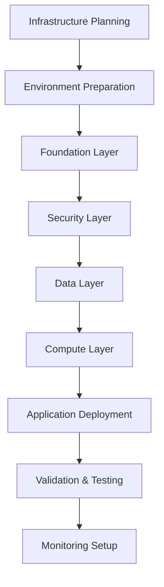

# Deployment Guide

This comprehensive guide covers all aspects of deploying and managing the AWS Terraform infrastructure across different environments and scenarios.

## Table of Contents

- [Deployment Overview](#deployment-overview)
- [Environment Setup](#environment-setup)
- [Initial Deployment](#initial-deployment)
- [Environment Management](#environment-management)
- [Application Deployment](#application-deployment)
- [Database Deployment](#database-deployment)
- [Monitoring Deployment](#monitoring-deployment)
- [Scaling and Updates](#scaling-and-updates)
- [Rollback Procedures](#rollback-procedures)
- [Troubleshooting](#troubleshooting)

## Deployment Overview

### Deployment Architecture

The infrastructure follows a layered deployment approach that ensures dependencies are properly managed and deployments are predictable.



### Deployment Layers

| Layer | Components | Dependencies | Deployment Time |
|-------|------------|--------------|-----------------|
| **Foundation** | VPC, Subnets, IGW, NAT | None | 5-10 minutes |
| **Security** | IAM, KMS, Security Groups | Foundation | 3-5 minutes |
| **Data** | RDS, DynamoDB, S3, ElastiCache | Foundation + Security | 10-20 minutes |
| **Compute** | EKS/ECS, Lambda, API Gateway | All previous layers | 15-30 minutes |

### Deployment Strategies

**Blue-Green Deployment:**
- Zero-downtime deployments
- Full environment duplication
- Instant rollback capability
- Higher resource costs

**Rolling Deployment:**
- Gradual instance replacement
- Minimal resource overhead
- Longer deployment time
- Limited rollback capability

**Canary Deployment:**
- Gradual traffic shifting
- Real user validation
- Risk mitigation
- Complex traffic management

## Environment Setup

### Prerequisites Validation

Before starting any deployment, validate all prerequisites:

```bash
#!/bin/bash
# Prerequisites validation script

echo "🔍 Validating deployment prerequisites..."

# Check AWS CLI
if ! command -v aws &> /dev/null; then
    echo "❌ AWS CLI not found. Please install AWS CLI."
    exit 1
fi

# Check Terraform
if ! command -v terraform &> /dev/null; then
    echo "❌ Terraform not found. Please install Terraform."
    exit 1
fi

# Check AWS credentials
if ! aws sts get-caller-identity &> /dev/null; then
    echo "❌ AWS credentials not configured or invalid."
    exit 1
fi

# Check Terraform version
TF_VERSION=$(terraform version -json | jq -r '.terraform_version')
REQUIRED_VERSION="1.5.7"

if [ "$TF_VERSION" != "$REQUIRED_VERSION" ]; then
    echo "⚠️  Terraform version $TF_VERSION found, required: $REQUIRED_VERSION"
fi

# Check required environment variables
REQUIRED_VARS=("AWS_REGION" "PROJECT_NAME" "ENVIRONMENT")
for var in "${REQUIRED_VARS[@]}"; do
    if [ -z "${!var}" ]; then
        echo "❌ Environment variable $var is not set."
        exit 1
    fi
done

echo "✅ All prerequisites validated successfully!"
```

### AWS Account Preparation

**1. Create S3 Backend Bucket:**
```bash
#!/bin/bash
# Create Terraform state bucket

ACCOUNT_ID=$(aws sts get-caller-identity --query Account --output text)
REGION=${AWS_REGION:-us-east-1}
BUCKET_NAME="terraform-state-${PROJECT_NAME}-${ACCOUNT_ID}"

# Create bucket
aws s3api create-bucket \
    --bucket $BUCKET_NAME \
    --region $REGION \
    --create-bucket-configuration LocationConstraint=$REGION

# Enable versioning
aws s3api put-bucket-versioning \
    --bucket $BUCKET_NAME \
    --versioning-configuration Status=Enabled

# Enable encryption
aws s3api put-bucket-encryption \
    --bucket $BUCKET_NAME \
    --server-side-encryption-configuration '{
        "Rules": [{
            "ApplyServerSideEncryptionByDefault": {
                "SSEAlgorithm": "AES256"
            }
        }]
    }'

# Block public access
aws s3api put-public-access-block \
    --bucket $BUCKET_NAME \
    --public-access-block-configuration \
    BlockPublicAcls=true,IgnorePublicAcls=true,BlockPublicPolicy=true,RestrictPublicBuckets=true

echo "✅ S3 backend bucket created: $BUCKET_NAME"
```

**2. Create DynamoDB Lock Table:**
```bash
#!/bin/bash
# Create DynamoDB table for state locking

TABLE_NAME="terraform-state-lock-${PROJECT_NAME}"

aws dynamodb create-table \
    --table-name $TABLE_NAME \
    --attribute-definitions \
        AttributeName=LockID,AttributeType=S \
    --key-schema \
        AttributeName=LockID,KeyType=HASH \
    --provisioned-throughput \
        ReadCapacityUnits=5,WriteCapacityUnits=5 \
    --tags Key=Project,Value=$PROJECT_NAME \
           Key=Purpose,Value=TerraformStateLock

echo "✅ DynamoDB lock table created: $TABLE_NAME"
```

### Environment Configuration

**Development Environment Setup:**
```hcl
# environments/dev/backend.conf
bucket         = "terraform-state-myapp-123456789012"
key            = "dev/terraform.tfstate"
region         = "us-east-1"
encrypt        = true
dynamodb_table = "terraform-state-lock-myapp"
```

```hcl
# environments/dev/terraform.tfvars
project_name = "myapp"
environment  = "dev"
aws_region   = "us-east-1"

# Cost-optimized settings for development
vpc_cidr = "10.1.0.0/16"
availability_zones = ["us-east-1a", "us-east-1b"]

database_config = {
  engine         = "mysql"
  engine_version = "8.0.35"
  instance_class = "db.t3.micro"
  allocated_storage = 20
  backup_retention = 1
  multi_az = false
  skip_final_snapshot = true
}

# Minimal compute resources
ecs_config = {
  cluster_name = "myapp-dev"
  services = {
    api = {
      desired_count = 1
      cpu          = 256
      memory       = 512
    }
  }
}

# Development-specific settings
enable_detailed_monitoring = false
enable_waf = false
enable_backup = false

tags = {
  Environment = "dev"
  AutoShutdown = "true"
  CostCenter = "engineering"
}
```

**Production Environment Setup:**
```hcl
# environments/prod/backend.conf
bucket         = "terraform-state-myapp-123456789012"
key            = "prod/terraform.tfstate"
region         = "us-east-1"
encrypt        = true
dynamodb_table = "terraform-state-lock-myapp"
```

```hcl
# environments/prod/terraform.tfvars
project_name = "myapp"
environment  = "prod"
aws_region   = "us-east-1"

# Production networking
vpc_cidr = "10.0.0.0/16"
availability_zones = ["us-east-1a", "us-east-1b", "us-east-1c"]

# Production database
database_config = {
  engine         = "mysql"
  engine_version = "8.0.35"
  instance_class = "db.r5.xlarge"
  allocated_storage = 500
  backup_retention = 30
  multi_az = true
  skip_final_snapshot = false
  performance_insights = true
}

# Production compute resources
ecs_config = {
  cluster_name = "myapp-prod"
  services = {
    api = {
      desired_count = 5
      cpu          = 1024
      memory       = 2048
      auto_scaling = {
        min_capacity = 3
        max_capacity = 20
        target_cpu   = 70
      }
    }
  }
}

# Production features
enable_detailed_monitoring = true
enable_waf = true
enable_backup = true
enable_multi_region = false

tags = {
  Environment = "prod"
  Backup = "required"
  Compliance = "SOC2"
  CostCenter = "engineering"
}
```

## Initial Deployment

### Deployment Workflow

**1. Environment Preparation:**
```bash
#!/bin/bash
# Initial deployment script

set -e

ENVIRONMENT=${1:-dev}
PROJECT_NAME=${2:-myapp}

echo "🚀 Starting deployment for environment: $ENVIRONMENT"

# Change to Terraform directory
cd terraform-infra-aws

# Initialize Terraform
echo "📦 Initializing Terraform..."
terraform init -backend-config=environments/$ENVIRONMENT/backend.conf

# Validate configuration
echo "✅ Validating Terraform configuration..."
terraform validate

# Plan deployment
echo "📋 Creating deployment plan..."
terraform plan \
    -var-file=environments/$ENVIRONMENT/terraform.tfvars \
    -out=$ENVIRONMENT.tfplan \
    -detailed-exitcode

# Check plan exit code
PLAN_EXIT_CODE=$?
if [ $PLAN_EXIT_CODE -eq 0 ]; then
    echo "ℹ️  No changes to apply"
    exit 0
elif [ $PLAN_EXIT_CODE -eq 1 ]; then
    echo "❌ Terraform plan failed"
    exit 1
elif [ $PLAN_EXIT_CODE -eq 2 ]; then
    echo "📝 Changes detected, proceeding with deployment..."
fi

# Apply deployment
echo "🔧 Applying infrastructure changes..."
terraform apply $ENVIRONMENT.tfplan

echo "✅ Deployment completed successfully for $ENVIRONMENT!"
```

### Layer-by-Layer Deployment

For complex environments or initial deployments, use a layered approach:

**1. Deploy Foundation Layer:**
```bash
#!/bin/bash
# Deploy foundation layer only

cd terraform-infra-aws/layers/networking

terraform init -backend-config=../../environments/$ENVIRONMENT/backend.conf
terraform plan -var-file=../../environments/$ENVIRONMENT/terraform.tfvars
terraform apply -auto-approve

echo "✅ Foundation layer deployed"
```

**2. Deploy Security Layer:**
```bash
#!/bin/bash
# Deploy security layer

cd terraform-infra-aws/layers/security

terraform init -backend-config=../../environments/$ENVIRONMENT/backend.conf
terraform plan -var-file=../../environments/$ENVIRONMENT/terraform.tfvars
terraform apply -auto-approve

echo "✅ Security layer deployed"
```

**3. Deploy Data Layer:**
```bash
#!/bin/bash
# Deploy data layer

cd terraform-infra-aws/layers/data

terraform init -backend-config=../../environments/$ENVIRONMENT/backend.conf
terraform plan -var-file=../../environments/$ENVIRONMENT/terraform.tfvars
terraform apply -auto-approve

echo "✅ Data layer deployed"
```

**4. Deploy Compute Layer:**
```bash
#!/bin/bash
# Deploy compute layer

cd terraform-infra-aws/layers/compute

terraform init -backend-config=../../environments/$ENVIRONMENT/backend.conf
terraform plan -var-file=../../environments/$ENVIRONMENT/terraform.tfvars
terraform apply -auto-approve

echo "✅ Compute layer deployed"
```

### Automated Deployment Script

**scripts/deploy-environment.sh:**
```bash
#!/bin/bash

set -e

# Configuration
ENVIRONMENT=$1
DRY_RUN=${2:-false}
LAYERS=("networking" "security" "data" "compute")

# Validation
if [ -z "$ENVIRONMENT" ]; then
    echo "❌ Usage: $0 <environment> [dry-run]"
    echo "   Examples:"
    echo "     $0 dev"
    echo "     $0 prod dry-run"
    exit 1
fi

# Check if environment configuration exists
if [ ! -f "environments/$ENVIRONMENT/terraform.tfvars" ]; then
    echo "❌ Environment configuration not found: environments/$ENVIRONMENT/terraform.tfvars"
    exit 1
fi

echo "🚀 Starting deployment for environment: $ENVIRONMENT"
if [ "$DRY_RUN" = "dry-run" ]; then
    echo "🔍 Running in DRY-RUN mode (plan only)"
fi

# Deploy each layer
for layer in "${LAYERS[@]}"; do
    echo ""
    echo "===========================================" 
    echo "🔧 Deploying layer: $layer"
    echo "==========================================="
    
    cd "layers/$layer"
    
    # Initialize
    terraform init -backend-config=../../environments/$ENVIRONMENT/backend.conf
    
    # Plan
    terraform plan -var-file=../../environments/$ENVIRONMENT/terraform.tfvars -out=$layer.tfplan
    
    # Apply (unless dry run)
    if [ "$DRY_RUN" != "dry-run" ]; then
        terraform apply $layer.tfplan
        echo "✅ Layer $layer deployed successfully"
    else
        echo "🔍 Layer $layer plan completed (dry-run mode)"
    fi
    
    cd ../..
done

if [ "$DRY_RUN" != "dry-run" ]; then
    echo ""
    echo "🎉 Complete deployment finished for environment: $ENVIRONMENT"
    echo ""
    echo "📋 Next steps:"
    echo "   1. Validate deployment with: ./scripts/validate-deployment.sh $ENVIRONMENT"
    echo "   2. Run integration tests: ./scripts/integration-tests.sh $ENVIRONMENT"
    echo "   3. Set up monitoring: ./scripts/setup-monitoring.sh $ENVIRONMENT"
else
    echo ""
    echo "🔍 Dry-run completed for environment: $ENVIRONMENT"
fi
```

## Environment Management

### Environment Lifecycle

**1. Environment Creation:**
```bash
#!/bin/bash
# Create new environment

NEW_ENV=$1
BASE_ENV=${2:-dev}

if [ -z "$NEW_ENV" ]; then
    echo "❌ Usage: $0 <new_environment> [base_environment]"
    exit 1
fi

echo "🆕 Creating new environment: $NEW_ENV (based on $BASE_ENV)"

# Create environment directory
mkdir -p environments/$NEW_ENV

# Copy base configuration
cp environments/$BASE_ENV/backend.conf environments/$NEW_ENV/
cp environments/$BASE_ENV/terraform.tfvars environments/$NEW_ENV/

# Update environment-specific values
sed -i "s/key = \"$BASE_ENV\//key = \"$NEW_ENV\//" environments/$NEW_ENV/backend.conf
sed -i "s/environment = \"$BASE_ENV\"/environment = \"$NEW_ENV\"/" environments/$NEW_ENV/terraform.tfvars

echo "✅ Environment $NEW_ENV created successfully"
echo "📝 Please review and update: environments/$NEW_ENV/terraform.tfvars"
```

**2. Environment Comparison:**
```bash
#!/bin/bash
# Compare environments

ENV1=$1
ENV2=$2

if [ -z "$ENV1" ] || [ -z "$ENV2" ]; then
    echo "❌ Usage: $0 <environment1> <environment2>"
    exit 1
fi

echo "🔍 Comparing environments: $ENV1 vs $ENV2"

# Compare Terraform variables
echo "📋 Configuration differences:"
diff -u environments/$ENV1/terraform.tfvars environments/$ENV2/terraform.tfvars || true

# Compare infrastructure state
echo ""
echo "🏗️  Infrastructure differences:"

cd terraform-infra-aws

# Plan for environment 1
terraform init -backend-config=environments/$ENV1/backend.conf -reconfigure
terraform plan -var-file=environments/$ENV1/terraform.tfvars -out=$ENV1.plan

# Plan for environment 2
terraform init -backend-config=environments/$ENV2/backend.conf -reconfigure
terraform plan -var-file=environments/$ENV2/terraform.tfvars -out=$ENV2.plan

# Show plans
terraform show -no-color $ENV1.plan > $ENV1.plan.txt
terraform show -no-color $ENV2.plan > $ENV2.plan.txt

diff -u $ENV1.plan.txt $ENV2.plan.txt || true

# Cleanup
rm -f $ENV1.plan $ENV2.plan $ENV1.plan.txt $ENV2.plan.txt
```

**3. Environment Promotion:**
```bash
#!/bin/bash
# Promote configuration from one environment to another

SOURCE_ENV=$1
TARGET_ENV=$2

if [ -z "$SOURCE_ENV" ] || [ -z "$TARGET_ENV" ]; then
    echo "❌ Usage: $0 <source_environment> <target_environment>"
    exit 1
fi

echo "📈 Promoting configuration from $SOURCE_ENV to $TARGET_ENV"

# Backup target environment
cp environments/$TARGET_ENV/terraform.tfvars environments/$TARGET_ENV/terraform.tfvars.backup

# Copy configuration (selective)
echo "🔄 Copying configuration..."

# Extract non-environment-specific variables
grep -v "^environment\s*=" environments/$SOURCE_ENV/terraform.tfvars > temp_config.tfvars
grep -v "^project_name\s*=" temp_config.tfvars > temp_config2.tfvars
grep -v "^vpc_cidr\s*=" temp_config2.tfvars > temp_config3.tfvars

# Preserve environment-specific settings
ENV_NAME=$(grep "^environment\s*=" environments/$TARGET_ENV/terraform.tfvars)
PROJECT_NAME=$(grep "^project_name\s*=" environments/$TARGET_ENV/terraform.tfvars)
VPC_CIDR=$(grep "^vpc_cidr\s*=" environments/$TARGET_ENV/terraform.tfvars)

# Merge configurations
{
    echo "$ENV_NAME"
    echo "$PROJECT_NAME"  
    echo "$VPC_CIDR"
    echo ""
    cat temp_config3.tfvars
} > environments/$TARGET_ENV/terraform.tfvars

# Cleanup
rm -f temp_config*.tfvars

echo "✅ Configuration promoted successfully"
echo "📝 Please review: environments/$TARGET_ENV/terraform.tfvars"
echo "💾 Backup available: environments/$TARGET_ENV/terraform.tfvars.backup"
```

## Application Deployment

### Container Application Deployment

**1. ECS Service Deployment:**
```bash
#!/bin/bash
# Deploy application to ECS

ENVIRONMENT=$1
SERVICE_NAME=$2
IMAGE_TAG=${3:-latest}

if [ -z "$ENVIRONMENT" ] || [ -z "$SERVICE_NAME" ]; then
    echo "❌ Usage: $0 <environment> <service_name> [image_tag]"
    exit 1
fi

echo "🚀 Deploying $SERVICE_NAME to $ENVIRONMENT (tag: $IMAGE_TAG)"

# Get cluster name
CLUSTER_NAME=$(aws ecs describe-clusters \
    --query "clusters[?contains(clusterName, '$ENVIRONMENT')].clusterName" \
    --output text)

if [ -z "$CLUSTER_NAME" ]; then
    echo "❌ ECS cluster not found for environment: $ENVIRONMENT"
    exit 1
fi

# Update service with new image
aws ecs update-service \
    --cluster $CLUSTER_NAME \
    --service $SERVICE_NAME \
    --task-definition $SERVICE_NAME:$IMAGE_TAG \
    --force-new-deployment

# Wait for deployment to complete
echo "⏳ Waiting for deployment to complete..."
aws ecs wait services-stable \
    --cluster $CLUSTER_NAME \
    --services $SERVICE_NAME

# Verify deployment
RUNNING_COUNT=$(aws ecs describe-services \
    --cluster $CLUSTER_NAME \
    --services $SERVICE_NAME \
    --query 'services[0].runningCount' \
    --output text)

DESIRED_COUNT=$(aws ecs describe-services \
    --cluster $CLUSTER_NAME \
    --services $SERVICE_NAME \
    --query 'services[0].desiredCount' \
    --output text)

if [ "$RUNNING_COUNT" -eq "$DESIRED_COUNT" ]; then
    echo "✅ Deployment successful: $RUNNING_COUNT/$DESIRED_COUNT tasks running"
else
    echo "❌ Deployment failed: $RUNNING_COUNT/$DESIRED_COUNT tasks running"
    exit 1
fi
```

**2. EKS Application Deployment:**
```bash
#!/bin/bash
# Deploy application to EKS

ENVIRONMENT=$1
APPLICATION=$2
IMAGE_TAG=${3:-latest}

if [ -z "$ENVIRONMENT" ] || [ -z "$APPLICATION" ]; then
    echo "❌ Usage: $0 <environment> <application> [image_tag]"
    exit 1
fi

echo "🚀 Deploying $APPLICATION to EKS cluster ($ENVIRONMENT)"

# Update kubeconfig
CLUSTER_NAME=$(aws eks describe-cluster \
    --name "$ENVIRONMENT-cluster" \
    --query 'cluster.name' \
    --output text 2>/dev/null)

if [ -z "$CLUSTER_NAME" ] || [ "$CLUSTER_NAME" = "None" ]; then
    echo "❌ EKS cluster not found for environment: $ENVIRONMENT"
    exit 1
fi

aws eks update-kubeconfig --name $CLUSTER_NAME --region $AWS_REGION

# Deploy application
kubectl set image deployment/$APPLICATION \
    $APPLICATION=myapp/$APPLICATION:$IMAGE_TAG \
    -n $ENVIRONMENT

# Wait for rollout
kubectl rollout status deployment/$APPLICATION -n $ENVIRONMENT --timeout=300s

# Verify deployment
READY_REPLICAS=$(kubectl get deployment $APPLICATION -n $ENVIRONMENT \
    -o jsonpath='{.status.readyReplicas}')
DESIRED_REPLICAS=$(kubectl get deployment $APPLICATION -n $ENVIRONMENT \
    -o jsonpath='{.spec.replicas}')

if [ "$READY_REPLICAS" -eq "$DESIRED_REPLICAS" ]; then
    echo "✅ Deployment successful: $READY_REPLICAS/$DESIRED_REPLICAS pods ready"
else
    echo "❌ Deployment failed: $READY_REPLICAS/$DESIRED_REPLICAS pods ready"
    exit 1
fi
```

### Lambda Function Deployment

**scripts/deploy-lambda.sh:**
```bash
#!/bin/bash
# Deploy Lambda functions

ENVIRONMENT=$1
FUNCTION_NAME=$2
ZIP_FILE=$3

if [ -z "$ENVIRONMENT" ] || [ -z "$FUNCTION_NAME" ] || [ -z "$ZIP_FILE" ]; then
    echo "❌ Usage: $0 <environment> <function_name> <zip_file>"
    exit 1
fi

echo "🚀 Deploying Lambda function: $FUNCTION_NAME to $ENVIRONMENT"

# Check if function exists
FUNCTION_ARN=$(aws lambda get-function \
    --function-name "$FUNCTION_NAME-$ENVIRONMENT" \
    --query 'Configuration.FunctionArn' \
    --output text 2>/dev/null || echo "None")

if [ "$FUNCTION_ARN" = "None" ]; then
    echo "❌ Lambda function not found: $FUNCTION_NAME-$ENVIRONMENT"
    echo "ℹ️  Please deploy infrastructure first"
    exit 1
fi

# Update function code
aws lambda update-function-code \
    --function-name "$FUNCTION_NAME-$ENVIRONMENT" \
    --zip-file "fileb://$ZIP_FILE"

# Wait for update to complete
echo "⏳ Waiting for function update to complete..."
aws lambda wait function-updated \
    --function-name "$FUNCTION_NAME-$ENVIRONMENT"

# Verify deployment
VERSION=$(aws lambda publish-version \
    --function-name "$FUNCTION_NAME-$ENVIRONMENT" \
    --query 'Version' \
    --output text)

echo "✅ Lambda function deployed successfully (Version: $VERSION)"

# Run test if test file exists
if [ -f "tests/lambda/$FUNCTION_NAME.test.js" ]; then
    echo "🧪 Running function tests..."
    
    # Invoke function with test payload
    aws lambda invoke \
        --function-name "$FUNCTION_NAME-$ENVIRONMENT" \
        --payload '{"test": true}' \
        response.json
    
    cat response.json
    rm -f response.json
fi
```

## Database Deployment

### RDS Deployment and Migration

**1. Database Schema Migration:**
```bash
#!/bin/bash
# Database migration script

ENVIRONMENT=$1
MIGRATION_DIR=${2:-migrations}

if [ -z "$ENVIRONMENT" ]; then
    echo "❌ Usage: $0 <environment> [migration_directory]"
    exit 1
fi

echo "🗄️  Running database migrations for environment: $ENVIRONMENT"

# Get database endpoint
DB_ENDPOINT=$(aws rds describe-db-instances \
    --query "DBInstances[?contains(DBInstanceIdentifier, '$ENVIRONMENT')].Endpoint.Address" \
    --output text)

if [ -z "$DB_ENDPOINT" ]; then
    echo "❌ Database not found for environment: $ENVIRONMENT"
    exit 1
fi

echo "📍 Database endpoint: $DB_ENDPOINT"

# Get database credentials from Secrets Manager
SECRET_ARN=$(aws secretsmanager list-secrets \
    --query "SecretList[?contains(Name, '$ENVIRONMENT') && contains(Name, 'database')].ARN" \
    --output text)

if [ -z "$SECRET_ARN" ]; then
    echo "❌ Database credentials not found in Secrets Manager"
    exit 1
fi

# Retrieve credentials
CREDENTIALS=$(aws secretsmanager get-secret-value \
    --secret-id $SECRET_ARN \
    --query SecretString \
    --output text)

DB_USERNAME=$(echo $CREDENTIALS | jq -r .username)
DB_PASSWORD=$(echo $CREDENTIALS | jq -r .password)
DB_NAME=$(echo $CREDENTIALS | jq -r .dbname)

# Run migrations
echo "🔄 Running migrations..."
for migration in $MIGRATION_DIR/*.sql; do
    if [ -f "$migration" ]; then
        echo "   Executing: $(basename $migration)"
        mysql -h $DB_ENDPOINT -u $DB_USERNAME -p$DB_PASSWORD $DB_NAME < $migration
        
        if [ $? -eq 0 ]; then
            echo "   ✅ Migration completed: $(basename $migration)"
        else
            echo "   ❌ Migration failed: $(basename $migration)"
            exit 1
        fi
    fi
done

echo "✅ All database migrations completed successfully"
```

**2. Database Backup Before Deployment:**
```bash
#!/bin/bash
# Create database backup before deployment

ENVIRONMENT=$1
BACKUP_TYPE=${2:-manual}

if [ -z "$ENVIRONMENT" ]; then
    echo "❌ Usage: $0 <environment> [backup_type]"
    exit 1
fi

echo "💾 Creating database backup for environment: $ENVIRONMENT"

# Get database identifier
DB_IDENTIFIER=$(aws rds describe-db-instances \
    --query "DBInstances[?contains(DBInstanceIdentifier, '$ENVIRONMENT')].DBInstanceIdentifier" \
    --output text)

if [ -z "$DB_IDENTIFIER" ]; then
    echo "❌ Database not found for environment: $ENVIRONMENT"
    exit 1
fi

# Create snapshot
SNAPSHOT_ID="${DB_IDENTIFIER}-${BACKUP_TYPE}-$(date +%Y%m%d-%H%M%S)"

echo "📸 Creating snapshot: $SNAPSHOT_ID"
aws rds create-db-snapshot \
    --db-instance-identifier $DB_IDENTIFIER \
    --db-snapshot-identifier $SNAPSHOT_ID

# Wait for snapshot completion
echo "⏳ Waiting for snapshot to complete..."
aws rds wait db-snapshot-completed \
    --db-snapshot-identifier $SNAPSHOT_ID

echo "✅ Database backup completed: $SNAPSHOT_ID"
```

### DynamoDB Table Deployment

**scripts/deploy-dynamodb.sh:**
```bash
#!/bin/bash
# Deploy DynamoDB tables and configuration

ENVIRONMENT=$1

if [ -z "$ENVIRONMENT" ]; then
    echo "❌ Usage: $0 <environment>"
    exit 1
fi

echo "📊 Deploying DynamoDB tables for environment: $ENVIRONMENT"

# Get table names
TABLES=$(aws dynamodb list-tables \
    --query "TableNames[?contains(@, '$ENVIRONMENT')]" \
    --output text)

if [ -z "$TABLES" ]; then
    echo "❌ No DynamoDB tables found for environment: $ENVIRONMENT"
    exit 1
fi

# Enable point-in-time recovery for all tables
for table in $TABLES; do
    echo "🔄 Configuring table: $table"
    
    # Enable PITR
    aws dynamodb update-continuous-backups \
        --table-name $table \
        --point-in-time-recovery-specification PointInTimeRecoveryEnabled=true
    
    # Check if auto-scaling is needed
    TABLE_STATUS=$(aws dynamodb describe-table \
        --table-name $table \
        --query 'Table.BillingModeSummary.BillingMode' \
        --output text)
    
    if [ "$TABLE_STATUS" = "PROVISIONED" ]; then
        echo "   ⚡ Setting up auto-scaling for $table"
        
        # Register read capacity target
        aws application-autoscaling register-scalable-target \
            --service-namespace dynamodb \
            --resource-id "table/$table" \
            --scalable-dimension "dynamodb:table:ReadCapacityUnits" \
            --min-capacity 5 \
            --max-capacity 1000
        
        # Register write capacity target
        aws application-autoscaling register-scalable-target \
            --service-namespace dynamodb \
            --resource-id "table/$table" \
            --scalable-dimension "dynamodb:table:WriteCapacityUnits" \
            --min-capacity 5 \
            --max-capacity 1000
    fi
    
    echo "   ✅ Table $table configured successfully"
done

echo "✅ DynamoDB deployment completed"
```

## Monitoring Deployment

### CloudWatch Setup

**scripts/setup-monitoring.sh:**
```bash
#!/bin/bash
# Setup monitoring and alerting

ENVIRONMENT=$1

if [ -z "$ENVIRONMENT" ]; then
    echo "❌ Usage: $0 <environment>"
    exit 1
fi

echo "📊 Setting up monitoring for environment: $ENVIRONMENT"

# Create SNS topics for alerts
ALERT_TOPIC_ARN=$(aws sns create-topic \
    --name "$ENVIRONMENT-infrastructure-alerts" \
    --query 'TopicArn' \
    --output text)

echo "📧 Created alert topic: $ALERT_TOPIC_ARN"

# Subscribe email to alerts (if EMAIL is set)
if [ -n "$ALERT_EMAIL" ]; then
    aws sns subscribe \
        --topic-arn $ALERT_TOPIC_ARN \
        --protocol email \
        --notification-endpoint $ALERT_EMAIL
    
    echo "📧 Subscribed $ALERT_EMAIL to alerts"
fi

# Create CloudWatch dashboard
DASHBOARD_BODY=$(cat <<EOF
{
    "widgets": [
        {
            "type": "metric",
            "properties": {
                "metrics": [
                    ["AWS/ApplicationELB", "RequestCount"],
                    ["AWS/ApplicationELB", "TargetResponseTime"],
                    ["AWS/RDS", "CPUUtilization"],
                    ["AWS/RDS", "DatabaseConnections"]
                ],
                "period": 300,
                "stat": "Average",
                "region": "$AWS_REGION",
                "title": "$ENVIRONMENT Infrastructure Overview"
            }
        }
    ]
}
EOF
)

aws cloudwatch put-dashboard \
    --dashboard-name "$ENVIRONMENT-infrastructure" \
    --dashboard-body "$DASHBOARD_BODY"

echo "📈 Created CloudWatch dashboard: $ENVIRONMENT-infrastructure"

# Setup basic alarms
echo "⚠️  Creating CloudWatch alarms..."

# High CPU alarm for RDS
aws cloudwatch put-metric-alarm \
    --alarm-name "$ENVIRONMENT-rds-high-cpu" \
    --alarm-description "High CPU utilization on RDS" \
    --metric-name CPUUtilization \
    --namespace AWS/RDS \
    --statistic Average \
    --period 300 \
    --threshold 80 \
    --comparison-operator GreaterThanThreshold \
    --evaluation-periods 2 \
    --alarm-actions $ALERT_TOPIC_ARN

# High response time alarm for ALB
aws cloudwatch put-metric-alarm \
    --alarm-name "$ENVIRONMENT-alb-high-response-time" \
    --alarm-description "High response time on ALB" \
    --metric-name TargetResponseTime \
    --namespace AWS/ApplicationELB \
    --statistic Average \
    --period 300 \
    --threshold 2.0 \
    --comparison-operator GreaterThanThreshold \
    --evaluation-periods 2 \
    --alarm-actions $ALERT_TOPIC_ARN

echo "✅ Monitoring setup completed for $ENVIRONMENT"
```

## Scaling and Updates

### Auto Scaling Configuration

**1. ECS Auto Scaling:**
```bash
#!/bin/bash
# Configure ECS auto scaling

ENVIRONMENT=$1
SERVICE_NAME=$2

if [ -z "$ENVIRONMENT" ] || [ -z "$SERVICE_NAME" ]; then
    echo "❌ Usage: $0 <environment> <service_name>"
    exit 1
fi

echo "⚡ Configuring auto scaling for $SERVICE_NAME in $ENVIRONMENT"

CLUSTER_NAME=$(aws ecs describe-clusters \
    --query "clusters[?contains(clusterName, '$ENVIRONMENT')].clusterName" \
    --output text)

# Register scalable target
aws application-autoscaling register-scalable-target \
    --service-namespace ecs \
    --resource-id "service/$CLUSTER_NAME/$SERVICE_NAME" \
    --scalable-dimension "ecs:service:DesiredCount" \
    --min-capacity 2 \
    --max-capacity 20

# Create scaling policy for CPU
aws application-autoscaling put-scaling-policy \
    --service-namespace ecs \
    --resource-id "service/$CLUSTER_NAME/$SERVICE_NAME" \
    --scalable-dimension "ecs:service:DesiredCount" \
    --policy-name "$SERVICE_NAME-cpu-scaling" \
    --policy-type "TargetTrackingScaling" \
    --target-tracking-scaling-policy-configuration '{
        "TargetValue": 70.0,
        "PredefinedMetricSpecification": {
            "PredefinedMetricType": "ECSServiceAverageCPUUtilization"
        },
        "ScaleOutCooldown": 300,
        "ScaleInCooldown": 300
    }'

echo "✅ Auto scaling configured for $SERVICE_NAME"
```

**2. Database Scaling:**
```bash
#!/bin/bash
# Scale RDS instance

ENVIRONMENT=$1
NEW_INSTANCE_CLASS=$2

if [ -z "$ENVIRONMENT" ] || [ -z "$NEW_INSTANCE_CLASS" ]; then
    echo "❌ Usage: $0 <environment> <new_instance_class>"
    exit 1
fi

echo "🔧 Scaling database for environment: $ENVIRONMENT"

DB_IDENTIFIER=$(aws rds describe-db-instances \
    --query "DBInstances[?contains(DBInstanceIdentifier, '$ENVIRONMENT')].DBInstanceIdentifier" \
    --output text)

if [ -z "$DB_IDENTIFIER" ]; then
    echo "❌ Database not found for environment: $ENVIRONMENT"
    exit 1
fi

# Get current instance class
CURRENT_CLASS=$(aws rds describe-db-instances \
    --db-instance-identifier $DB_IDENTIFIER \
    --query 'DBInstances[0].DBInstanceClass' \
    --output text)

echo "📊 Current instance class: $CURRENT_CLASS"
echo "📊 New instance class: $NEW_INSTANCE_CLASS"

# Modify instance
aws rds modify-db-instance \
    --db-instance-identifier $DB_IDENTIFIER \
    --db-instance-class $NEW_INSTANCE_CLASS \
    --apply-immediately

# Wait for modification
echo "⏳ Waiting for database modification to complete..."
aws rds wait db-instance-available \
    --db-instance-identifier $DB_IDENTIFIER

echo "✅ Database scaling completed"
```

## Rollback Procedures

### Infrastructure Rollback

**scripts/rollback-infrastructure.sh:**
```bash
#!/bin/bash
# Rollback infrastructure to previous state

ENVIRONMENT=$1
ROLLBACK_TARGET=$2

if [ -z "$ENVIRONMENT" ]; then
    echo "❌ Usage: $0 <environment> [rollback_target]"
    echo "   rollback_target can be:"
    echo "     - commit_hash: specific commit"
    echo "     - previous: previous deployment"
    echo "     - stable: last known stable state"
    exit 1
fi

echo "🔄 Starting rollback for environment: $ENVIRONMENT"

cd terraform-infra-aws

# Initialize Terraform
terraform init -backend-config=environments/$ENVIRONMENT/backend.conf

case $ROLLBACK_TARGET in
    "previous")
        echo "📋 Rolling back to previous state..."
        # Get previous state backup
        aws s3 cp s3://terraform-state-backup-bucket/$ENVIRONMENT/terraform.tfstate.backup \
            terraform.tfstate.backup
        
        # Restore previous state
        terraform state pull > current.tfstate
        cp current.tfstate current.tfstate.backup
        cp terraform.tfstate.backup previous.tfstate
        terraform state push previous.tfstate
        ;;
        
    "stable")
        echo "📋 Rolling back to last stable state..."
        # Implementation depends on tagging strategy
        STABLE_COMMIT=$(git tag --list "stable-$ENVIRONMENT-*" | sort -V | tail -1)
        git checkout $STABLE_COMMIT
        ;;
        
    *)
        if [ -n "$ROLLBACK_TARGET" ]; then
            echo "📋 Rolling back to commit: $ROLLBACK_TARGET"
            git checkout $ROLLBACK_TARGET
        else
            echo "📋 Rolling back to previous commit..."
            git checkout HEAD~1
        fi
        ;;
esac

# Plan rollback
echo "📋 Planning rollback changes..."
terraform plan -var-file=environments/$ENVIRONMENT/terraform.tfvars -out=rollback.tfplan

# Confirm rollback
echo "⚠️  This will modify your infrastructure. Continue? (yes/no)"
read -r CONFIRM

if [ "$CONFIRM" = "yes" ]; then
    echo "🔄 Applying rollback..."
    terraform apply rollback.tfplan
    echo "✅ Rollback completed successfully"
else
    echo "❌ Rollback cancelled"
    exit 1
fi
```

### Application Rollback

**scripts/rollback-application.sh:**
```bash
#!/bin/bash
# Rollback application deployment

ENVIRONMENT=$1
SERVICE_NAME=$2
TARGET_VERSION=$3

if [ -z "$ENVIRONMENT" ] || [ -z "$SERVICE_NAME" ]; then
    echo "❌ Usage: $0 <environment> <service_name> [target_version]"
    exit 1
fi

echo "🔄 Rolling back application: $SERVICE_NAME in $ENVIRONMENT"

# ECS rollback
if aws ecs describe-clusters --query "clusters[?contains(clusterName, '$ENVIRONMENT')]" | grep -q clusterName; then
    echo "🐳 Rolling back ECS service..."
    
    CLUSTER_NAME=$(aws ecs describe-clusters \
        --query "clusters[?contains(clusterName, '$ENVIRONMENT')].clusterName" \
        --output text)
    
    if [ -n "$TARGET_VERSION" ]; then
        # Rollback to specific version
        aws ecs update-service \
            --cluster $CLUSTER_NAME \
            --service $SERVICE_NAME \
            --task-definition $SERVICE_NAME:$TARGET_VERSION
    else
        # Rollback to previous version
        PREVIOUS_TASK_DEF=$(aws ecs describe-services \
            --cluster $CLUSTER_NAME \
            --services $SERVICE_NAME \
            --query 'services[0].deployments[1].taskDefinition' \
            --output text)
        
        aws ecs update-service \
            --cluster $CLUSTER_NAME \
            --service $SERVICE_NAME \
            --task-definition $PREVIOUS_TASK_DEF
    fi
    
    echo "⏳ Waiting for rollback to complete..."
    aws ecs wait services-stable \
        --cluster $CLUSTER_NAME \
        --services $SERVICE_NAME
fi

# EKS rollback
CLUSTER_NAME=$(aws eks describe-cluster \
    --name "$ENVIRONMENT-cluster" \
    --query 'cluster.name' \
    --output text 2>/dev/null)

if [ "$CLUSTER_NAME" != "None" ] && [ -n "$CLUSTER_NAME" ]; then
    echo "☸️  Rolling back EKS deployment..."
    
    aws eks update-kubeconfig --name $CLUSTER_NAME --region $AWS_REGION
    
    if [ -n "$TARGET_VERSION" ]; then
        # Rollback to specific version
        kubectl set image deployment/$SERVICE_NAME \
            $SERVICE_NAME=myapp/$SERVICE_NAME:$TARGET_VERSION \
            -n $ENVIRONMENT
    else
        # Rollback to previous revision
        kubectl rollout undo deployment/$SERVICE_NAME -n $ENVIRONMENT
    fi
    
    echo "⏳ Waiting for rollback to complete..."
    kubectl rollout status deployment/$SERVICE_NAME -n $ENVIRONMENT
fi

echo "✅ Application rollback completed"
```

## Troubleshooting

### Common Deployment Issues

**1. Terraform State Lock Issues:**
```bash
#!/bin/bash
# Resolve Terraform state lock

ENVIRONMENT=$1

if [ -z "$ENVIRONMENT" ]; then
    echo "❌ Usage: $0 <environment>"
    exit 1
fi

echo "🔓 Resolving Terraform state lock for: $ENVIRONMENT"

# Get lock table name
LOCK_TABLE=$(grep dynamodb_table environments/$ENVIRONMENT/backend.conf | cut -d'"' -f2)

# Check for existing locks
LOCK_ID=$(aws dynamodb scan \
    --table-name $LOCK_TABLE \
    --query 'Items[0].LockID.S' \
    --output text 2>/dev/null || echo "None")

if [ "$LOCK_ID" != "None" ]; then
    echo "🔒 Found lock: $LOCK_ID"
    echo "⚠️  Force unlock? This could cause state corruption if another operation is running. (yes/no)"
    read -r CONFIRM
    
    if [ "$CONFIRM" = "yes" ]; then
        terraform force-unlock $LOCK_ID -force
        echo "✅ State unlocked"
    else
        echo "❌ Unlock cancelled"
    fi
else
    echo "ℹ️  No locks found"
fi
```

**2. Resource Dependency Issues:**
```bash
#!/bin/bash
# Debug resource dependencies

ENVIRONMENT=$1

if [ -z "$ENVIRONMENT" ]; then
    echo "❌ Usage: $0 <environment>"
    exit 1
fi

echo "🔍 Debugging dependencies for: $ENVIRONMENT"

cd terraform-infra-aws

terraform init -backend-config=environments/$ENVIRONMENT/backend.conf

# Generate dependency graph
terraform graph | dot -Tpng > dependency-graph-$ENVIRONMENT.png

echo "📊 Dependency graph generated: dependency-graph-$ENVIRONMENT.png"

# Show resource dependencies
terraform show -json | jq '.values.root_module.resources[] | select(.address) | {address: .address, depends_on: .depends_on}'
```

**3. Deployment Validation:**
```bash
#!/bin/bash
# Validate deployment

ENVIRONMENT=$1

if [ -z "$ENVIRONMENT" ]; then
    echo "❌ Usage: $0 <environment>"
    exit 1
fi

echo "✅ Validating deployment for: $ENVIRONMENT"

# Check VPC
VPC_ID=$(aws ec2 describe-vpcs \
    --filters "Name=tag:Environment,Values=$ENVIRONMENT" \
    --query 'Vpcs[0].VpcId' \
    --output text)

if [ "$VPC_ID" != "None" ]; then
    echo "✅ VPC found: $VPC_ID"
else
    echo "❌ VPC not found"
fi

# Check load balancer
ALB_ARN=$(aws elbv2 describe-load-balancers \
    --query "LoadBalancers[?contains(LoadBalancerName, '$ENVIRONMENT')].LoadBalancerArn" \
    --output text)

if [ -n "$ALB_ARN" ]; then
    ALB_STATE=$(aws elbv2 describe-load-balancers \
        --load-balancer-arns $ALB_ARN \
        --query 'LoadBalancers[0].State.Code' \
        --output text)
    echo "✅ Load Balancer: $ALB_STATE"
else
    echo "⚠️ No load balancer found"
fi

# Check database
DB_STATUS=$(aws rds describe-db-instances \
    --query "DBInstances[?contains(DBInstanceIdentifier, '$ENVIRONMENT')].DBInstanceStatus" \
    --output text)

if [ -n "$DB_STATUS" ]; then
    echo "✅ Database: $DB_STATUS"
else
    echo "⚠️ No database found"
fi

# Test connectivity
echo "🌐 Testing connectivity..."
if [ -n "$ALB_ARN" ]; then
    ALB_DNS=$(aws elbv2 describe-load-balancers \
        --load-balancer-arns $ALB_ARN \
        --query 'LoadBalancers[0].DNSName' \
        --output text)
    
    HTTP_STATUS=$(curl -s -o /dev/null -w "%{http_code}" http://$ALB_DNS/health || echo "000")
    
    if [ "$HTTP_STATUS" = "200" ]; then
        echo "✅ Health check passed"
    else
        echo "❌ Health check failed: HTTP $HTTP_STATUS"
    fi
fi

echo "✅ Deployment validation completed"
```

---

**Related Documentation**:
- [CI/CD Guide](CICD.md) - Automated deployment pipelines
- [Operations Guide](OPERATIONS.md) - Day-to-day operational procedures
- [Security Guide](SECURITY.md) - Security deployment practices
- [Architecture Guide](architecture/overview.md) - Infrastructure architecture details