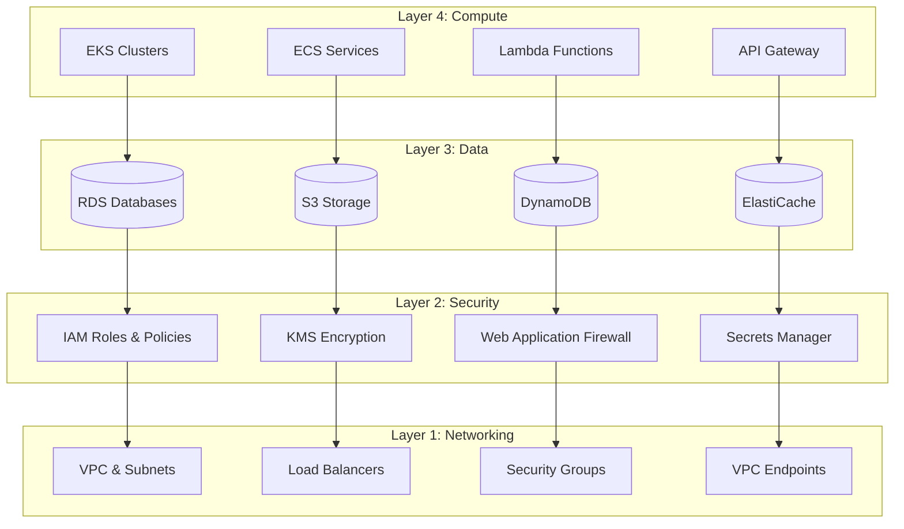

# AWS Terraform Infrastructure Documentation

Welcome to the comprehensive documentation for the AWS Terraform Infrastructure project. This documentation provides detailed guidance for deploying, managing, and maintaining enterprise-grade AWS infrastructure using Terraform.

## 📚 Documentation Structure

### [🏗️ Architecture](./architecture/)
- [Overall Architecture](./architecture/overview.md) - High-level system design and patterns
- [Layer Architecture](./architecture/layers.md) - 4-layer infrastructure design
- [Network Architecture](./architecture/networking.md) - VPC, subnets, and connectivity
- [Security Architecture](./architecture/security.md) - Security patterns and controls
- [Data Architecture](./architecture/data.md) - Storage and database design
- [Compute Architecture](./architecture/compute.md) - Application and compute services

### [🚀 Deployment](./deployment/)
- [Getting Started](./deployment/getting-started.md) - Quick start guide
- [Prerequisites](./deployment/prerequisites.md) - Required tools and access
- [Environment Setup](./deployment/environment-setup.md) - Environment configuration
- [Deployment Guide](./deployment/deployment-guide.md) - Step-by-step deployment
- [Troubleshooting](./deployment/troubleshooting.md) - Common issues and solutions

### [🔧 Modules](./modules/)
- [Module Overview](./modules/overview.md) - Terraform modules documentation
- [Core Services](./modules/core-services.md) - Essential AWS services
- [Network Services](./modules/network-services.md) - Networking components
- [Security Services](./modules/security-services.md) - Security and compliance
- [Data Services](./modules/data-services.md) - Storage and databases
- [Compute Services](./modules/compute-services.md) - Applications and compute

### [⚙️ Operations](./operations/)
- [Monitoring](./operations/monitoring.md) - Observability and alerting
- [Backup & Recovery](./operations/backup-recovery.md) - Data protection strategies
- [Scaling](./operations/scaling.md) - Auto-scaling and capacity planning
- [Cost Optimization](./operations/cost-optimization.md) - Cost management strategies
- [Maintenance](./operations/maintenance.md) - Regular maintenance tasks

### [🛡️ Security](./security/)
- [Security Overview](./security/overview.md) - Security framework and principles
- [Identity & Access Management](./security/iam.md) - IAM policies and roles
- [Network Security](./security/network-security.md) - Network protection
- [Data Protection](./security/data-protection.md) - Encryption and data security
- [Compliance](./security/compliance.md) - Regulatory compliance
- [Incident Response](./security/incident-response.md) - Security incident procedures

### [📝 Examples](./examples/)
- [Configuration Examples](./examples/configurations.md) - Sample configurations
- [Use Cases](./examples/use-cases.md) - Common deployment scenarios
- [Best Practices](./examples/best-practices.md) - Implementation best practices

## 🎯 Quick Start

1. **Prerequisites**: Ensure you have [Terraform](./deployment/prerequisites.md#terraform), [AWS CLI](./deployment/prerequisites.md#aws-cli), and proper [AWS credentials](./deployment/prerequisites.md#aws-credentials) configured.

2. **Choose Your Path**:
   - 🆕 **New Deployment**: Follow the [Getting Started Guide](./deployment/getting-started.md)
   - 🔄 **Existing Infrastructure**: See [Migration Guide](./deployment/migration.md)
   - 🧪 **Development Setup**: Use [Development Environment](./deployment/development.md)

3. **Deploy Infrastructure**:
   ```bash
   # Clone repository
   git clone <repository-url>
   cd terraform-infra-aws
   
   # Configure environment
   cd layers/networking/environments/dev
   cp terraform.auto.tfvars.example terraform.auto.tfvars
   # Edit variables as needed
   
   # Initialize and deploy
   terraform init -backend-config=backend.conf
   terraform plan
   terraform apply
   ```

4. **Verify Deployment**: Follow the [verification steps](./deployment/verification.md) to ensure successful deployment.

## 🏗️ Architecture Overview

This infrastructure follows a **4-layer architecture pattern**:



### Key Features

- ✅ **Multi-Environment Support**: Dev, QA, UAT, and Production
- ✅ **Security-First Design**: Comprehensive security controls and encryption
- ✅ **Scalable Architecture**: Auto-scaling and high availability
- ✅ **Cost Optimized**: Environment-specific resource sizing
- ✅ **Well-Architected**: Follows AWS Well-Architected Framework
- ✅ **Infrastructure as Code**: 100% Terraform managed

## 🔧 Supported Services

### Networking Layer
- **VPC & Subnets**: Multi-AZ network architecture
- **Application Load Balancers**: Layer 7 load balancing
- **Security Groups**: Micro-segmentation
- **VPC Endpoints**: Private service connectivity
- **Transit Gateway**: Network hub connectivity

### Security Layer
- **IAM**: Roles, policies, and service accounts
- **KMS**: Encryption key management
- **Secrets Manager**: Credential management
- **WAF**: Web application protection
- **CloudTrail**: Audit logging

### Data Layer
- **RDS**: Relational databases (MySQL, PostgreSQL)
- **S3**: Object storage with lifecycle policies
- **DynamoDB**: NoSQL databases
- **ElastiCache**: In-memory caching (Redis)
- **Backup**: Automated backup strategies

### Compute Layer
- **EKS**: Kubernetes container orchestration
- **ECS**: Container service with Fargate
- **Lambda**: Serverless functions
- **API Gateway**: API management
- **CloudFront**: Content delivery network

## 📊 Environment Matrix

| Feature | Dev | QA | UAT | Prod |
|---------|-----|----|----|------|
| **High Availability** | Single AZ | Multi-AZ | Multi-AZ | Multi-AZ |
| **Encryption** | Basic | Enhanced | Enhanced | Full |
| **Monitoring** | Basic | Standard | Enhanced | Full |
| **Backup Retention** | 7 days | 14 days | 30 days | 90 days |
| **Auto Scaling** | Limited | Standard | Enhanced | Full |
| **Cost Optimization** | Aggressive | Moderate | Balanced | Performance |

## 🎯 Design Principles

### 1. **Security by Design**
- Zero-trust network architecture
- Principle of least privilege
- Defense in depth
- Encryption everywhere

### 2. **Operational Excellence**
- Infrastructure as Code
- Automated deployment pipelines
- Comprehensive monitoring
- Disaster recovery planning

### 3. **Reliability**
- Multi-AZ deployments
- Auto-scaling capabilities
- Health monitoring
- Automated recovery

### 4. **Performance Efficiency**
- Right-sizing resources
- Caching strategies
- CDN utilization
- Database optimization

### 5. **Cost Optimization**
- Environment-specific sizing
- Spot instance utilization
- Reserved capacity planning
- Resource lifecycle management

### 6. **Sustainability**
- Efficient resource utilization
- Auto-shutdown policies
- Green computing practices
- Carbon footprint awareness

## 📖 Additional Resources

### AWS Documentation
- [AWS Well-Architected Framework](https://aws.amazon.com/architecture/well-architected/)
- [AWS Security Best Practices](https://aws.amazon.com/security/security-resources/)
- [Terraform AWS Provider](https://registry.terraform.io/providers/hashicorp/aws/latest)

### Training & Certification
- [AWS Solutions Architect](https://aws.amazon.com/certification/certified-solutions-architect-associate/)
- [Terraform Associate](https://www.hashicorp.com/certification/terraform-associate)
- [Kubernetes Fundamentals](https://kubernetes.io/training/)

### Community Resources
- [AWS Samples](https://github.com/aws-samples)
- [Terraform AWS Modules](https://github.com/terraform-aws-modules)
- [Kubernetes Documentation](https://kubernetes.io/docs/)

## 🤝 Contributing

We welcome contributions! Please see our [Contributing Guide](./CONTRIBUTING.md) for details on:
- Code standards and conventions
- Pull request process
- Issue reporting
- Documentation updates

## 📞 Support

- **Technical Issues**: Create an issue in the repository
- **Architecture Questions**: Consult the [architecture documentation](./architecture/)
- **Deployment Help**: Follow the [troubleshooting guide](./deployment/troubleshooting.md)
- **Security Concerns**: Review [security documentation](./security/)

## 📄 License

This project is licensed under the [MIT License](../LICENSE). See the license file for details.

---

**Last Updated**: October 2025  
**Version**: 1.0.0  
**Terraform Version**: >= 1.9.0  
**AWS Provider Version**: ~> 5.0