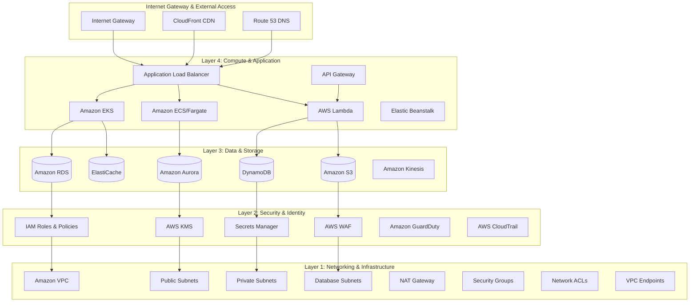
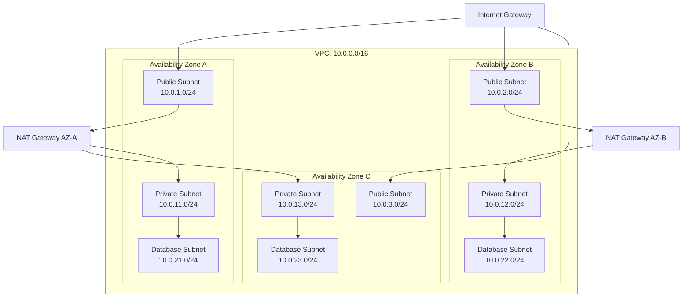
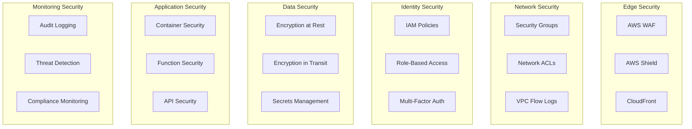
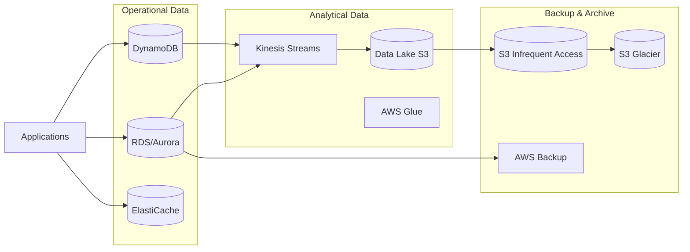
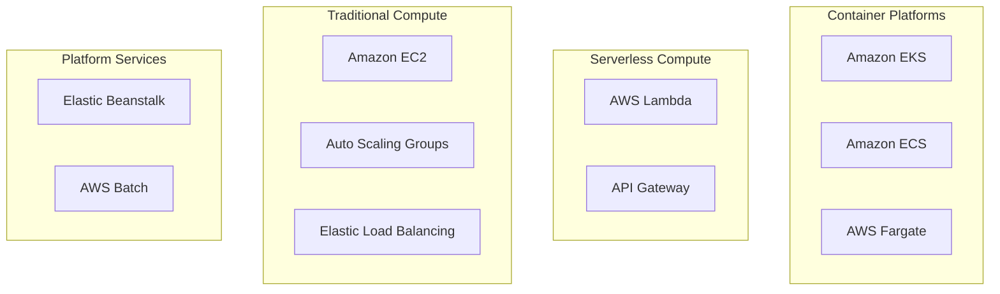
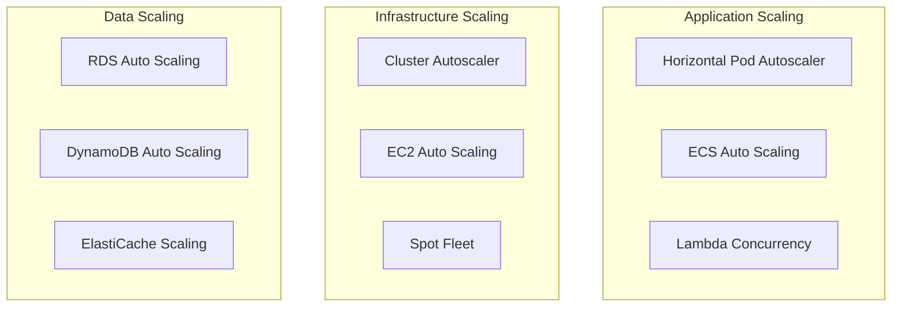
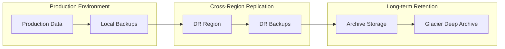

# Architecture Overview

## Introduction

The AWS Terraform Infrastructure implements a comprehensive 4-layer architecture pattern designed for enterprise-scale applications. This architecture follows AWS Well-Architected Framework principles and provides a robust, secure, and scalable foundation for modern cloud-native applications.

## High-Level Architecture

## Layer Architecture Details

### Layer 1: Networking & Infrastructure Foundation

**Purpose**: Provides the fundamental network infrastructure and connectivity.

#### Core Components:
- **Amazon VPC**: Isolated network environment
- **Subnets**: Multi-AZ subnet architecture
  - Public Subnets: Internet-facing resources
  - Private Subnets: Application workloads
  - Database Subnets: Data tier isolation
- **Internet Gateway**: Internet connectivity
- **NAT Gateway**: Outbound internet access for private resources
- **Security Groups**: Virtual firewalls
- **Network ACLs**: Subnet-level security
- **VPC Endpoints**: Private service connectivity

#### Design Patterns:
- **Multi-AZ Deployment**: Resources distributed across multiple availability zones
- **Network Segmentation**: Logical separation of tiers
- **Zero Trust Network**: Default deny with explicit allow rules

### Layer 2: Security & Identity Management

**Purpose**: Implements comprehensive security controls and identity management.

#### Core Components:
- **AWS IAM**: Identity and access management
- **AWS KMS**: Encryption key management
- **Secrets Manager**: Credential management
- **AWS WAF**: Web application firewall
- **CloudTrail**: Audit logging
- **GuardDuty**: Threat detection

#### Security Patterns:
- **Principle of Least Privilege**: Minimal required permissions
- **Defense in Depth**: Multiple security layers
- **Encryption Everywhere**: Data protection at rest and in transit
- **Automated Compliance**: Policy-as-code implementation

### Layer 3: Data & Storage Services

**Purpose**: Provides scalable and reliable data storage and processing capabilities.

#### Core Components:
- **Amazon RDS**: Managed relational databases
- **Amazon Aurora**: High-performance database clusters
- **DynamoDB**: NoSQL database service
- **Amazon S3**: Object storage
- **ElastiCache**: In-memory caching
- **Amazon Kinesis**: Real-time data streaming

#### Data Patterns:
- **Polyglot Persistence**: Right tool for the right job
- **Data Lifecycle Management**: Automated data archiving
- **Backup and Recovery**: Automated backup strategies
- **Performance Optimization**: Caching and indexing strategies

### Layer 4: Compute & Application Services

**Purpose**: Hosts application workloads and provides compute resources.

#### Core Components:
- **Amazon EKS**: Kubernetes container orchestration
- **Amazon ECS/Fargate**: Container service
- **AWS Lambda**: Serverless computing
- **API Gateway**: API management
- **Application Load Balancer**: Load balancing
- **CloudFront**: Content delivery network

#### Compute Patterns:
- **Microservices Architecture**: Loosely coupled services
- **Event-Driven Architecture**: Asynchronous processing
- **Auto Scaling**: Dynamic resource adjustment
- **Blue/Green Deployments**: Zero-downtime updates

## Network Architecture

### VPC Design

### Subnet Strategy

#### Public Subnets (DMZ)
- **Purpose**: Internet-facing resources
- **Resources**: Load balancers, NAT gateways, bastion hosts
- **Security**: Restrictive security groups, WAF protection

#### Private Subnets (Application Tier)
- **Purpose**: Application workloads
- **Resources**: EKS nodes, ECS tasks, Lambda functions, application servers
- **Security**: No direct internet access, outbound through NAT

#### Database Subnets (Data Tier)
- **Purpose**: Data storage and processing
- **Resources**: RDS instances, ElastiCache clusters, data processing services
- **Security**: Isolated from internet, restricted access from application tier

## Security Architecture

### Defense in Depth Strategy

### Security Controls Matrix

| Layer | Control Type | Implementation | Purpose |
|-------|-------------|----------------|---------|
| **Edge** | Perimeter Defense | WAF, Shield, CloudFront | DDoS protection, malicious traffic filtering |
| **Network** | Micro-segmentation | Security Groups, NACLs | Network-level access control |
| **Identity** | Access Control | IAM, RBAC, MFA | Authentication and authorization |
| **Data** | Encryption | KMS, TLS, Secrets Manager | Data protection at rest and in transit |
| **Application** | Runtime Security | Container scanning, Lambda layers | Application-level protection |
| **Monitoring** | Threat Detection | CloudTrail, GuardDuty, Config | Security monitoring and compliance |

## Data Architecture

### Data Storage Strategy

### Data Flow Patterns

#### Transactional Data Flow
1. **Application** → **RDS/Aurora** (OLTP workloads)
2. **Application** → **DynamoDB** (NoSQL workloads)
3. **Application** → **ElastiCache** (Caching layer)

#### Analytical Data Flow
1. **Operational Systems** → **Kinesis** (Real-time streaming)
2. **Kinesis** → **S3** (Data lake storage)
3. **S3** → **Analytics Services** (Athena, EMR, Redshift)

#### Backup Data Flow
1. **Production Data** → **AWS Backup** (Automated backups)
2. **S3 Standard** → **S3 IA** → **S3 Glacier** (Lifecycle management)

## Compute Architecture

### Container Orchestration Strategy

### Workload Distribution

#### Containerized Workloads
- **EKS**: Complex, stateful applications requiring Kubernetes
- **ECS/Fargate**: Stateless microservices and web applications
- **Container Benefits**: Portability, scalability, resource efficiency

#### Serverless Workloads
- **Lambda**: Event-driven processing, API backends, data processing
- **API Gateway**: API management, throttling, authentication
- **Serverless Benefits**: No infrastructure management, pay-per-use, auto-scaling

#### Traditional Workloads
- **EC2**: Legacy applications, specialized software, custom configurations
- **Auto Scaling**: Dynamic capacity management
- **Traditional Benefits**: Full control, custom configurations, persistent storage

## Scalability & Performance

### Auto Scaling Strategy

### Performance Optimization

#### Caching Strategy
- **Application Level**: In-memory caching with Redis/ElastiCache
- **API Level**: API Gateway response caching
- **Content Level**: CloudFront CDN caching
- **Database Level**: RDS read replicas, DynamoDB DAX

#### Network Optimization
- **Content Delivery**: CloudFront global edge locations
- **Load Balancing**: Application Load Balancer with health checks
- **Connection Pooling**: Database connection optimization
- **VPC Endpoints**: Reduced latency for AWS service access

## Disaster Recovery & Business Continuity

### RTO/RPO Targets

| Environment | RTO (Recovery Time Objective) | RPO (Recovery Point Objective) | Strategy |
|-------------|-------------------------------|--------------------------------|----------|
| **Development** | 4 hours | 24 hours | Basic backup restoration |
| **QA/UAT** | 2 hours | 12 hours | Cross-AZ failover |
| **Production** | 15 minutes | 5 minutes | Multi-region active-passive |

### Backup Strategy

## Cost Optimization

### Cost Management Strategy

#### Right-Sizing
- **Development**: Smaller instances, single AZ deployment
- **Production**: Performance-optimized, multi-AZ deployment
- **Spot Instances**: Non-critical workloads, batch processing

#### Resource Lifecycle
- **Auto-shutdown**: Development environments outside business hours
- **Storage Tiering**: Automated S3 lifecycle policies
- **Reserved Capacity**: Predictable workloads, long-term commitments

#### Monitoring & Optimization
- **Cost Allocation Tags**: Department and project tracking
- **Budget Alerts**: Proactive cost monitoring
- **Usage Analytics**: Regular cost optimization reviews

## Technology Stack

### Core Technologies
- **Infrastructure**: Terraform >= 1.9.0
- **Cloud Provider**: AWS (Provider ~> 5.0)
- **Container Orchestration**: Kubernetes 1.28+
- **Container Runtime**: Docker, containerd
- **Monitoring**: CloudWatch, Prometheus, Grafana
- **Security**: AWS Security Services, OPA/Gatekeeper

### Development Tools
- **CI/CD**: GitHub Actions, AWS CodePipeline
- **Version Control**: Git, GitHub
- **Testing**: Terratest, Kitchen-Terraform
- **Documentation**: Markdown, Mermaid diagrams

---

**Next Steps**: 
- Review [Layer Architecture Details](./layers.md)
- Explore [Network Architecture](./networking.md)
- Understand [Security Architecture](./security.md)