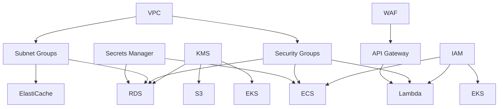

# Module Overview

The AWS Terraform Infrastructure is built using a modular architecture that promotes reusability, maintainability, and consistency across different environments. This document provides an overview of all available modules and their purposes.

## Module Architecture

### Design Principles

1. **Single Responsibility**: Each module handles a specific AWS service or logical grouping
2. **Reusability**: Modules can be used across different environments and projects
3. **Composability**: Modules can be combined to build complex infrastructure
4. **Standardization**: Consistent interface and naming conventions
5. **Testing**: All modules include validation and testing capabilities

### Module Structure

Each module follows a standard structure:

```
modules/<service-name>/
├── main.tf          # Primary resource definitions
├── variables.tf     # Input variable declarations
├── outputs.tf       # Output value declarations
├── versions.tf      # Provider version constraints
├── locals.tf        # Local value definitions (if needed)
├── data.tf         # Data source declarations (if needed)
├── README.md       # Module documentation
└── examples/       # Usage examples
    ├── basic/
    └── advanced/
```

## Core Infrastructure Modules

### Networking Modules

#### 🌐 VPC Module
**Purpose**: Creates and configures Amazon VPC with subnets, route tables, and gateways.

**Features**:
- Multi-AZ subnet configuration
- Internet and NAT gateway management
- Route table association
- DNS configuration
- Flow logs support

**Usage**:
```hcl
module "vpc" {
  source = "./modules/vpc"
  
  cidr_block           = "10.0.0.0/16"
  availability_zones   = ["us-east-1a", "us-east-1b", "us-east-1c"]
  public_subnet_cidrs  = ["10.0.1.0/24", "10.0.2.0/24", "10.0.3.0/24"]
  private_subnet_cidrs = ["10.0.11.0/24", "10.0.12.0/24", "10.0.13.0/24"]
  
  enable_dns_hostnames = true
  enable_nat_gateway   = true
  
  tags = local.common_tags
}
```

#### 🛡️ Security Groups Module
**Purpose**: Manages security groups with standardized rules and best practices.

**Features**:
- Pre-defined rule sets for common services
- Dynamic rule generation
- Cross-security group references
- Compliance-ready configurations

**Usage**:
```hcl
module "security_groups" {
  source = "./modules/security-groups"
  
  vpc_id = module.vpc.vpc_id
  
  security_groups = {
    web = {
      name = "web-tier-sg"
      ingress_rules = [
        {
          from_port   = 80
          to_port     = 80
          protocol    = "tcp"
          cidr_blocks = ["0.0.0.0/0"]
        }
      ]
    }
  }
}
```

#### 🔗 VPC Endpoints Module
**Purpose**: Creates VPC endpoints for private connectivity to AWS services.

**Features**:
- Gateway and interface endpoints
- Private DNS configuration
- Route table associations
- Policy management

#### 🌉 Transit Gateway Module
**Purpose**: Manages AWS Transit Gateway for network connectivity hub.

**Features**:
- Multi-VPC connectivity
- Route table management
- Cross-region peering
- Network segmentation

### Security Modules

#### 🔐 IAM Module
**Purpose**: Creates and manages IAM roles, policies, and service accounts.

**Features**:
- Service-linked roles
- Cross-service trust relationships
- Policy attachment management
- OIDC provider integration

**Usage**:
```hcl
module "iam" {
  source = "./modules/iam"
  
  roles = {
    ecs_task_execution = {
      name = "ecs-task-execution-role"
      assume_role_policy = data.aws_iam_policy_document.ecs_assume_role.json
      managed_policy_arns = [
        "arn:aws:iam::aws:policy/service-role/AmazonECSTaskExecutionRolePolicy"
      ]
    }
  }
}
```

#### 🔑 KMS Module
**Purpose**: Manages KMS keys for encryption across services.

**Features**:
- Service-specific key policies
- Key rotation management
- Cross-account access
- Alias management

**Usage**:
```hcl
module "kms" {
  source = "./modules/kms"
  
  keys = {
    application = {
      description = "Application data encryption key"
      key_usage   = "ENCRYPT_DECRYPT"
      policy      = data.aws_iam_policy_document.application_kms_policy.json
    }
  }
}
```

#### 🔒 Secrets Manager Module
**Purpose**: Manages secrets with automatic rotation capabilities.

**Features**:
- Automatic rotation configuration
- Cross-region replication
- Lambda rotation functions
- Database integration

#### 🛡️ WAF Module
**Purpose**: Implements Web Application Firewall protection.

**Features**:
- Managed rule groups
- Custom rule creation
- Rate limiting
- Geo-blocking capabilities

### Data Storage Modules

#### 🗄️ RDS Module
**Purpose**: Manages Amazon RDS instances and clusters.

**Features**:
- Multi-engine support (MySQL, PostgreSQL, Aurora)
- Multi-AZ deployment
- Read replica management
- Backup and maintenance windows
- Performance Insights integration

**Usage**:
```hcl
module "rds" {
  source = "./modules/rds"
  
  identifier = "app-database"
  engine     = "mysql"
  engine_version = "8.0.35"
  instance_class = "db.t3.medium"
  
  allocated_storage = 100
  storage_encrypted = true
  kms_key_id       = module.kms.key_arns["database"]
  
  db_name  = "application"
  username = "admin"
  manage_master_user_password = true
  
  vpc_security_group_ids = [module.security_groups.security_group_ids["rds"]]
  db_subnet_group_name   = module.vpc.database_subnet_group_name
  
  backup_retention_period = 7
  backup_window          = "03:00-04:00"
  maintenance_window     = "Sun:04:00-Sun:05:00"
  
  tags = local.common_tags
}
```

#### 📦 S3 Module
**Purpose**: Creates and configures S3 buckets with security best practices.

**Features**:
- Versioning configuration
- Lifecycle policies
- Server-side encryption
- Access logging
- Public access blocking

**Usage**:
```hcl
module "s3" {
  source = "./modules/s3"
  
  buckets = {
    application_data = {
      bucket_name = "app-data-${random_id.bucket_suffix.hex}"
      versioning  = true
      encryption = {
        kms_key_id = module.kms.key_arns["application"]
      }
      lifecycle_rules = [
        {
          id     = "archive_old_versions"
          status = "Enabled"
          noncurrent_version_transitions = [
            {
              days          = 30
              storage_class = "STANDARD_IA"
            }
          ]
        }
      ]
    }
  }
}
```

#### ⚡ DynamoDB Module
**Purpose**: Manages DynamoDB tables with scaling and backup capabilities.

**Features**:
- Auto-scaling configuration
- Global secondary indexes
- Point-in-time recovery
- Backup scheduling
- Stream configuration

**Usage**:
```hcl
module "dynamodb" {
  source = "./modules/dynamodb"
  
  tables = {
    user_sessions = {
      name     = "user-sessions"
      hash_key = "session_id"
      
      attributes = [
        {
          name = "session_id"
          type = "S"
        }
      ]
      
      billing_mode = "PAY_PER_REQUEST"
      
      ttl = {
        attribute_name = "expires_at"
        enabled       = true
      }
      
      point_in_time_recovery_enabled = true
    }
  }
}
```

#### 🔄 ElastiCache Module
**Purpose**: Manages ElastiCache clusters for Redis and Memcached.

**Features**:
- Multi-AZ deployment
- Automatic failover
- Backup and restore
- Parameter group management
- Subnet group configuration

### Compute Modules

#### ☸️ EKS Module
**Purpose**: Creates and manages Amazon EKS clusters.

**Features**:
- Managed node groups
- Fargate profiles
- Add-ons management
- OIDC integration
- Network configuration

**Usage**:
```hcl
module "eks" {
  source = "./modules/eks"
  
  cluster_name    = "app-cluster"
  cluster_version = "1.28"
  
  vpc_id     = module.vpc.vpc_id
  subnet_ids = module.vpc.private_subnet_ids
  
  node_groups = {
    general = {
      instance_types = ["m5.large"]
      scaling_config = {
        desired_size = 3
        max_size     = 10
        min_size     = 1
      }
    }
  }
  
  cluster_encryption_config = {
    provider_key_arn = module.kms.key_arns["application"]
    resources        = ["secrets"]
  }
  
  tags = local.common_tags
}
```

#### 🐳 ECS Module
**Purpose**: Manages ECS clusters and services.

**Features**:
- Fargate and EC2 launch types
- Service discovery integration
- Auto scaling configuration
- Load balancer integration
- Container Insights

#### ⚡ Lambda Module
**Purpose**: Deploys and manages Lambda functions.

**Features**:
- Multiple runtime support
- VPC configuration
- Environment variables
- Dead letter queues
- Event source mappings

**Usage**:
```hcl
module "lambda" {
  source = "./modules/lambda"
  
  functions = {
    api_handler = {
      function_name = "api-handler"
      runtime      = "python3.11"
      handler      = "lambda_function.lambda_handler"
      
      filename = "api-handler.zip"
      
      environment_variables = {
        ENVIRONMENT = var.environment
        LOG_LEVEL  = "INFO"
      }
      
      vpc_config = {
        subnet_ids         = module.vpc.private_subnet_ids
        security_group_ids = [module.security_groups.security_group_ids["lambda"]]
      }
    }
  }
}
```

#### 🌐 API Gateway Module
**Purpose**: Creates and configures API Gateway REST and HTTP APIs.

**Features**:
- REST and HTTP API support
- Custom domains
- Authorization methods
- VPC links
- Usage plans and API keys

## Utility Modules

### 🏷️ Tagging Module
**Purpose**: Provides consistent tagging across all resources.

**Features**:
- Standard tag generation
- Cost allocation tags
- Compliance tags
- Environment-specific tags

### 📊 Monitoring Module
**Purpose**: Sets up CloudWatch monitoring and alerting.

**Features**:
- Custom metrics
- Alarms and notifications
- Dashboard creation
- Log group management

### 🔄 Backup Module
**Purpose**: Implements automated backup strategies.

**Features**:
- AWS Backup integration
- Cross-region backup
- Lifecycle management
- Compliance reporting

## Module Dependencies

### Dependency Graph



### Layer Dependencies

1. **Foundation Layer** (No dependencies)
   - VPC
   - IAM
   - KMS

2. **Security Layer** (Depends on Foundation)
   - Security Groups
   - Secrets Manager
   - WAF

3. **Data Layer** (Depends on Foundation + Security)
   - RDS
   - DynamoDB
   - S3
   - ElastiCache

4. **Compute Layer** (Depends on all previous layers)
   - EKS
   - ECS
   - Lambda
   - API Gateway

## Module Usage Patterns

### Basic Usage

```hcl
# Simple module usage
module "vpc" {
  source = "./modules/vpc"
  
  cidr_block = "10.0.0.0/16"
  name       = "app-vpc"
  
  tags = {
    Environment = "dev"
    Project     = "my-app"
  }
}
```

### Advanced Usage with Dependencies

```hcl
# Module with dependencies and data sources
module "rds" {
  source = "./modules/rds"
  
  # Dependencies from other modules
  vpc_id               = module.vpc.vpc_id
  subnet_group_name    = module.vpc.database_subnet_group_name
  security_group_ids   = [module.security_groups.rds_sg_id]
  kms_key_id          = module.kms.database_key_id
  
  # Configuration
  identifier = "${var.project_name}-${var.environment}-db"
  engine     = "mysql"
  
  tags = local.common_tags
}
```

### Conditional Module Usage

```hcl
# Conditional module deployment
module "eks" {
  count = var.enable_kubernetes ? 1 : 0
  
  source = "./modules/eks"
  
  cluster_name = "${var.project_name}-${var.environment}-eks"
  # ... other configuration
}
```

## Module Testing

### Validation Tests

Each module includes validation tests to ensure:
- Required variables are provided
- Variable values are within acceptable ranges
- Resource naming follows conventions
- Tags are properly applied

### Integration Tests

Modules are tested for:
- Successful resource creation
- Proper dependency handling
- Output value accuracy
- Cross-module communication

### Test Structure

```
modules/<module-name>/
├── tests/
│   ├── unit/           # Unit tests
│   ├── integration/    # Integration tests
│   └── examples/       # Example configurations
```

## Best Practices

### Module Development

1. **Follow Standard Structure**: Use consistent file organization
2. **Document Thoroughly**: Include comprehensive README files
3. **Validate Inputs**: Use variable validation rules
4. **Provide Examples**: Include usage examples
5. **Test Extensively**: Implement automated testing

### Module Usage

1. **Pin Versions**: Use specific module versions in production
2. **Use Data Sources**: Prefer data sources over hard-coded values
3. **Apply Consistent Tagging**: Use standardized tags
4. **Handle Dependencies**: Properly manage module dependencies
5. **Monitor Resources**: Implement monitoring for all resources

### Security Considerations

1. **Least Privilege**: Grant minimum required permissions
2. **Encrypt Data**: Enable encryption for all data stores
3. **Network Isolation**: Use private subnets for internal resources
4. **Audit Access**: Enable logging and monitoring
5. **Rotate Secrets**: Implement automatic secret rotation

## Common Patterns

### Multi-Environment Deployment

```hcl
# Environment-specific configuration
locals {
  environment_config = {
    dev = {
      instance_class = "db.t3.micro"
      replica_count  = 0
    }
    prod = {
      instance_class = "db.r5.large"
      replica_count  = 2
    }
  }
  
  current_config = local.environment_config[var.environment]
}

module "rds" {
  source = "./modules/rds"
  
  instance_class = local.current_config.instance_class
  replica_count  = local.current_config.replica_count
  
  # ... other configuration
}
```

### Cross-Region Deployment

```hcl
# Primary region deployment
module "primary_region" {
  source = "./modules/region"
  
  providers = {
    aws = aws.primary
  }
  
  region = "us-east-1"
  # ... configuration
}

# Secondary region deployment
module "secondary_region" {
  source = "./modules/region"
  
  providers = {
    aws = aws.secondary
  }
  
  region = "us-west-2"
  # ... configuration
}
```

## Module Versioning

### Version Strategy

- **Major Version**: Breaking changes (2.0.0)
- **Minor Version**: New features (1.1.0)
- **Patch Version**: Bug fixes (1.0.1)

### Version Pinning

```hcl
# Pin to specific version
module "vpc" {
  source  = "git::https://github.com/org/terraform-modules.git//vpc?ref=v1.2.3"
  
  # ... configuration
}

# Pin to major version
module "rds" {
  source  = "git::https://github.com/org/terraform-modules.git//rds?ref=v2"
  
  # ... configuration
}
```

---

**Next Steps**:
- Explore [Core Services](./core-services.md) documentation
- Review [Network Services](./network-services.md) modules
- Check [Security Services](./security-services.md) modules
- Learn about [Data Services](./data-services.md) modules
- Understand [Compute Services](./compute-services.md) modules