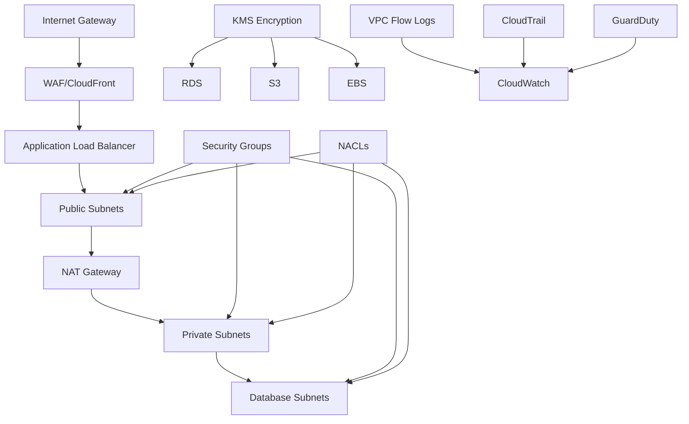

# Security Framework

This document provides comprehensive guidance on security implementation, best practices, and compliance for the AWS infrastructure deployed using Terraform.

## Table of Contents

- [Security Architecture](#security-architecture)
- [Identity and Access Management](#identity-and-access-management)
- [Network Security](#network-security)
- [Data Protection](#data-protection)
- [Monitoring and Logging](#monitoring-and-logging)
- [Compliance Framework](#compliance-framework)
- [Incident Response](#incident-response)
- [Security Automation](#security-automation)

## Security Architecture

### Defense in Depth Strategy

The infrastructure implements a multi-layered security approach:



### Security Zones

#### Perimeter Security
- **WAF (Web Application Firewall)**: Protects against common web exploits
- **CloudFront**: CDN with DDoS protection and geo-blocking
- **Route 53 Resolver DNS Firewall**: DNS-level threat protection

#### Network Security
- **VPC Segmentation**: Isolated network environments
- **Security Groups**: Instance-level firewalls
- **NACLs**: Subnet-level network controls
- **VPC Flow Logs**: Network traffic monitoring

#### Compute Security
- **IMDSv2**: Secure instance metadata service
- **Systems Manager Session Manager**: Secure shell access
- **Container Image Scanning**: Vulnerability detection in images
- **Patch Management**: Automated security updates

#### Data Security
- **Encryption at Rest**: KMS-managed encryption for all data stores
- **Encryption in Transit**: TLS/SSL for all communications
- **Secrets Management**: AWS Secrets Manager for credentials
- **Backup Encryption**: Encrypted backups with cross-region replication

## Identity and Access Management

### IAM Strategy

#### Principle of Least Privilege

**Service Roles**:
```hcl
# ECS Task Execution Role
resource "aws_iam_role" "ecs_task_execution" {
  name = "${var.project_name}-ecs-task-execution-role"

  assume_role_policy = jsonencode({
    Version = "2012-10-17"
    Statement = [
      {
        Action = "sts:AssumeRole"
        Effect = "Allow"
        Principal = {
          Service = "ecs-tasks.amazonaws.com"
        }
      }
    ]
  })
}

# Attach minimal required policies
resource "aws_iam_role_policy_attachment" "ecs_task_execution" {
  role       = aws_iam_role.ecs_task_execution.name
  policy_arn = "arn:aws:iam::aws:policy/service-role/AmazonECSTaskExecutionRolePolicy"
}

# Custom policy for specific resources only
resource "aws_iam_role_policy" "ecs_secrets_access" {
  name = "secrets-access"
  role = aws_iam_role.ecs_task_execution.id

  policy = jsonencode({
    Version = "2012-10-17"
    Statement = [
      {
        Effect = "Allow"
        Action = [
          "secretsmanager:GetSecretValue"
        ]
        Resource = [
          aws_secretsmanager_secret.database_password.arn,
          aws_secretsmanager_secret.api_keys.arn
        ]
      }
    ]
  })
}
```

#### Cross-Account Access

**Assumable Roles for CI/CD**:
```hcl
resource "aws_iam_role" "cicd_deployment" {
  name = "cicd-deployment-role"

  assume_role_policy = jsonencode({
    Version = "2012-10-17"
    Statement = [
      {
        Effect = "Allow"
        Principal = {
          AWS = "arn:aws:iam::${var.cicd_account_id}:root"
        }
        Action = "sts:AssumeRole"
        Condition = {
          StringEquals = {
            "sts:ExternalId" = var.external_id
          }
        }
      }
    ]
  })
}
```

#### Service-Linked Roles

**EKS Service Role**:
```hcl
resource "aws_iam_role" "eks_cluster" {
  name = "${var.cluster_name}-cluster-role"

  assume_role_policy = jsonencode({
    Version = "2012-10-17"
    Statement = [
      {
        Action = "sts:AssumeRole"
        Effect = "Allow"
        Principal = {
          Service = "eks.amazonaws.com"
        }
      }
    ]
  })
}

resource "aws_iam_role_policy_attachment" "eks_cluster_policy" {
  policy_arn = "arn:aws:iam::aws:policy/AmazonEKSClusterPolicy"
  role       = aws_iam_role.eks_cluster.name
}
```

### RBAC Implementation

#### Kubernetes RBAC

**Namespace-based Access Control**:
```yaml
apiVersion: rbac.authorization.k8s.io/v1
kind: Role
metadata:
  namespace: production
  name: pod-manager
rules:
- apiGroups: [""]
  resources: ["pods"]
  verbs: ["get", "watch", "list", "create", "update", "patch", "delete"]
- apiGroups: [""]
  resources: ["pods/log"]
  verbs: ["get", "list"]
---
apiVersion: rbac.authorization.k8s.io/v1
kind: RoleBinding
metadata:
  name: manage-pods
  namespace: production
subjects:
- kind: ServiceAccount
  name: deployment-sa
  namespace: production
roleRef:
  kind: Role
  name: pod-manager
  apiGroup: rbac.authorization.k8s.io
```

#### Database Access Control

**RDS IAM Authentication**:
```hcl
resource "aws_db_instance" "main" {
  # ... other configuration
  
  iam_database_authentication_enabled = true
  
  tags = {
    Name = "production-database"
  }
}

# IAM policy for database access
resource "aws_iam_policy" "rds_access" {
  name = "rds-iam-access"

  policy = jsonencode({
    Version = "2012-10-17"
    Statement = [
      {
        Effect = "Allow"
        Action = [
          "rds-db:connect"
        ]
        Resource = [
          "arn:aws:rds-db:${var.aws_region}:${data.aws_caller_identity.current.account_id}:dbuser:${aws_db_instance.main.id}/app_user"
        ]
      }
    ]
  })
}
```

## Network Security

### VPC Configuration

#### Network Segmentation

**Multi-Tier Architecture**:
```hcl
resource "aws_vpc" "main" {
  cidr_block           = var.vpc_cidr
  enable_dns_hostnames = true
  enable_dns_support   = true

  tags = {
    Name = "${var.project_name}-vpc"
  }
}

# Public subnets for load balancers
resource "aws_subnet" "public" {
  count = length(var.availability_zones)

  vpc_id            = aws_vpc.main.id
  cidr_block        = var.public_subnet_cidrs[count.index]
  availability_zone = var.availability_zones[count.index]

  map_public_ip_on_launch = true

  tags = {
    Name = "${var.project_name}-public-${count.index + 1}"
    Type = "Public"
  }
}

# Private subnets for application servers
resource "aws_subnet" "private" {
  count = length(var.availability_zones)

  vpc_id            = aws_vpc.main.id
  cidr_block        = var.private_subnet_cidrs[count.index]
  availability_zone = var.availability_zones[count.index]

  tags = {
    Name = "${var.project_name}-private-${count.index + 1}"
    Type = "Private"
  }
}

# Database subnets with no internet access
resource "aws_subnet" "database" {
  count = length(var.availability_zones)

  vpc_id            = aws_vpc.main.id
  cidr_block        = var.database_subnet_cidrs[count.index]
  availability_zone = var.availability_zones[count.index]

  tags = {
    Name = "${var.project_name}-database-${count.index + 1}"
    Type = "Database"
  }
}
```

#### Network ACLs

**Restrictive Default NACLs**:
```hcl
resource "aws_network_acl" "private" {
  vpc_id     = aws_vpc.main.id
  subnet_ids = aws_subnet.private[*].id

  # Allow inbound HTTP/HTTPS from public subnets
  ingress {
    rule_no    = 100
    protocol   = "tcp"
    action     = "allow"
    cidr_block = "10.0.1.0/24"
    from_port  = 80
    to_port    = 80
  }

  ingress {
    rule_no    = 110
    protocol   = "tcp"
    action     = "allow"
    cidr_block = "10.0.1.0/24"
    from_port  = 443
    to_port    = 443
  }

  # Allow outbound internet access for updates
  egress {
    rule_no    = 100
    protocol   = "tcp"
    action     = "allow"
    cidr_block = "0.0.0.0/0"
    from_port  = 80
    to_port    = 80
  }

  egress {
    rule_no    = 110
    protocol   = "tcp"
    action     = "allow"
    cidr_block = "0.0.0.0/0"
    from_port  = 443
    to_port    = 443
  }

  tags = {
    Name = "${var.project_name}-private-nacl"
  }
}
```

### Security Groups

#### Tiered Security Groups

**Application Layer Security Group**:
```hcl
resource "aws_security_group" "application" {
  name        = "${var.project_name}-app-sg"
  description = "Security group for application servers"
  vpc_id      = aws_vpc.main.id

  # Allow inbound traffic from load balancer
  ingress {
    description     = "HTTP from ALB"
    from_port       = 80
    to_port         = 80
    protocol        = "tcp"
    security_groups = [aws_security_group.load_balancer.id]
  }

  ingress {
    description     = "HTTPS from ALB"
    from_port       = 443
    to_port         = 443
    protocol        = "tcp"
    security_groups = [aws_security_group.load_balancer.id]
  }

  # Allow outbound internet access
  egress {
    description = "All outbound traffic"
    from_port   = 0
    to_port     = 0
    protocol    = "-1"
    cidr_blocks = ["0.0.0.0/0"]
  }

  tags = {
    Name = "${var.project_name}-app-sg"
  }
}

# Database security group - only allows access from application
resource "aws_security_group" "database" {
  name        = "${var.project_name}-db-sg"
  description = "Security group for database servers"
  vpc_id      = aws_vpc.main.id

  ingress {
    description     = "MySQL from application"
    from_port       = 3306
    to_port         = 3306
    protocol        = "tcp"
    security_groups = [aws_security_group.application.id]
  }

  # No outbound rules - databases don't need internet access

  tags = {
    Name = "${var.project_name}-db-sg"
  }
}
```

### WAF Configuration

#### Web Application Firewall Rules

**OWASP Top 10 Protection**:
```hcl
resource "aws_wafv2_web_acl" "main" {
  name  = "${var.project_name}-waf"
  scope = "CLOUDFRONT"

  default_action {
    allow {}
  }

  # AWS Managed Core Rule Set
  rule {
    name     = "AWSManagedRulesCommonRuleSet"
    priority = 1

    override_action {
      none {}
    }

    statement {
      managed_rule_group_statement {
        name        = "AWSManagedRulesCommonRuleSet"
        vendor_name = "AWS"
      }
    }

    visibility_config {
      cloudwatch_metrics_enabled = true
      metric_name                = "CommonRuleSetMetric"
      sampled_requests_enabled   = true
    }
  }

  # SQL Injection Protection
  rule {
    name     = "AWSManagedRulesSQLiRuleSet"
    priority = 2

    override_action {
      none {}
    }

    statement {
      managed_rule_group_statement {
        name        = "AWSManagedRulesSQLiRuleSet"
        vendor_name = "AWS"
      }
    }

    visibility_config {
      cloudwatch_metrics_enabled = true
      metric_name                = "SQLiRuleSetMetric"
      sampled_requests_enabled   = true
    }
  }

  # Rate limiting
  rule {
    name     = "RateLimitRule"
    priority = 3

    action {
      block {}
    }

    statement {
      rate_based_statement {
        limit              = 2000
        aggregate_key_type = "IP"
      }
    }

    visibility_config {
      cloudwatch_metrics_enabled = true
      metric_name                = "RateLimitRule"
      sampled_requests_enabled   = true
    }
  }

  tags = {
    Name = "${var.project_name}-waf"
  }
}
```

## Data Protection

### Encryption Strategy

#### Encryption at Rest

**KMS Key Management**:
```hcl
# Customer managed key for application data
resource "aws_kms_key" "application" {
  description             = "KMS key for application data encryption"
  deletion_window_in_days = 7
  enable_key_rotation     = true

  policy = jsonencode({
    Version = "2012-10-17"
    Statement = [
      {
        Sid    = "Enable IAM User Permissions"
        Effect = "Allow"
        Principal = {
          AWS = "arn:aws:iam::${data.aws_caller_identity.current.account_id}:root"
        }
        Action   = "kms:*"
        Resource = "*"
      },
      {
        Sid    = "Allow use of the key for encryption/decryption"
        Effect = "Allow"
        Principal = {
          AWS = [
            aws_iam_role.ecs_task_execution.arn,
            aws_iam_role.lambda_execution.arn
          ]
        }
        Action = [
          "kms:Encrypt",
          "kms:Decrypt",
          "kms:ReEncrypt*",
          "kms:GenerateDataKey*",
          "kms:DescribeKey"
        ]
        Resource = "*"
      }
    ]
  })

  tags = {
    Name = "${var.project_name}-application-key"
  }
}

resource "aws_kms_alias" "application" {
  name          = "alias/${var.project_name}-application"
  target_key_id = aws_kms_key.application.key_id
}
```

**RDS Encryption**:
```hcl
resource "aws_db_instance" "main" {
  # ... other configuration
  
  storage_encrypted = true
  kms_key_id       = aws_kms_key.database.arn
  
  # Enable encryption for automated backups
  copy_tags_to_snapshot = true
  
  tags = {
    Name = "encrypted-database"
  }
}

# Separate key for database encryption
resource "aws_kms_key" "database" {
  description             = "KMS key for database encryption"
  deletion_window_in_days = 7
  enable_key_rotation     = true
  
  tags = {
    Name = "${var.project_name}-database-key"
  }
}
```

**S3 Encryption**:
```hcl
resource "aws_s3_bucket_server_side_encryption_configuration" "main" {
  bucket = aws_s3_bucket.main.id

  rule {
    apply_server_side_encryption_by_default {
      kms_master_key_id = aws_kms_key.application.arn
      sse_algorithm     = "aws:kms"
    }
    bucket_key_enabled = true
  }
}

# Deny unencrypted uploads
resource "aws_s3_bucket_policy" "main" {
  bucket = aws_s3_bucket.main.id

  policy = jsonencode({
    Version = "2012-10-17"
    Statement = [
      {
        Sid    = "DenyUnencryptedUploads"
        Effect = "Deny"
        Principal = "*"
        Action = "s3:PutObject"
        Resource = "${aws_s3_bucket.main.arn}/*"
        Condition = {
          StringNotEquals = {
            "s3:x-amz-server-side-encryption" = "aws:kms"
          }
        }
      }
    ]
  })
}
```

#### Encryption in Transit

**Application Load Balancer SSL/TLS**:
```hcl
resource "aws_lb_listener" "https" {
  load_balancer_arn = aws_lb.main.arn
  port              = "443"
  protocol          = "HTTPS"
  ssl_policy        = "ELBSecurityPolicy-TLS-1-2-2017-01"
  certificate_arn   = aws_acm_certificate.main.arn

  default_action {
    type             = "forward"
    target_group_arn = aws_lb_target_group.app.arn
  }
}

# Redirect HTTP to HTTPS
resource "aws_lb_listener" "http_redirect" {
  load_balancer_arn = aws_lb.main.arn
  port              = "80"
  protocol          = "HTTP"

  default_action {
    type = "redirect"
    redirect {
      port        = "443"
      protocol    = "HTTPS"
      status_code = "HTTP_301"
    }
  }
}
```

### Secrets Management

#### AWS Secrets Manager

**Database Credentials**:
```hcl
resource "aws_secretsmanager_secret" "database_password" {
  name                    = "${var.project_name}/database/master-password"
  description             = "Master password for RDS instance"
  recovery_window_in_days = 7

  tags = {
    Name = "${var.project_name}-db-password"
  }
}

resource "aws_secretsmanager_secret_version" "database_password" {
  secret_id = aws_secretsmanager_secret.database_password.id
  secret_string = jsonencode({
    username = var.db_username
    password = random_password.database.result
  })
}

# Automatic rotation
resource "aws_secretsmanager_secret_rotation" "database_password" {
  secret_id           = aws_secretsmanager_secret.database_password.id
  rotation_lambda_arn = aws_lambda_function.rotate_secret.arn

  rotation_rules {
    automatically_after_days = 30
  }
}
```

**Application API Keys**:
```hcl
resource "aws_secretsmanager_secret" "api_keys" {
  name        = "${var.project_name}/api/keys"
  description = "Third-party API keys"

  tags = {
    Name = "${var.project_name}-api-keys"
  }
}

resource "aws_secretsmanager_secret_version" "api_keys" {
  secret_id = aws_secretsmanager_secret.api_keys.id
  secret_string = jsonencode({
    payment_gateway = var.payment_api_key
    email_service   = var.email_api_key
    analytics       = var.analytics_key
  })
}
```

### Data Classification

#### Data Handling Policies

**S3 Bucket Classification**:
```hcl
# Public data bucket
resource "aws_s3_bucket" "public_assets" {
  bucket = "${var.project_name}-public-assets"
  
  tags = {
    DataClassification = "Public"
    BackupRequired     = "false"
  }
}

# Internal data bucket
resource "aws_s3_bucket" "internal_data" {
  bucket = "${var.project_name}-internal-data"
  
  tags = {
    DataClassification = "Internal"
    BackupRequired     = "true"
    RetentionPeriod    = "7years"
  }
}

# Confidential data bucket
resource "aws_s3_bucket" "confidential_data" {
  bucket = "${var.project_name}-confidential-data"
  
  tags = {
    DataClassification = "Confidential"
    BackupRequired     = "true"
    RetentionPeriod    = "10years"
    EncryptionRequired = "true"
  }
}
```

## Monitoring and Logging

### Security Monitoring

#### AWS CloudTrail

**Comprehensive Audit Logging**:
```hcl
resource "aws_cloudtrail" "main" {
  name                          = "${var.project_name}-cloudtrail"
  s3_bucket_name               = aws_s3_bucket.cloudtrail_logs.bucket
  include_global_service_events = true
  is_multi_region_trail        = true
  enable_logging               = true

  # Enable log file validation
  enable_log_file_validation = true

  # CloudWatch Logs integration
  cloud_watch_logs_group_arn = "${aws_cloudwatch_log_group.cloudtrail.arn}:*"
  cloud_watch_logs_role_arn  = aws_iam_role.cloudtrail_logs.arn

  # Data events for S3 buckets
  event_selector {
    read_write_type                 = "All"
    include_management_events       = true
    read_data_events               = true
    write_data_events              = true

    data_resource {
      type   = "AWS::S3::Object"
      values = ["arn:aws:s3:::${aws_s3_bucket.confidential_data.bucket}/*"]
    }
  }

  # Insight events
  insight_selector {
    insight_type = "ApiCallRateInsight"
  }

  tags = {
    Name = "${var.project_name}-cloudtrail"
  }
}
```

#### AWS GuardDuty

**Threat Detection Service**:
```hcl
resource "aws_guardduty_detector" "main" {
  enable = true

  datasources {
    s3_logs {
      enable = true
    }
    kubernetes {
      audit_logs {
        enable = true
      }
    }
    malware_protection {
      scan_ec2_instance_with_findings {
        ebs_volumes {
          enable = true
        }
      }
    }
  }

  tags = {
    Name = "${var.project_name}-guardduty"
  }
}

# Custom threat intel
resource "aws_guardduty_threat_intel_set" "main" {
  activate    = true
  detector_id = aws_guardduty_detector.main.id
  format      = "TXT"
  location    = "https://${aws_s3_bucket.threat_intel.bucket}.s3.amazonaws.com/threat_intel.txt"
  name        = "${var.project_name}-threat-intel"
}
```

#### AWS Config

**Configuration Compliance Monitoring**:
```hcl
resource "aws_config_configuration_recorder" "main" {
  name     = "${var.project_name}-config-recorder"
  role_arn = aws_iam_role.config.arn

  recording_group {
    all_supported                 = true
    include_global_resource_types = true
  }
}

# Security-focused Config Rules
resource "aws_config_config_rule" "encrypted_volumes" {
  name = "encrypted-ebs-volumes"

  source {
    owner             = "AWS"
    source_identifier = "ENCRYPTED_VOLUMES"
  }

  depends_on = [aws_config_configuration_recorder.main]
}

resource "aws_config_config_rule" "s3_bucket_public_access_prohibited" {
  name = "s3-bucket-public-access-prohibited"

  source {
    owner             = "AWS"
    source_identifier = "S3_BUCKET_PUBLIC_ACCESS_PROHIBITED"
  }

  depends_on = [aws_config_configuration_recorder.main]
}

resource "aws_config_config_rule" "rds_encryption_enabled" {
  name = "rds-storage-encrypted"

  source {
    owner             = "AWS"
    source_identifier = "RDS_STORAGE_ENCRYPTED"
  }

  depends_on = [aws_config_configuration_recorder.main]
}
```

### Security Alerting

#### CloudWatch Alarms for Security Events

**Failed Login Attempts**:
```hcl
resource "aws_cloudwatch_log_metric_filter" "failed_logins" {
  name           = "failed-console-logins"
  log_group_name = aws_cloudwatch_log_group.cloudtrail.name
  pattern        = "[version, account, time, region, source, user, ...]"

  metric_transformation {
    name      = "FailedConsoleLogins"
    namespace = "Security/Authentication"
    value     = "1"
  }
}

resource "aws_cloudwatch_metric_alarm" "failed_logins" {
  alarm_name          = "failed-console-logins"
  comparison_operator = "GreaterThanThreshold"
  evaluation_periods  = "2"
  metric_name         = "FailedConsoleLogins"
  namespace           = "Security/Authentication"
  period              = "60"
  statistic           = "Sum"
  threshold           = "3"
  alarm_description   = "Multiple failed console login attempts detected"
  alarm_actions       = [aws_sns_topic.security_alerts.arn]
}
```

**Root Account Usage**:
```hcl
resource "aws_cloudwatch_log_metric_filter" "root_usage" {
  name           = "root-account-usage"
  log_group_name = aws_cloudwatch_log_group.cloudtrail.name
  pattern        = "{ $.userIdentity.type = \"Root\" && $.userIdentity.invokedBy NOT EXISTS && $.eventType != \"AwsServiceEvent\" }"

  metric_transformation {
    name      = "RootAccountUsage"
    namespace = "Security/RootAccess"
    value     = "1"
  }
}

resource "aws_cloudwatch_metric_alarm" "root_usage" {
  alarm_name          = "root-account-usage"
  comparison_operator = "GreaterThanOrEqualToThreshold"
  evaluation_periods  = "1"
  metric_name         = "RootAccountUsage"
  namespace           = "Security/RootAccess"
  period              = "60"
  statistic           = "Sum"
  threshold           = "1"
  alarm_description   = "Root account usage detected"
  alarm_actions       = [aws_sns_topic.security_alerts.arn]
}
```

## Compliance Framework

### Industry Standards

#### SOC 2 Type II Compliance

**Control Implementation**:

1. **Security Controls**:
   - Multi-factor authentication required
   - Encryption at rest and in transit
   - Network segmentation
   - Regular vulnerability assessments

2. **Availability Controls**:
   - Multi-AZ deployments
   - Auto-scaling configurations
   - Backup and recovery procedures
   - Disaster recovery planning

3. **Processing Integrity Controls**:
   - Input validation
   - Error handling and logging
   - Data integrity checks
   - Transaction monitoring

4. **Confidentiality Controls**:
   - Data classification
   - Access controls
   - Encryption key management
   - Data retention policies

5. **Privacy Controls**:
   - Personal data inventory
   - Data subject rights management
   - Consent management
   - Data breach procedures

#### GDPR Compliance

**Data Protection Implementation**:
```hcl
# Data residency controls
resource "aws_s3_bucket" "eu_data" {
  bucket = "${var.project_name}-eu-data"

  tags = {
    DataResidency = "EU"
    GDPRScope     = "true"
    PersonalData  = "true"
  }
}

# Lifecycle policy for data retention
resource "aws_s3_bucket_lifecycle_configuration" "eu_data_retention" {
  bucket = aws_s3_bucket.eu_data.id

  rule {
    id     = "personal_data_retention"
    status = "Enabled"

    expiration {
      days = 2555  # 7 years
    }

    noncurrent_version_expiration {
      noncurrent_days = 30
    }
  }
}
```

### Compliance Automation

#### AWS Security Hub

**Centralized Security Findings**:
```hcl
resource "aws_securityhub_account" "main" {
  enable_default_standards = true
}

# Enable security standards
resource "aws_securityhub_standards_subscription" "cis" {
  standards_arn = "arn:aws:securityhub:::ruleset/CIS/CIS_Amazon_Web_Services_Foundations_Benchmark_v1.2.0"
  depends_on    = [aws_securityhub_account.main]
}

resource "aws_securityhub_standards_subscription" "aws_foundational" {
  standards_arn = "arn:aws:securityhub:${var.aws_region}::standard/aws-foundational-security-standard/v/1.0.0"
  depends_on    = [aws_securityhub_account.main]
}
```

#### Automated Remediation

**Lambda-based Auto-remediation**:
```python
import boto3
import json

def lambda_handler(event, context):
    """
    Auto-remediate security findings from Security Hub
    """
    security_hub = boto3.client('securityhub')
    ec2 = boto3.client('ec2')
    s3 = boto3.client('s3')
    
    # Parse Security Hub finding
    finding = event['detail']['findings'][0]
    
    if finding['ProductArn'].endswith('aws-foundational-security-standard'):
        remediate_aws_foundational_finding(finding, ec2, s3)
    elif finding['ProductArn'].endswith('cis-aws-foundations-benchmark'):
        remediate_cis_finding(finding, ec2, s3)
    
    return {'statusCode': 200}

def remediate_aws_foundational_finding(finding, ec2, s3):
    """
    Remediate AWS Foundational Security Standard findings
    """
    control_id = finding['ProductFields']['ControlId']
    
    if control_id == 'EC2.8':  # EC2 instances should use IMDSv2
        instance_id = finding['Resources'][0]['Id'].split('/')[-1]
        ec2.modify_instance_metadata_options(
            InstanceId=instance_id,
            HttpTokens='required',
            HttpPutResponseHopLimit=1
        )
    elif control_id == 'S3.1':  # S3 buckets should prohibit public access
        bucket_name = finding['Resources'][0]['Id'].split(':')[-1]
        s3.put_public_access_block(
            Bucket=bucket_name,
            PublicAccessBlockConfiguration={
                'BlockPublicAcls': True,
                'IgnorePublicAcls': True,
                'BlockPublicPolicy': True,
                'RestrictPublicBuckets': True
            }
        )
```

## Incident Response

### Security Incident Response Plan

#### Incident Classification

**Severity Levels**:

1. **Critical (P1)**: Confirmed security breach with data exfiltration
2. **High (P2)**: Active security threat or potential breach
3. **Medium (P3)**: Security control failure or suspicious activity
4. **Low (P4)**: Security policy violation or minor configuration issue

#### Response Procedures

**Incident Response Playbook**:

```bash
#!/bin/bash
# Security incident response automation

INCIDENT_ID=${1:-$(date +%s)}
SEVERITY=${2:-"P3"}

echo "Starting security incident response for ID: $INCIDENT_ID"
echo "Severity Level: $SEVERITY"

# Step 1: Initial containment
if [ "$SEVERITY" = "P1" ] || [ "$SEVERITY" = "P2" ]; then
    echo "High severity incident - implementing immediate containment..."
    
    # Isolate affected instances
    aws ec2 describe-instances --filters "Name=tag:IncidentId,Values=$INCIDENT_ID" \
        --query 'Reservations[].Instances[].InstanceId' --output text | \
    while read instance; do
        # Create isolated security group
        aws ec2 create-security-group \
            --group-name "incident-isolation-$INCIDENT_ID" \
            --description "Isolation SG for incident $INCIDENT_ID"
        
        # Apply isolation security group
        aws ec2 modify-instance-attribute \
            --instance-id $instance \
            --groups "incident-isolation-$INCIDENT_ID"
    done
fi

# Step 2: Evidence collection
echo "Collecting forensic evidence..."

# Create snapshots of affected volumes
aws ec2 describe-instances --filters "Name=tag:IncidentId,Values=$INCIDENT_ID" \
    --query 'Reservations[].Instances[].BlockDeviceMappings[].Ebs.VolumeId' --output text | \
while read volume; do
    aws ec2 create-snapshot \
        --volume-id $volume \
        --description "Forensic snapshot for incident $INCIDENT_ID"
done

# Export CloudTrail logs
aws logs export-task \
    --log-group-name "/aws/cloudtrail/main" \
    --from $(date -d '24 hours ago' +%s)000 \
    --to $(date +%s)000 \
    --destination "s3://forensics-bucket/incident-$INCIDENT_ID/"

# Step 3: Notification
echo "Sending incident notifications..."
aws sns publish \
    --topic-arn "arn:aws:sns:us-east-1:123456789012:security-incidents" \
    --message "Security incident $INCIDENT_ID (Severity: $SEVERITY) initiated response procedures"
```

### Forensics and Investigation

#### Digital Forensics Tools

**Memory Dump Collection**:
```bash
#!/bin/bash
# Collect memory dump from EC2 instance

INSTANCE_ID=$1
INCIDENT_ID=$2

echo "Collecting memory dump from instance: $INSTANCE_ID"

# Stop instance (preserves memory state)
aws ec2 stop-instances --instance-ids $INSTANCE_ID

# Create memory dump using Systems Manager
aws ssm send-command \
    --instance-ids $INSTANCE_ID \
    --document-name "AWS-RunShellScript" \
    --parameters 'commands=[
        "sudo yum install -y crash kexec-tools",
        "sudo service kdump start",
        "sudo kdump-config show",
        "sudo cp /proc/kcore /tmp/memory-dump-'$INCIDENT_ID'.img",
        "aws s3 cp /tmp/memory-dump-'$INCIDENT_ID'.img s3://forensics-bucket/"
    ]'
```

**Log Analysis Scripts**:
```python
#!/usr/bin/env python3
import boto3
import json
from datetime import datetime, timedelta

def analyze_cloudtrail_logs(incident_time, duration_hours=24):
    """
    Analyze CloudTrail logs for suspicious activity
    """
    logs_client = boto3.client('logs')
    
    # Define suspicious API calls
    suspicious_apis = [
        'CreateUser', 'AttachUserPolicy', 'PutUserPolicy',
        'CreateRole', 'AttachRolePolicy', 'PutRolePolicy',
        'CreateAccessKey', 'DeleteAccessKey',
        'ModifyDBInstance', 'DeleteDBInstance',
        'CreateSnapshot', 'DeleteSnapshot',
        'PutBucketPolicy', 'DeleteBucketPolicy'
    ]
    
    start_time = incident_time - timedelta(hours=duration_hours)
    end_time = incident_time + timedelta(hours=1)
    
    query = f"""
    fields @timestamp, eventName, sourceIPAddress, userIdentity.userName, errorMessage
    | filter eventName in {suspicious_apis}
    | filter @timestamp >= {int(start_time.timestamp() * 1000)}
    | filter @timestamp <= {int(end_time.timestamp() * 1000)}
    | sort @timestamp desc
    | limit 1000
    """
    
    response = logs_client.start_query(
        logGroupName='/aws/cloudtrail/main',
        startTime=int(start_time.timestamp()),
        endTime=int(end_time.timestamp()),
        queryString=query
    )
    
    return response['queryId']

def get_query_results(query_id):
    """
    Retrieve results from CloudWatch Logs Insights query
    """
    logs_client = boto3.client('logs')
    
    response = logs_client.get_query_results(queryId=query_id)
    
    if response['status'] == 'Complete':
        return response['results']
    else:
        return None

# Usage example
if __name__ == "__main__":
    incident_time = datetime.now()
    query_id = analyze_cloudtrail_logs(incident_time)
    
    print(f"Started analysis query: {query_id}")
    print("Check results with get_query_results() function")
```

## Security Automation

### Automated Security Controls

#### AWS Systems Manager

**Patch Management Automation**:
```hcl
resource "aws_ssm_patch_baseline" "production" {
  name             = "${var.project_name}-prod-baseline"
  description      = "Production patch baseline"
  operating_system = "AMAZON_LINUX_2"

  approval_rule {
    approve_after_days  = 7
    compliance_level    = "HIGH"
    enable_non_security = false

    patch_filter {
      key    = "CLASSIFICATION"
      values = ["Security", "Bugfix", "Critical"]
    }

    patch_filter {
      key    = "SEVERITY"
      values = ["Critical", "Important"]
    }
  }

  tags = {
    Name = "${var.project_name}-prod-baseline"
  }
}

# Maintenance window for patching
resource "aws_ssm_maintenance_window" "production" {
  name     = "${var.project_name}-prod-maintenance"
  schedule = "cron(0 2 ? * SUN *)"  # Every Sunday at 2 AM
  duration = 4
  cutoff   = 1

  tags = {
    Name = "${var.project_name}-prod-maintenance"
  }
}
```

#### Lambda Security Functions

**Automated Security Group Cleanup**:
```python
import boto3
import json
from datetime import datetime, timedelta

def lambda_handler(event, context):
    """
    Automatically remove unused security groups
    """
    ec2 = boto3.client('ec2')
    
    # Get all security groups
    response = ec2.describe_security_groups()
    security_groups = response['SecurityGroups']
    
    # Get all network interfaces
    interfaces = ec2.describe_network_interfaces()['NetworkInterfaces']
    used_sg_ids = set()
    
    # Collect security groups in use
    for interface in interfaces:
        for group in interface.get('Groups', []):
            used_sg_ids.add(group['GroupId'])
    
    # Find unused security groups (older than 30 days)
    cutoff_date = datetime.now() - timedelta(days=30)
    unused_groups = []
    
    for sg in security_groups:
        # Skip default security groups
        if sg['GroupName'] == 'default':
            continue
            
        # Check if security group is unused and old
        if (sg['GroupId'] not in used_sg_ids and 
            'CreatedDate' in sg and 
            sg['CreatedDate'] < cutoff_date):
            unused_groups.append(sg)
    
    # Remove unused security groups
    for sg in unused_groups:
        try:
            ec2.delete_security_group(GroupId=sg['GroupId'])
            print(f"Deleted unused security group: {sg['GroupId']}")
        except Exception as e:
            print(f"Failed to delete {sg['GroupId']}: {str(e)}")
    
    return {
        'statusCode': 200,
        'body': json.dumps({
            'message': f'Processed {len(unused_groups)} unused security groups',
            'deleted': [sg['GroupId'] for sg in unused_groups]
        })
    }
```

### Security Testing Automation

#### Vulnerability Scanning

**Automated Security Assessments**:
```bash
#!/bin/bash
# Automated security assessment script

PROJECT_NAME=${1:-"default"}
ENVIRONMENT=${2:-"prod"}

echo "Starting security assessment for $PROJECT_NAME ($ENVIRONMENT)"

# Run AWS Config compliance check
echo "Checking AWS Config compliance..."
aws configservice get-compliance-summary-by-config-rule > config-compliance.json

# Check Security Hub findings
echo "Retrieving Security Hub findings..."
aws securityhub get-findings \
    --filters '{"SeverityLabel": [{"Value": "HIGH", "Comparison": "EQUALS"}, {"Value": "CRITICAL", "Comparison": "EQUALS"}]}' \
    > security-hub-findings.json

# Scan ECR images for vulnerabilities
echo "Scanning container images..."
aws ecr describe-repositories --query 'repositories[].repositoryName' --output text | \
while read repo; do
    echo "Scanning repository: $repo"
    aws ecr describe-image-scan-findings \
        --repository-name $repo \
        --image-id imageTag=latest \
        > "scan-results-$repo.json" 2>/dev/null || echo "No scan results for $repo"
done

# Check for public S3 buckets
echo "Checking for public S3 buckets..."
aws s3api list-buckets --query 'Buckets[].Name' --output text | \
while read bucket; do
    public_status=$(aws s3api get-bucket-acl --bucket $bucket --query 'Grants[?Grantee.URI==`http://acs.amazonaws.com/groups/global/AllUsers`]' --output text)
    if [ ! -z "$public_status" ]; then
        echo "WARNING: Public bucket found: $bucket"
    fi
done

echo "Security assessment completed. Check output files for details."
```

---

**Related Documentation**:
- [Architecture Guide](../architecture/overview.md) - Infrastructure security architecture
- [Operations Guide](../operations/overview.md) - Security operations procedures  
- [Deployment Guide](../deployment/getting-started.md) - Secure deployment practices
- [Compliance Checklist](./compliance-checklist.md) - Security compliance requirements