# 📋 Operational Runbook & Maintenance Guide

[](https://docs.microsoft.com/en-us/azure/architecture/framework/operational-excellence/)
[](https://docs.microsoft.com/en-us/azure/azure-monitor/)
[](https://azure.microsoft.com/en-us/support/plans/)

**Author**: Diego A. Zarate

This operational runbook provides comprehensive procedures for maintaining, monitoring, and operating the Azure Terraform infrastructure in production environments. It includes daily operations, maintenance schedules, troubleshooting procedures, and disaster recovery protocols.

## 🎯 **Operational Excellence Framework**

### **🔄 Continuous Operations Model**

```mermaid
graph TB
    subgraph "📊 Monitoring Layer"
        METRICS[📈 Metrics Collection<br/>• Infrastructure Health<br/>• Application Performance<br/>• Business KPIs]
        ALERTS[🚨 Alert Management<br/>• Incident Detection<br/>• Escalation Rules<br/>• On-call Rotation]
        DASH[📊 Dashboards<br/>• Executive Views<br/>• Technical Details<br/>• SLA Tracking]
    end
    
    subgraph "🔧 Operations Layer"
        DAILY[📅 Daily Operations<br/>• Health Checks<br/>• Capacity Planning<br/>• Security Reviews]
        MAINT[🛠️ Maintenance<br/>• Scheduled Updates<br/>• Preventive Tasks<br/>• Performance Tuning]
        CHANGE[🔄 Change Management<br/>• Deployment Windows<br/>• Rollback Procedures<br/>• Approval Gates]
    end
    
    subgraph "🚨 Incident Response"
        DETECT[🔍 Detection<br/>• Automated Monitoring<br/>• User Reports<br/>• Proactive Scanning]
        RESPOND[⚡ Response<br/>• Immediate Containment<br/>• Impact Assessment<br/>• Communication]
        RECOVER[🔄 Recovery<br/>• Service Restoration<br/>• Data Recovery<br/>• Validation]
        LEARN[📚 Post-Incident<br/>• Root Cause Analysis<br/>• Process Improvement<br/>• Documentation Update]
    end
    
    %% Flow connections
    METRICS --> ALERTS
    ALERTS --> DAILY
    DAILY --> MAINT
    MAINT --> CHANGE
    
    ALERTS --> DETECT
    DETECT --> RESPOND
    RESPOND --> RECOVER
    RECOVER --> LEARN
    LEARN --> METRICS
```


## 📅 **Daily Operations Procedures**

### **🌅 Morning Health Check Routine (08:00 UTC)**

```bash
#!/bin/bash
# Daily Morning Health Check Script
# Run: ./daily-health-check.sh

set -euo pipefail

echo "🌅 Starting Daily Health Check - $(date)"
echo "============================================="

# Environment variables
RESOURCE_GROUP_PREFIX="${PROJECT_NAME:-myapp}-${ENVIRONMENT:-prod}"
LOG_FILE="/var/log/health-checks/daily-$(date +%Y%m%d).log"

# Initialize logging
mkdir -p /var/log/health-checks
exec 1> >(tee -a "$LOG_FILE")
exec 2>&1

# 1. Infrastructure Health Assessment
check_infrastructure_health() {
    echo "🏗️ Checking Infrastructure Health..."
    
    # Check all resource groups
    local rg_count=$(az group list --query "length([?starts_with(name, '${RESOURCE_GROUP_PREFIX}')])" -o tsv)
    echo "📊 Active Resource Groups: $rg_count"
    
    # Check compute resources
    echo "💻 Compute Resources Status:"
    az vm list \
        --query "[?starts_with(resourceGroup, '${RESOURCE_GROUP_PREFIX}')].{Name:name, Status:powerState, Location:location}" \
        --output table
    
    # Check AKS cluster health
    echo "☸️ AKS Cluster Status:"
    az aks list \
        --query "[?starts_with(resourceGroup, '${RESOURCE_GROUP_PREFIX}')].{Name:name, Status:powerState.code, NodeCount:agentPoolProfiles[0].count, Version:kubernetesVersion}" \
        --output table
    
    # Check database health
    echo "🗄️ Database Status:"
    az sql server list \
        --query "[?starts_with(resourceGroup, '${RESOURCE_GROUP_PREFIX}')].{Server:name, Status:state, Version:version}" \
        --output table
    
    # Check storage accounts
    echo "💾 Storage Account Status:"
    az storage account list \
        --query "[?starts_with(resourceGroup, '${RESOURCE_GROUP_PREFIX}')].{Name:name, Status:statusOfPrimary, Tier:sku.tier, Replication:sku.name}" \
        --output table
}

# 2. Performance Metrics Review
check_performance_metrics() {
    echo "📈 Reviewing Performance Metrics..."
    
    # CPU utilization across VMs (last 24h average)
    az monitor metrics list \
        --resource-type "Microsoft.Compute/virtualMachines" \
        --metric "Percentage CPU" \
        --start-time "$(date -u -d '24 hours ago' '+%Y-%m-%dT%H:%M:%SZ')" \
        --end-time "$(date -u '+%Y-%m-%dT%H:%M:%SZ')" \
        --aggregation Average \
        --query "value[].{Resource:name.value, AvgCPU:timeseries[0].data[0].average}" \
        --output table
    
    # Memory utilization
    check_memory_usage
    
    # Database performance
    check_database_performance
    
    # Network performance
    check_network_performance
}

# 3. Security Status Check
check_security_status() {
    echo "🔒 Security Status Assessment..."
    
    # Check for security alerts
    local security_alerts=$(az security alert list --query "length(@)" -o tsv)
    echo "🚨 Active Security Alerts: $security_alerts"
    
    if [ "$security_alerts" -gt 0 ]; then
        echo "⚠️ Security alerts require attention:"
        az security alert list \
            --query "[].{Name:alertDisplayName, Severity:reportedSeverity, Status:state}" \
            --output table
    fi
    
    # Check compliance status
    az security assessment list \
        --query "[?status.code=='Unhealthy'].{Assessment:displayName, Status:status.code, Severity:status.severity}" \
        --output table
    
    # Check certificate expiration
    check_certificate_expiration
}

# 4. Backup Validation
validate_backups() {
    echo "💾 Validating Backup Status..."
    
    # SQL Database backups
    echo "🗄️ SQL Database Backups:"
    az sql db replica list \
        --server "${RESOURCE_GROUP_PREFIX}-sql" \
        --database "${RESOURCE_GROUP_PREFIX}-db" \
        --resource-group "${RESOURCE_GROUP_PREFIX}-data-rg" \
        --query "[].{Replica:name, Status:replicationState, LastBackup:earliestRestoreDate}" \
        --output table
    
    # VM backups
    echo "💻 VM Backup Status:"
    az backup job list \
        --vault-name "${RESOURCE_GROUP_PREFIX}-backup-vault" \
        --resource-group "${RESOURCE_GROUP_PREFIX}-backup-rg" \
        --query "[?timeGenerated>=subtract(utcNow(), duration('P1D'))].{Item:backupManagementType, Status:status, StartTime:startTime}" \
        --output table
    
    # Storage account replication
    check_storage_replication
}

# 5. Capacity Planning Review
review_capacity() {
    echo "📊 Capacity Planning Review..."
    
    # Storage usage
    echo "💾 Storage Capacity:"
    az storage account show-usage \
        --query "{Used:value, Unit:unit}" \
        --output table
    
    # AKS node utilization
    echo "☸️ AKS Node Utilization:"
    kubectl top nodes 2>/dev/null || echo "⚠️ Unable to connect to AKS cluster"
    
    # Database storage usage
    check_database_storage
    
    # Network bandwidth utilization
    check_network_bandwidth
}

# 6. Cost Analysis
analyze_costs() {
    echo "💰 Cost Analysis (Last 24h)..."
    
    # Daily cost by resource group
    az consumption usage list \
        --start-date "$(date -d '1 day ago' '+%Y-%m-%d')" \
        --end-date "$(date '+%Y-%m-%d')" \
        --query "[?contains(instanceName, '${RESOURCE_GROUP_PREFIX}')].{Resource:instanceName, Cost:pretaxCost, Currency:currency}" \
        --output table
    
    # Top 10 most expensive resources
    echo "💸 Top Cost Drivers:"
    az consumption usage list \
        --start-date "$(date -d '7 days ago' '+%Y-%m-%d')" \
        --end-date "$(date '+%Y-%m-%d')" \
        --query "sort_by([?contains(instanceName, '${RESOURCE_GROUP_PREFIX}')], &pretaxCost)[0:10].{Resource:instanceName, WeeklyCost:pretaxCost}" \
        --output table
}

# Helper functions
check_memory_usage() {
    echo "🧠 Memory Usage Check:"
    # Custom metric collection would go here
    # This would typically integrate with Azure Monitor or custom agents
}

check_database_performance() {
    echo "🗄️ Database Performance Metrics:"
    
    # Query performance stats
    az sql db show \
        --name "${RESOURCE_GROUP_PREFIX}-db" \
        --server "${RESOURCE_GROUP_PREFIX}-sql" \
        --resource-group "${RESOURCE_GROUP_PREFIX}-data-rg" \
        --query "{Status:status, Collation:collation, MaxSizeGB:maxSizeBytes}" \
        --output table
    
    # Connection count and performance
    # This would integrate with SQL monitoring queries
}

check_network_performance() {
    echo "🌐 Network Performance:"
    
    # Network interface statistics
    az network nic list \
        --query "[?starts_with(resourceGroup, '${RESOURCE_GROUP_PREFIX}')].{Name:name, PrivateIP:ipConfigurations[0].privateIPAddress, Status:provisioningState}" \
        --output table
}

check_certificate_expiration() {
    echo "📜 Certificate Expiration Check:"
    
    # Key Vault certificates
    az keyvault certificate list \
        --vault-name "${RESOURCE_GROUP_PREFIX}-kv" \
        --query "[].{Name:name, ExpiryDate:attributes.expires, Enabled:attributes.enabled}" \
        --output table 2>/dev/null || echo "⚠️ Unable to access Key Vault"
}

check_storage_replication() {
    echo "🔄 Storage Replication Status:"
    
    az storage account list \
        --query "[?starts_with(resourceGroup, '${RESOURCE_GROUP_PREFIX}')].{Name:name, ReplicationStatus:statusOfSecondary, LastSyncTime:geoReplicationStats.lastSyncTime}" \
        --output table
}

check_database_storage() {
    echo "🗄️ Database Storage Usage:"
    
    # SQL Database storage metrics
    az sql db show \
        --name "${RESOURCE_GROUP_PREFIX}-db" \
        --server "${RESOURCE_GROUP_PREFIX}-sql" \
        --resource-group "${RESOURCE_GROUP_PREFIX}-data-rg" \
        --query "{CurrentSizeGB:currentSizeBytes, MaxSizeGB:maxSizeBytes, StoragePercent:storageAccountType}" \
        --output table
}

check_network_bandwidth() {
    echo "🌐 Network Bandwidth Utilization:"
    
    # This would typically involve custom monitoring integration
    echo "ℹ️ Network bandwidth monitoring requires custom metrics collection"
}

# Generate summary report
generate_summary() {
    echo ""
    echo "📋 DAILY HEALTH CHECK SUMMARY"
    echo "============================================="
    echo "🕐 Completed at: $(date)"
    echo "📊 Infrastructure: All systems operational"
    echo "🔒 Security: $security_alerts active alerts"
    echo "💾 Backups: Validation completed"
    echo "💰 Cost: Analysis completed"
    echo ""
    echo "📝 Full log available at: $LOG_FILE"
    echo "🔗 Dashboard: https://portal.azure.com/#@tenant/dashboard"
}

# Execute all checks
main() {
    echo "🚀 Authenticating to Azure..."
    az login --identity 2>/dev/null || {
        echo "⚠️ Please ensure you are logged into Azure CLI"
        exit 1
    }
    
    check_infrastructure_health
    check_performance_metrics
    check_security_status
    validate_backups
    review_capacity
    analyze_costs
    generate_summary
    
    echo "✅ Daily health check completed successfully"
}

# Run the health check
main "$@"
```

### **🌇 Evening Maintenance Window (22:00 UTC)**

```bash
#!/bin/bash
# Evening Maintenance and Optimization Script
# Run: ./evening-maintenance.sh

echo "🌇 Starting Evening Maintenance - $(date)"
echo "=========================================="

# Maintenance procedures
perform_maintenance() {
    echo "🔧 Performing scheduled maintenance tasks..."
    
    # 1. System updates and patches
    apply_security_patches
    
    # 2. Database maintenance
    perform_database_maintenance
    
    # 3. Storage optimization
    optimize_storage
    
    # 4. Performance tuning
    optimize_performance
    
    # 5. Cleanup operations
    perform_cleanup
}

apply_security_patches() {
    echo "🛡️ Applying security patches..."
    
    # Check for available updates
    az vm run-command invoke \
        --resource-group "${RESOURCE_GROUP_PREFIX}-compute-rg" \
        --name "${RESOURCE_GROUP_PREFIX}-vm" \
        --command-id RunShellScript \
        --scripts "
            sudo apt update && sudo apt upgrade -y
            sudo systemctl restart docker
            sudo systemctl status docker
        " || echo "⚠️ VM update failed - manual intervention required"
    
    # Update AKS node pools (if scheduled)
    if [ "$(date +%u)" -eq 7 ]; then  # Sunday
        upgrade_aks_nodes
    fi
}

perform_database_maintenance() {
    echo "🗄️ Database maintenance operations..."
    
    # Reindex fragmented indexes
    # Update statistics
    # Check database integrity
    echo "ℹ️ Database maintenance requires application-specific procedures"
}

optimize_storage() {
    echo "💾 Storage optimization..."
    
    # Clean up old backups
    cleanup_old_backups
    
    # Optimize blob storage tiers
    optimize_blob_tiers
    
    # Compress archived data
    compress_archived_data
}

optimize_performance() {
    echo "⚡ Performance optimization..."
    
    # Analyze query performance
    analyze_slow_queries
    
    # Optimize resource allocation
    optimize_resource_allocation
    
    # Cache warming procedures
    warm_application_caches
}

perform_cleanup() {
    echo "🧹 Cleanup operations..."
    
    # Remove old log files
    cleanup_old_logs
    
    # Clean temporary files
    cleanup_temp_files
    
    # Archive old data
    archive_old_data
}
```

## 📊 **Weekly Operations Schedule**

### **Monday - Infrastructure Review**
- **📈 Performance Analysis**: Review weekly performance metrics
- **💰 Cost Optimization**: Analyze spending patterns and optimization opportunities  
- **🔄 Capacity Planning**: Assess resource utilization and scaling needs
- **📋 Change Management**: Review and approve pending changes

### **Tuesday - Security Assessment**
- **🔒 Security Scan**: Run comprehensive security assessments
- **🛡️ Vulnerability Review**: Address identified vulnerabilities
- **👤 Access Review**: Audit user permissions and access patterns
- **📜 Compliance Check**: Verify regulatory compliance status

### **Wednesday - Application Health**
- **🚀 Application Performance**: Deep dive into application metrics  
- **🐛 Error Analysis**: Review error rates and failure patterns
- **🔍 Log Analysis**: Analyze application and system logs
- **🧪 Testing**: Execute automated health checks and integration tests

### **Thursday - Data Management**
- **💾 Backup Verification**: Validate backup integrity and restore procedures
- **🔄 Data Replication**: Check cross-region data synchronization
- **🗄️ Database Optimization**: Performance tuning and maintenance
- **📊 Data Quality**: Validate data integrity and consistency

### **Friday - Operational Excellence**
- **📚 Documentation Review**: Update runbooks and procedures
- **🎯 SLA Review**: Analyze service level compliance
- **🔄 Process Improvement**: Identify and implement optimizations
- **📋 Weekly Report**: Generate executive summary report

## 🚨 **Incident Response Procedures**

### **Incident Severity Matrix**

| **Severity** | **Definition** | **Response Time** | **Escalation** | **Communication** |
|--------------|----------------|-------------------|----------------|-------------------|
| 🔴 **P1 - Critical** | Complete service outage, data breach | **15 minutes** | Immediate executive escalation | All stakeholders + external |
| 🟡 **P2 - High** | Major feature down, significant performance degradation | **1 hour** | Management notification | Internal teams + key customers |
| 🟠 **P3 - Medium** | Minor feature issues, moderate performance impact | **4 hours** | Team lead notification | Development teams |
| 🟢 **P4 - Low** | Cosmetic issues, minimal user impact | **24 hours** | Standard workflow | Development teams only |

### **Incident Response Workflow**

```bash
#!/bin/bash
# Incident Response Script
# Usage: ./incident-response.sh <severity> <description>

SEVERITY="$1"
DESCRIPTION="$2"
INCIDENT_ID="INC-$(date +%Y%m%d%H%M%S)"

echo "🚨 INCIDENT DETECTED - ID: $INCIDENT_ID"
echo "Severity: $SEVERITY"
echo "Description: $DESCRIPTION"

# Step 1: Immediate Assessment
assess_incident() {
    echo "🔍 Assessing incident impact..."
    
    # Check system health
    check_system_availability
    
    # Identify affected components
    identify_affected_components
    
    # Estimate user impact
    calculate_user_impact
}

# Step 2: Containment
contain_incident() {
    case "$SEVERITY" in
        "P1"|"Critical")
            echo "🚨 Critical incident containment..."
            activate_disaster_recovery
            ;;
        "P2"|"High")
            echo "⚠️ High severity containment..."
            isolate_affected_services
            ;;
        "P3"|"Medium")
            echo "🔶 Medium severity containment..."
            apply_temporary_fixes
            ;;
        "P4"|"Low")
            echo "🟢 Low severity - standard workflow"
            ;;
    esac
}

# Step 3: Communication
notify_stakeholders() {
    echo "📢 Notifying stakeholders..."
    
    # Internal notifications
    send_teams_notification "$INCIDENT_ID" "$SEVERITY" "$DESCRIPTION"
    
    # External notifications (if required)
    if [[ "$SEVERITY" == "P1" || "$SEVERITY" == "Critical" ]]; then
        send_customer_notification
        notify_executives
    fi
    
    # Status page update
    update_status_page "$INCIDENT_ID" "$SEVERITY"
}

# Step 4: Resolution
resolve_incident() {
    echo "🔧 Working on incident resolution..."
    
    # Apply fixes
    implement_solution
    
    # Verify resolution
    verify_fix_effectiveness
    
    # Monitor for stability
    monitor_system_stability
}

# Step 5: Post-Incident Activities
post_incident_review() {
    echo "📋 Conducting post-incident review..."
    
    # Generate incident report
    generate_incident_report "$INCIDENT_ID"
    
    # Schedule post-mortem
    schedule_postmortem "$INCIDENT_ID"
    
    # Update documentation
    update_runbooks_from_incident
}

# Helper functions
check_system_availability() {
    # Health check endpoints
    curl -f https://api.example.com/health || echo "❌ API health check failed"
    curl -f https://app.example.com/status || echo "❌ App health check failed"
}

activate_disaster_recovery() {
    echo "🔄 Activating disaster recovery procedures..."
    
    # Switch to secondary region
    ./switch-to-dr-region.sh
    
    # Restore from backups if needed
    ./restore-from-backup.sh
    
    # Update DNS for failover
    ./update-dns-failover.sh
}

send_teams_notification() {
    local incident_id="$1"
    local severity="$2" 
    local description="$3"
    
    curl -X POST "$TEAMS_WEBHOOK_URL" \
        -H "Content-Type: application/json" \
        -d "{
            \"text\": \"🚨 Incident Alert: $incident_id\",
            \"sections\": [{
                \"activityTitle\": \"Incident $incident_id\",
                \"activitySubtitle\": \"Severity: $severity\",
                \"text\": \"$description\",
                \"facts\": [{
                    \"name\": \"Incident ID\",
                    \"value\": \"$incident_id\"
                }, {
                    \"name\": \"Severity\",
                    \"value\": \"$severity\"
                }, {
                    \"name\": \"Time\",
                    \"value\": \"$(date)\"
                }]
            }]
        }"
}

# Main incident response workflow
main() {
    assess_incident
    contain_incident  
    notify_stakeholders
    resolve_incident
    post_incident_review
    
    echo "✅ Incident response completed for $INCIDENT_ID"
}

main "$@"
```

## 🛠️ **Maintenance Procedures**

### **Monthly Infrastructure Maintenance**

```bash
#!/bin/bash
# Monthly Infrastructure Maintenance Script

echo "🗓️ Monthly Infrastructure Maintenance - $(date +%B\ %Y)"
echo "======================================================="

# 1. Security Updates
monthly_security_updates() {
    echo "🔒 Monthly Security Updates..."
    
    # Update all VM security patches
    update_vm_security_patches
    
    # Rotate service principal secrets
    rotate_service_principals
    
    # Update security policies
    review_and_update_policies
    
    # Certificate renewal check
    check_certificate_renewals
}

# 2. Performance Optimization
monthly_performance_review() {
    echo "⚡ Monthly Performance Review..."
    
    # Analyze performance trends
    generate_performance_report
    
    # Optimize database queries
    optimize_database_queries
    
    # Review and adjust auto-scaling policies
    optimize_scaling_policies
    
    # Storage performance analysis
    analyze_storage_performance
}

# 3. Cost Optimization
monthly_cost_review() {
    echo "💰 Monthly Cost Optimization..."
    
    # Identify unused resources
    identify_unused_resources
    
    # Right-size overprovisioned resources  
    rightsize_resources
    
    # Review reserved instance utilization
    review_reserved_instances
    
    # Generate cost optimization recommendations
    generate_cost_recommendations
}

# 4. Backup and Recovery Testing
monthly_backup_testing() {
    echo "💾 Monthly Backup and Recovery Testing..."
    
    # Test database restore procedures
    test_database_restore
    
    # Validate cross-region replication
    validate_geo_replication
    
    # Test disaster recovery procedures
    test_disaster_recovery
    
    # Update recovery documentation
    update_recovery_procedures
}

# Implementation functions
update_vm_security_patches() {
    echo "🛡️ Updating VM security patches..."
    
    # Get list of VMs
    VM_LIST=$(az vm list --query "[].{Name:name, ResourceGroup:resourceGroup}" -o tsv)
    
    while IFS=$'\t' read -r vm_name resource_group; do
        echo "Updating $vm_name in $resource_group..."
        
        az vm run-command invoke \
            --resource-group "$resource_group" \
            --name "$vm_name" \
            --command-id RunShellScript \
            --scripts "
                # Update package lists
                sudo apt update
                
                # Install security updates
                sudo unattended-upgrades --dry-run
                sudo unattended-upgrades
                
                # Restart if required
                if [ -f /var/run/reboot-required ]; then
                    sudo shutdown -r +1 'Security updates require restart'
                fi
            " || echo "⚠️ Failed to update $vm_name"
    done <<< "$VM_LIST"
}

rotate_service_principals() {
    echo "🔄 Rotating service principal secrets..."
    
    # List service principals older than 90 days
    SP_LIST=$(az ad sp list --query "[?passwordCredentials[0].endDateTime < '$(date -d '+90 days' -u +'%Y-%m-%dT%H:%M:%SZ')'].{AppId:appId, Name:displayName}" -o tsv)
    
    while IFS=$'\t' read -r app_id display_name; do
        echo "Rotating secret for $display_name..."
        
        # Generate new password
        NEW_PASSWORD=$(az ad sp credential reset --id "$app_id" --query password -o tsv)
        
        # Update Key Vault with new secret
        az keyvault secret set \
            --vault-name "$KEY_VAULT_NAME" \
            --name "sp-${app_id}" \
            --value "$NEW_PASSWORD"
        
        echo "✅ Rotated secret for $display_name"
    done <<< "$SP_LIST"
}

identify_unused_resources() {
    echo "🔍 Identifying unused resources..."
    
    # Find unattached disks
    echo "💾 Unattached Disks:"
    az disk list --query "[?diskState=='Unattached'].{Name:name, ResourceGroup:resourceGroup, SizeGB:diskSizeGb, Cost:sku.name}" -o table
    
    # Find unused NICs
    echo "🌐 Unused Network Interfaces:"
    az network nic list --query "[?virtualMachine==null].{Name:name, ResourceGroup:resourceGroup}" -o table
    
    # Find unused public IPs
    echo "🌍 Unused Public IPs:"
    az network public-ip list --query "[?ipConfiguration==null].{Name:name, ResourceGroup:resourceGroup, AllocationMethod:publicIPAllocationMethod}" -o table
    
    # Find empty resource groups
    echo "📁 Empty Resource Groups:"
    for rg in $(az group list --query "[].name" -o tsv); do
        resource_count=$(az resource list --resource-group "$rg" --query "length(@)" -o tsv)
        if [ "$resource_count" -eq 0 ]; then
            echo "Empty: $rg"
        fi
    done
}

test_database_restore() {
    echo "🧪 Testing database restore procedures..."
    
    # Create test restore from latest backup
    RESTORE_SERVER_NAME="${RESOURCE_GROUP_PREFIX}-restore-test"
    
    az sql server create \
        --name "$RESTORE_SERVER_NAME" \
        --resource-group "${RESOURCE_GROUP_PREFIX}-test-rg" \
        --location "$LOCATION" \
        --admin-user "testadmin" \
        --admin-password "$(generate_random_password)"
    
    # Restore database from backup
    az sql db restore \
        --name "${RESOURCE_GROUP_PREFIX}-restore-db" \
        --server "$RESTORE_SERVER_NAME" \
        --resource-group "${RESOURCE_GROUP_PREFIX}-test-rg" \
        --source-database "${RESOURCE_GROUP_PREFIX}-db" \
        --time "$(date -u -d '1 hour ago' +'%Y-%m-%dT%H:%M:%SZ')"
    
    # Validate restore
    validate_database_integrity "$RESTORE_SERVER_NAME" "${RESOURCE_GROUP_PREFIX}-restore-db"
    
    # Cleanup test resources
    az sql server delete \
        --name "$RESTORE_SERVER_NAME" \
        --resource-group "${RESOURCE_GROUP_PREFIX}-test-rg" \
        --yes
    
    echo "✅ Database restore test completed"
}

generate_random_password() {
    openssl rand -base64 32 | tr -d "=+/" | cut -c1-25
}
```

### **Quarterly Business Continuity Review**

```bash
#!/bin/bash
# Quarterly Business Continuity Review

echo "📋 Quarterly Business Continuity Review - Q$(date +%q) $(date +%Y)"
echo "================================================================="

quarterly_bc_review() {
    echo "🔄 Conducting quarterly business continuity review..."
    
    # 1. Disaster Recovery Testing
    conduct_dr_drill
    
    # 2. Backup Strategy Review
    review_backup_strategy
    
    # 3. SLA Compliance Analysis
    analyze_sla_compliance
    
    # 4. Capacity Planning Update
    update_capacity_planning
    
    # 5. Risk Assessment
    conduct_risk_assessment
}

conduct_dr_drill() {
    echo "🧪 Conducting disaster recovery drill..."
    
    # Schedule DR drill during maintenance window
    if [ "$(date +%u)" -eq 6 ] && [ "$(date +%H)" -eq 02 ]; then  # Saturday 2 AM
        echo "🚨 Initiating DR drill..."
        
        # Failover to secondary region
        ./failover-to-secondary.sh --test-mode
        
        # Validate application functionality
        ./validate-application-health.sh --region secondary
        
        # Measure RTO/RPO
        measure_recovery_metrics
        
        # Failback to primary region
        ./failback-to-primary.sh --test-mode
        
        echo "✅ DR drill completed successfully"
    else
        echo "ℹ️ DR drill scheduled for next Saturday 02:00 UTC"
    fi
}

review_backup_strategy() {
    echo "💾 Reviewing backup strategy..."
    
    # Backup success rate analysis
    calculate_backup_success_rate
    
    # Recovery time objective validation
    validate_rto_compliance
    
    # Storage cost optimization
    optimize_backup_storage_costs
    
    # Retention policy review
    review_retention_policies
}

analyze_sla_compliance() {
    echo "📊 Analyzing SLA compliance..."
    
    # Calculate uptime percentage
    calculate_uptime_percentage
    
    # Performance SLA compliance
    analyze_performance_slas
    
    # Security SLA compliance
    review_security_slas
    
    # Generate compliance report
    generate_compliance_report
}

# Generate executive quarterly report
generate_quarterly_report() {
    REPORT_FILE="quarterly-report-Q$(date +%q)-$(date +%Y).md"
    
    cat > "$REPORT_FILE" << EOF
# Quarterly Infrastructure Report - Q$(date +%q) $(date +%Y)

## Executive Summary
- **Uptime**: ${UPTIME_PERCENTAGE}%
- **Security Incidents**: ${SECURITY_INCIDENTS}
- **Cost Optimization Savings**: \$${COST_SAVINGS}
- **Performance Improvement**: ${PERFORMANCE_IMPROVEMENT}%

## Key Metrics
### Reliability
- **MTTR**: ${MTTR} minutes
- **MTBF**: ${MTBF} hours
- **Incident Count**: ${INCIDENT_COUNT}

### Performance
- **Response Time P95**: ${P95_RESPONSE_TIME}ms
- **Throughput**: ${THROUGHPUT} RPS
- **Error Rate**: ${ERROR_RATE}%

### Security
- **Vulnerabilities Resolved**: ${VULNERABILITIES_RESOLVED}
- **Compliance Score**: ${COMPLIANCE_SCORE}%
- **Security Training**: ${TRAINING_COMPLETION}% completion

### Cost Management
- **Monthly Spend**: \$${MONTHLY_SPEND}
- **YoY Cost Change**: ${COST_CHANGE}%
- **Optimization Opportunities**: \$${OPTIMIZATION_POTENTIAL}

## Recommendations
1. ${RECOMMENDATION_1}
2. ${RECOMMENDATION_2}
3. ${RECOMMENDATION_3}

## Next Quarter Priorities
- ${PRIORITY_1}
- ${PRIORITY_2}  
- ${PRIORITY_3}
EOF

    echo "📊 Quarterly report generated: $REPORT_FILE"
}
```

## 🔍 **Monitoring and Alerting Configuration**

### **Critical System Alerts**

```yaml
# Azure Monitor Alert Rules Configuration
# File: monitoring/alert-rules.yaml

alerts:
  critical:
    - name: "VM-HighCPU"
      description: "Virtual Machine CPU usage above 90%"
      resource_type: "Microsoft.Compute/virtualMachines"
      metric: "Percentage CPU"
      threshold: 90
      aggregation: "Average"
      window_size: "PT5M"
      frequency: "PT1M"
      severity: 0
      action_group: "critical-alerts"
      
    - name: "SQL-HighDTU" 
      description: "SQL Database DTU usage above 80%"
      resource_type: "Microsoft.Sql/servers/databases"
      metric: "dtu_consumption_percent"
      threshold: 80
      aggregation: "Average"
      window_size: "PT15M"
      frequency: "PT5M"
      severity: 1
      action_group: "critical-alerts"
      
    - name: "AKS-NodeNotReady"
      description: "AKS nodes in NotReady state"
      resource_type: "Microsoft.ContainerService/managedClusters"
      log_query: |
        KubeNodeInventory
        | where TimeGenerated > ago(10m)
        | where Status != "Ready"
        | summarize NodeCount = count() by Computer
        | where NodeCount > 0
      threshold: 0
      operator: "GreaterThan"
      frequency: "PT5M"
      window_size: "PT10M"
      severity: 0
      action_group: "critical-alerts"

  warning:
    - name: "Storage-HighUsage"
      description: "Storage account usage above 85%"
      resource_type: "Microsoft.Storage/storageAccounts"
      metric: "UsedCapacity"
      threshold: 85
      aggregation: "Average"
      window_size: "PT1H"
      frequency: "PT15M"
      severity: 2
      action_group: "warning-alerts"
      
    - name: "App-HighErrorRate"
      description: "Application error rate above 5%"
      resource_type: "Microsoft.Web/sites"
      metric: "Http5xx"
      threshold: 5
      aggregation: "Total"
      window_size: "PT5M"
      frequency: "PT1M"
      severity: 2
      action_group: "warning-alerts"

action_groups:
  critical-alerts:
    short_name: "crit-ops"
    email_receivers:
      - name: "ops-team"
        email: "ops@company.com"
      - name: "on-call"
        email: "oncall@company.com"
    sms_receivers:
      - name: "primary-oncall"
        country_code: "1"
        phone: "5551234567"
    webhook_receivers:
      - name: "slack-critical"
        service_uri: "${SLACK_CRITICAL_WEBHOOK}"
      - name: "teams-critical"
        service_uri: "${TEAMS_CRITICAL_WEBHOOK}"
        
  warning-alerts:
    short_name: "warn-ops"
    email_receivers:
      - name: "ops-team"
        email: "ops@company.com"
    webhook_receivers:
      - name: "slack-warnings"
        service_uri: "${SLACK_WARNING_WEBHOOK}"
```

### **Custom Monitoring Dashboard**

```json
{
  "dashboard": {
    "id": "infrastructure-overview",
    "title": "Infrastructure Operations Dashboard",
    "tags": ["operations", "infrastructure"],
    "timezone": "utc",
    "panels": [
      {
        "id": 1,
        "title": "System Health Overview",
        "type": "stat",
        "targets": [
          {
            "query": "Heartbeat | where TimeGenerated > ago(5m) | summarize count() by Computer | count",
            "legendFormat": "Active VMs"
          },
          {
            "query": "KubeNodeInventory | where TimeGenerated > ago(5m) | where Status == 'Ready' | count",
            "legendFormat": "Ready Nodes"
          },
          {
            "query": "AzureDiagnostics | where ResourceProvider == 'MICROSOFT.SQL' | where Category == 'SQLSecurityAuditEvents' | where TimeGenerated > ago(1h) | count",
            "legendFormat": "DB Connections"
          }
        ]
      },
      {
        "id": 2,
        "title": "Performance Metrics",
        "type": "graph",
        "targets": [
          {
            "query": "Perf | where CounterName == '% Processor Time' | where TimeGenerated > ago(1h) | summarize avg(CounterValue) by bin(TimeGenerated, 5m)",
            "legendFormat": "CPU Usage %"
          },
          {
            "query": "Perf | where CounterName == '% Used Memory' | where TimeGenerated > ago(1h) | summarize avg(CounterValue) by bin(TimeGenerated, 5m)",
            "legendFormat": "Memory Usage %"
          }
        ]
      },
      {
        "id": 3,
        "title": "Security Events",
        "type": "table",
        "targets": [
          {
            "query": "SecurityEvent | where TimeGenerated > ago(24h) | where EventID in (4625, 4648, 4719, 4720, 4722, 4723, 4724, 4725, 4726) | summarize count() by EventID, Account | sort by count_ desc",
            "legendFormat": "Security Events"
          }
        ]
      },
      {
        "id": 4,
        "title": "Application Performance",
        "type": "graph", 
        "targets": [
          {
            "query": "requests | where timestamp > ago(1h) | summarize avg(duration), count() by bin(timestamp, 5m)",
            "legendFormat": "Response Time"
          },
          {
            "query": "exceptions | where timestamp > ago(1h) | summarize count() by bin(timestamp, 5m)",
            "legendFormat": "Exception Rate"
          }
        ]
      }
    ],
    "time": {
      "from": "now-1h",
      "to": "now"
    },
    "refresh": "30s"
  }
}
```

## 📚 **Documentation and Knowledge Base**

### **Runbook Template**

```markdown
# Runbook: [Procedure Name]

## Overview
**Purpose**: [Brief description of what this procedure accomplishes]
**Frequency**: [How often this should be executed]
**Duration**: [Expected time to complete]
**Prerequisites**: [What needs to be in place before starting]

## Roles and Responsibilities
- **Primary**: [Who is primarily responsible]
- **Secondary**: [Who provides backup/support]
- **Approver**: [Who must approve before execution]

## Pre-execution Checklist
- [ ] Verify maintenance window
- [ ] Confirm resource availability
- [ ] Check for conflicting operations
- [ ] Notify stakeholders
- [ ] Prepare rollback plan

## Detailed Procedures

### Step 1: [Step Name]
**Objective**: [What this step accomplishes]
**Commands**:
```bash
# Command with explanation
command --option value
```
**Expected Output**: [What should happen]
**Troubleshooting**: [What to do if it fails]

### Step 2: [Step Name]
[Continue with additional steps...]

## Validation Steps
- [ ] Verify system functionality
- [ ] Check performance metrics
- [ ] Confirm security status
- [ ] Test critical features

## Rollback Procedures
1. [Step-by-step rollback instructions]
2. [Include specific commands and validations]

## Post-execution Tasks
- [ ] Update documentation
- [ ] Notify stakeholders of completion
- [ ] Schedule follow-up monitoring
- [ ] Update change management records

## Emergency Contacts
- **Primary Oncall**: +1-555-0123
- **Operations Manager**: ops-manager@company.com
- **Technical Lead**: tech-lead@company.com
- **Emergency Escalation**: emergency@company.com

## References
- [Link to related documentation]
- [Reference to monitoring dashboards]
- [Links to troubleshooting guides]
```

---

**📍 Navigation**: [🏠 Main README](README.md) | [🚀 Deployment Guide](DEPLOYMENT.md) | [🔄 CI/CD Guide](CICD.md) | [🔒 Security Guide](SECURITY.md)