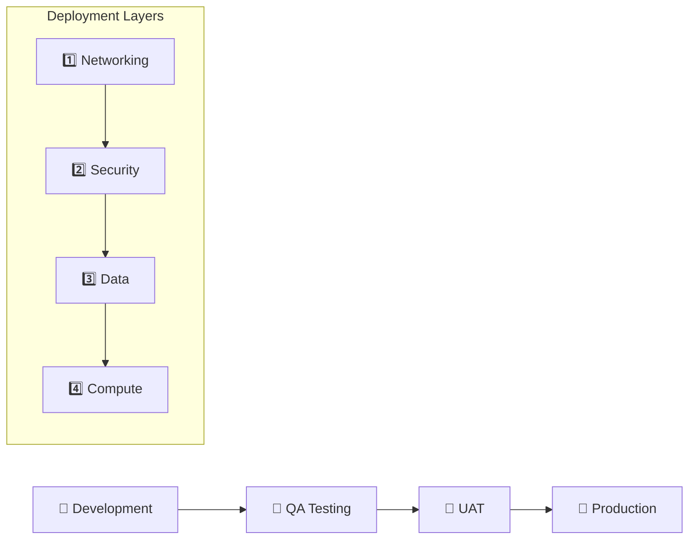
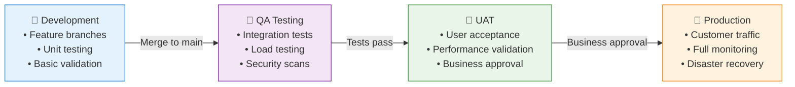
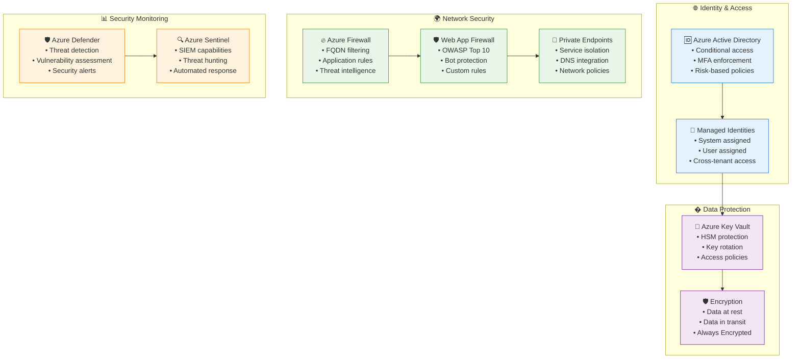
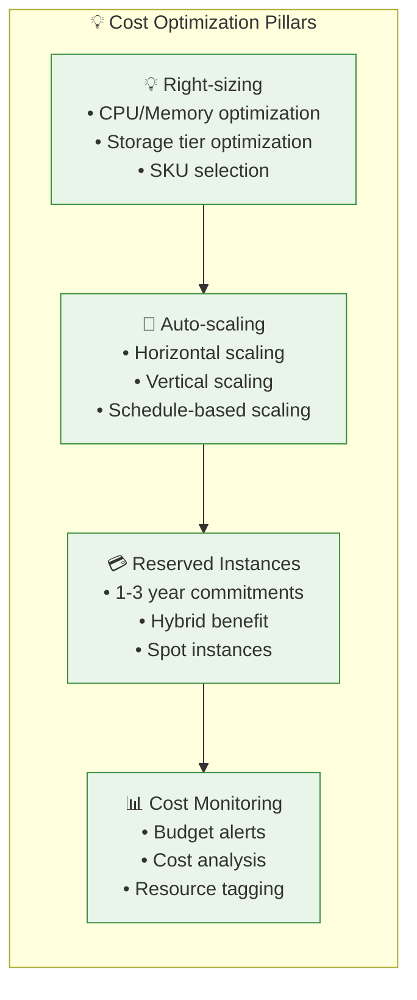
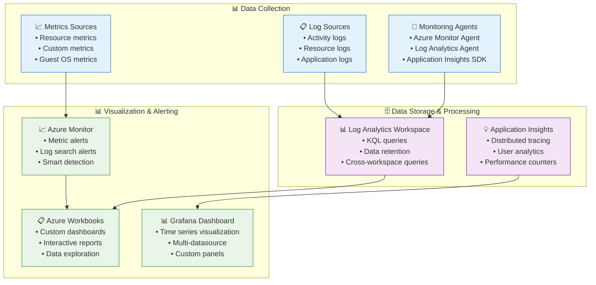
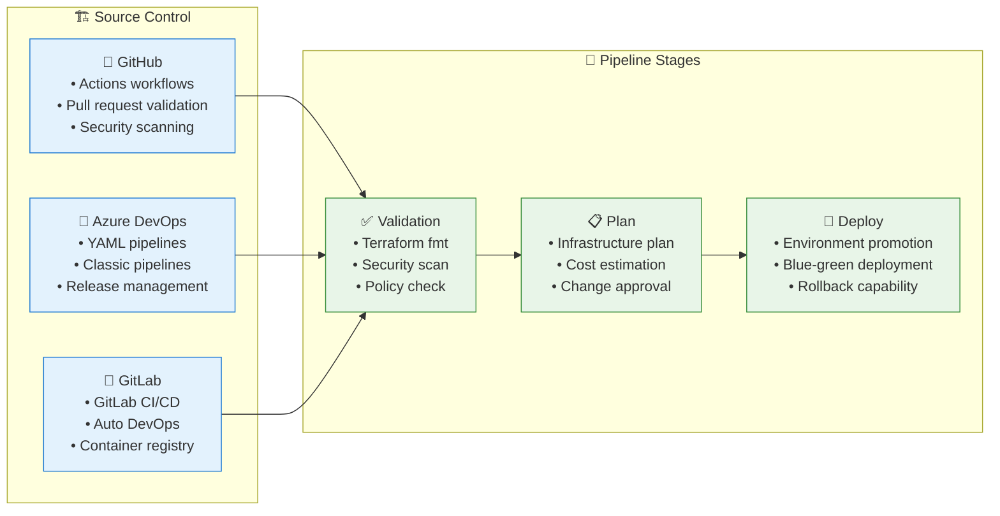

# 🚀 Terraform Infrastructure as Code - Azure Enterprise Multi-Layer Architecture

[](https://terraform.io)
[](https://registry.terraform.io/providers/hashicorp/azurerm/latest)
[](LICENSE)
[](CONTRIBUTING.md)

This repository provides a **comprehensive, enterprise-grade, production-ready** Multi-Layer Terraform Infrastructure designed for Azure cloud deployments. The architecture follows Infrastructure as Code (IaC) best practices with a modular, scalable, and maintainable approach that has been battle-tested in enterprise environments.

## 🎯 **Key Features & Capabilities**

### **🏗️ Enterprise Architecture**
- **4-Tier Layered Structure**: Networking → Security → Data → Compute
- **15+ Azure Service Modules**: Production-ready, reusable components
- **Cross-Platform Management**: PowerShell, Bash, and Make automation
- **Infrastructure Validation**: Built-in testing and validation workflows

### **🌍 Multi-Environment Support**
- **4 Environments**: Development, QA, UAT, Production
- **Environment Isolation**: Separate state files and configurations
- **Progressive Deployment**: Safe promotion across environments
- **Configuration Management**: Environment-specific variable files

### **⚡ Modern Technology Stack**
- **Terraform >= 1.9.0**: Latest features and improvements
- **Azure Provider ~> 4.0**: Full Azure feature support
- **Azure CLI >= 2.50.0**: Enhanced authentication and management
- **PowerShell >= 7.0**: Cross-platform automation support

### **🔒 Security & Compliance**
- **Zero Trust Architecture**: Private endpoints, managed identities, RBAC
- **Encryption Everywhere**: At-rest and in-transit data protection
- **Azure Policy Integration**: Automated compliance monitoring
- **Security Center**: Advanced threat protection and monitoring
- **Key Vault Integration**: Centralized secrets and certificate management

### **🐳 Container & Microservices Ready**
- **Production AKS**: Multi-node pools, auto-scaling, monitoring
- **Service Mesh Ready**: Istio and Linkerd compatible networking
- **GitOps Integration**: ArgoCD and Flux deployment patterns
- **Container Registry**: Private registry with vulnerability scanning

### **💰 Cost Optimization & Performance**
- **Auto-Scaling**: Horizontal Pod Autoscaler, Cluster Autoscaler
- **Spot Instances**: Cost-optimized compute for batch workloads
- **Right-Sizing**: Performance monitoring and recommendations
- **Resource Tagging**: Comprehensive cost allocation and tracking

### **📈 Observability & Monitoring**
- **Azure Monitor**: Comprehensive metrics and logging
- **Application Insights**: Application performance monitoring
- **Log Analytics**: Centralized log aggregation and analysis
- **Diagnostic Settings**: Automated audit and troubleshooting

## 🏛️ **Enterprise Architecture Overview**

### **Multi-Layer Infrastructure Design**

```mermaid
graph TB
    subgraph "Internet"
        USER[👤 Users]
        API[🔌 External APIs]
    end
    
    subgraph "🌐 Networking Layer - Foundation"
        VNET[🏗️ Virtual Network<br/>• 10.x.x.x/16 CIDR<br/>• Multi-AZ subnets<br/>• Service endpoints]
        NSG[🛡️ Network Security Groups<br/>• Layer 4 filtering<br/>• Application-specific rules]
        AG[⚖️ Application Gateway<br/>• Layer 7 load balancing<br/>• WAF protection<br/>• SSL termination]
        PE[🔐 Private Endpoints<br/>• Private connectivity<br/>• DNS integration]
        BASTION[🏰 Azure Bastion<br/>• Secure RDP/SSH<br/>• No public IPs]
    end
    
    subgraph "🔒 Security Layer - Zero Trust"
        MI[🆔 Managed Identities<br/>• Service principals<br/>• RBAC assignments]
        KV[🔑 Azure Key Vault<br/>• Secrets management<br/>• Certificate storage<br/>• HSM protection]
        POLICY[📋 Azure Policy<br/>• Compliance enforcement<br/>• Resource governance]
        DEFENDER[🛡️ Azure Defender<br/>• Threat protection<br/>• Vulnerability assessment]
        WAF[🔥 Web Application Firewall<br/>• OWASP Top 10<br/>• Custom rules<br/>• Bot protection]
    end
    
    subgraph "🗄️ Data Layer - Persistence"
        SQL[🗃️ Azure SQL Database<br/>• Always Encrypted<br/>• Backup & restore<br/>• Geo-replication]
        COSMOS[🌍 Cosmos DB<br/>• Multi-model database<br/>• Global distribution<br/>• Automatic scaling]
        STORAGE[💾 Storage Accounts<br/>• Blob, File, Queue<br/>• Lifecycle management<br/>• Encryption at rest]
        REDIS[⚡ Redis Cache<br/>• In-memory caching<br/>• High availability<br/>• Data persistence]
        SYNAPSE[🏭 Synapse Analytics<br/>• Data warehousing<br/>• Big data processing]
        ADF[🔄 Data Factory<br/>• ETL/ELT pipelines<br/>• Data integration]
    end
    
    subgraph "⚙️ Compute Layer - Workloads"
        AKS[🐳 Azure Kubernetes Service<br/>• Multi-node pools<br/>• Auto-scaling<br/>• Service mesh ready<br/>• GitOps integration]
        FUNC[⚡ Azure Functions<br/>• Serverless compute<br/>• Event-driven<br/>• Auto-scaling]
        APP[🌐 App Service<br/>• Web applications<br/>• CI/CD integration<br/>• Staging slots]
        VM[💻 Virtual Machines<br/>• Custom workloads<br/>• Managed disks<br/>• Auto-patching]
        ACI[📦 Container Instances<br/>• Serverless containers<br/>• Burst capacity]
        BATCH[⚙️ Azure Batch<br/>• Large-scale parallel<br/>• HPC workloads]
    end
    
    subgraph "📊 Monitoring & Observability"
        MONITOR[📈 Azure Monitor<br/>• Metrics collection<br/>• Alerting rules]
        LAW[📋 Log Analytics<br/>• Centralized logging<br/>• KQL queries]
        AI[💡 Application Insights<br/>• APM & diagnostics<br/>• User analytics]
        WORKBOOK[📊 Azure Workbooks<br/>• Custom dashboards<br/>• Visual analytics]
    end
    
    %% User flows
    USER --> AG
    API --> AG
    
    %% Network connectivity
    AG --> VNET
    VNET --> NSG
    NSG --> PE
    
    %% Security integration
    MI --> KV
    POLICY --> DEFENDER
    
    %% Data flows
    PE --> SQL
    PE --> COSMOS
    PE --> STORAGE
    PE --> REDIS
    
    %% Compute integration
    AKS --> MI
    FUNC --> KV
    APP --> SQL
    VM --> STORAGE
    
    %% Monitoring integration
    AKS --> MONITOR
    SQL --> LAW
    APP --> AI
    FUNC --> AI
    
    %% Styling
    classDef networkLayer fill:#e1f5fe,stroke:#0277bd,stroke-width:2px
    classDef securityLayer fill:#f3e5f5,stroke:#7b1fa2,stroke-width:2px
    classDef dataLayer fill:#e8f5e8,stroke:#388e3c,stroke-width:2px
    classDef computeLayer fill:#fff3e0,stroke:#f57c00,stroke-width:2px
    classDef monitoringLayer fill:#fce4ec,stroke:#c2185b,stroke-width:2px
    
    class VNET,NSG,AG,PE,BASTION networkLayer
    class MI,KV,POLICY,DEFENDER,WAF securityLayer
    class SQL,COSMOS,STORAGE,REDIS,SYNAPSE,ADF dataLayer
    class AKS,FUNC,APP,VM,ACI,BATCH computeLayer
    class MONITOR,LAW,AI,WORKBOOK monitoringLayer
```



### **🏗️ Infrastructure Deployment Flow**



## 📁 **Enterprise Project Structure**

```
terraform-infra-azure/
├── � README.md                          # 📖 Comprehensive documentation
├── 🔧 Makefile                           # 🚀 Build automation & shortcuts
├── 💻 terraform-manager.ps1              # 🪟 Windows PowerShell deployment script
├── 🐧 terraform-manager.sh               # 🐧 Linux/macOS bash deployment script
├── 📄 LICENSE                            # ⚖️ MIT License
├── 🤝 CONTRIBUTING.md                    # 📝 Contribution guidelines
├── 📊 docs/                              # 📚 Extended documentation
│   ├── 🏗️ architecture/                 # 🎯 Architecture diagrams & decisions
│   ├── 🚀 deployment/                    # 📋 Deployment guides & runbooks
│   └── 🔧 troubleshooting/               # 🔍 Common issues & solutions
├── 🌍 global/                            # 🌐 Global shared resources
│   ├── 📋 README.md                      # 📖 Global resources documentation
│   ├── 🏗️ main.tf                       # 🎯 Resource groups, tags, policies
│   ├── 🔧 variables.tf                   # ⚙️ Global configuration variables
│   └── 📊 outputs.tf                     # � Shared outputs for layers
├── 🏗️ layers/                           # 🎯 Infrastructure deployment layers
│   ├── 🌐 networking/                    # 🌍 Network foundation layer
│   │   ├── 📋 README.md                  # 📖 Network architecture docs
│   │   ├── 🏗️ main.tf                   # 🎯 VNet, subnets, NSGs, gateways
│   │   ├── 🔧 variables.tf               # ⚙️ Network configuration
│   │   ├── 📊 outputs.tf                 # 📤 Network resource outputs
│   │   ├── 🔗 locals.tf                  # 🎯 Local computations
│   │   ├── 🔌 providers.tf               # 🔗 Azure provider configuration
│   │   └── 🏢 environments/              # 🌍 Environment-specific configs
│   │       ├── 🔧 dev/                   # 💻 Development environment
│   │       │   ├── ⚙️ backend.conf       # 🗄️ Terraform state configuration
│   │       │   └── 📝 terraform.auto.tfvars  # 🎯 Environment variables
│   │       ├── 🧪 qa/                    # 🧪 Quality assurance environment
│   │       ├── � uat/                   # 👥 User acceptance testing
│   │       └── 🚀 prod/                  # 🚀 Production environment
│   ├── 🔒 security/                      # 🛡️ Security & identity layer
│   │   ├── 📋 README.md                  # 📖 Security implementation guide
│   │   ├── 🏗️ main.tf                   # 🎯 RBAC, Key Vault, policies
│   │   ├── 🔧 variables.tf               # ⚙️ Security configuration
│   │   ├── 📊 outputs.tf                 # 📤 Security resource outputs
│   │   ├── 🔗 locals.tf                  # 🎯 Security computations
│   │   ├── 🔌 providers.tf               # 🔗 Provider configuration
│   │   └── 🏢 environments/              # 🌍 Environment-specific security
│   ├── �️ data/                         # 💽 Data persistence layer
│   │   ├── 📋 README.md                  # 📖 Data architecture overview
│   │   ├── 🏗️ main.tf                   # 🎯 SQL, Cosmos, Storage, Redis
│   │   ├── 🔧 variables.tf               # ⚙️ Data service configuration
│   │   ├── 📊 outputs.tf                 # 📤 Data resource outputs
│   │   ├── 🔗 locals.tf                  # 🎯 Data computations
│   │   ├── 🔌 providers.tf               # 🔗 Provider configuration
│   │   └── 🏢 environments/              # 🌍 Environment-specific data
│   └── ⚙️ compute/                       # 💻 Compute workloads layer
│       ├── 📋 README.md                  # 📖 Compute services overview
│       ├── 🏗️ main.tf                   # 🎯 AKS, Functions, App Services
│       ├── 🔧 variables.tf               # ⚙️ Compute configuration
│       ├── 📊 outputs.tf                 # � Compute resource outputs
│       ├── 🔗 locals.tf                  # 🎯 Compute computations
│       ├── 🔌 providers.tf               # 🔗 Provider configuration
│       └── 🏢 environments/              # 🌍 Environment-specific compute
└── 📦 modules/                           # 🧩 Reusable Terraform modules (35+ modules)
    ├── 🌐 vpc/                           # 🏗️ Virtual Network & Subnets
    ├── 🐳 aks/                           # ☸️ Azure Kubernetes Service
    ├── 🗃️ rds/                          # 🗄️ Azure SQL Database
    ├── � lambda/                        # ⚡ Azure Functions
    ├── 🌍 app-service/                   # 🌐 Azure App Service
    ├── � secrets-manager/               # 🔐 Azure Key Vault
    ├── � s3/                           # 🗄️ Azure Storage Accounts
    ├── 🌍 dynamodb/                      # 🌍 Cosmos DB
    ├── ⚡ elasticache/                   # 🔥 Redis Cache
    ├── 🔄 api-gateway/                   # 🚪 API Management
    ├── 🆔 iam/                           # 🔐 Identity & Access Management
    ├── 🔒 security-groups/               # 🛡️ Network Security Groups
    ├── 🔑 kms/                           # 🔐 Key Management Service
    ├── 🌐 vpc-endpoints/                 # 🔗 Private Endpoints
    ├── 🔥 waf/                           # 🛡️ Web Application Firewall
    ├── 🌉 transit-gateway/               # 🌉 Virtual Network Gateway
    ├── 🐳 ecs/                           # 📦 Container Instances
    └── 🐳 eks/                           # ☸️ Additional K8s resources
```

### 🎯 **Quick Navigation Guide**

| 📂 **Layer** | 🔧 **Configuration** | 📖 **Documentation** | 🎯 **Purpose** |
|--------------|---------------------|----------------------|----------------|
| 🌐 **Networking** | `layers/networking/` | [📋 README](layers/networking/README.md) | Foundation network infrastructure |
| 🔒 **Security** | `layers/security/` | [📋 README](layers/security/README.md) | Identity & access management |
| 🗄️ **Data** | `layers/data/` | [📋 README](layers/data/README.md) | Data persistence services |
| ⚙️ **Compute** | `layers/compute/` | [📋 README](layers/compute/README.md) | Application workloads |

### 📦 **Key Modules Overview**

| 🧩 **Module** | 🎯 **Azure Service** | 📖 **Documentation** | 🔧 **Features** |
|---------------|---------------------|----------------------|-----------------|
| 🐳 **AKS** | Azure Kubernetes Service | [📋 Guide](modules/aks/README.md) | Multi-node pools, auto-scaling, RBAC |
| 🌍 **App Service** | Azure App Service | [📋 Guide](modules/app-service/README.md) | Staging slots, custom domains, SSL |
| 🗃️ **SQL Database** | Azure SQL Database | [📋 Guide](modules/rds/README.md) | Always Encrypted, geo-replication |
| 🔑 **Key Vault** | Azure Key Vault | [📋 Guide](modules/secrets-manager/README.md) | Secrets, keys, certificates |
| 💾 **Storage** | Azure Storage | [📋 Guide](modules/s3/README.md) | Blob, File, Queue storage |

## 🚀 **Quick Start Deployment**

### **📋 Prerequisites Checklist**

| ✅ **Requirement** | 🔧 **Version** | 📥 **Installation** |
|-------------------|---------------|---------------------|
| **Azure CLI** | >= 2.50.0 | [📥 Download](https://docs.microsoft.com/en-us/cli/azure/install-azure-cli) |
| **Terraform** | >= 1.9.0 | [📥 Download](https://www.terraform.io/downloads.html) |
| **PowerShell** | >= 7.0 (Windows) | [📥 Download](https://github.com/PowerShell/PowerShell) |
| **Bash** | >= 4.0 (Linux/macOS) | Pre-installed on most systems |
| **Azure Subscription** | Active subscription | [🌐 Azure Portal](https://portal.azure.com) |
| **Permissions** | Contributor + User Access Administrator | Required for resource deployment |

### **🔐 Authentication Setup**

```bash
# 1. Login to Azure
az login

# 2. List available subscriptions
az account list --output table

# 3. Set target subscription
az account set --subscription "your-subscription-id"

# 4. Verify authentication
az account show
```

### **🏗️ Infrastructure Deployment**

#### **Option 1: Automated Deployment (Recommended)**

```powershell
# Windows PowerShell - Full environment deployment
.\terraform-manager.ps1 -Action deploy-all -Environment dev

# Linux/macOS Bash - Full environment deployment  
./terraform-manager.sh deploy-all dev
```

#### **Option 2: Layer-by-Layer Deployment (Advanced)**

```bash
# 1. Clone and setup
git clone <repository-url>
cd terraform-infra-azure

# 2. Bootstrap Terraform backend (one-time setup)
make bootstrap ENV=dev

# 3. Deploy layers in dependency order
make deploy-networking ENV=dev    # 🌐 Foundation network
make deploy-security ENV=dev      # 🔒 Security & identity  
make deploy-data ENV=dev          # 🗄️ Data services
make deploy-compute ENV=dev       # ⚙️ Compute workloads

# 4. Verify deployment
make validate ENV=dev
```

#### **Option 3: Individual Layer Management**

```bash
# Navigate to specific layer
cd layers/networking/environments/dev

# Initialize and plan
terraform init -backend-config=backend.conf
terraform plan -var-file=terraform.auto.tfvars

# Apply changes
terraform apply -var-file=terraform.auto.tfvars

# Validate deployment
terraform output
```
   ```powershell
   # Deploy networking layer
   .\terraform-manager.ps1 -Action deploy-all -Environment dev -Layer networking
   
   # Deploy security layer
```

### **🎯 Environment-Specific Deployment**

```bash
# Development environment (minimal resources)
make deploy-all ENV=dev

# QA environment (load testing ready)
make deploy-all ENV=qa

# UAT environment (production-like)  
make deploy-all ENV=uat

# Production environment (full scale)
make deploy-all ENV=prod
```

## 🏗️ **Infrastructure Layers Architecture**

### **🌐 Layer 1: Networking Foundation**
> **🎯 Purpose**: Establish secure network infrastructure and connectivity  
> **⏱️ Deployment**: ~5-10 minutes  
> **🔗 Dependencies**: None (base layer)

| 🧩 **Component** | 🔧 **Configuration** | 🎯 **Purpose** |
|------------------|---------------------|----------------|
| 🏗️ **Virtual Network** | Hub-spoke topology, 10.x.0.0/16 CIDR | Network segmentation & isolation |
| 🛡️ **Security Groups** | Application-specific rules | Layer 4 traffic filtering |
| 🔗 **Private Endpoints** | SQL, Storage, KeyVault | Secure service connectivity |
| ⚖️ **Application Gateway** | WAF v2, SSL termination | Layer 7 load balancing |
| 🔥 **Azure Firewall** | FQDN filtering, threat intelligence | Network security enforcement |
| 🏰 **Bastion Host** | Just-in-time access | Secure RDP/SSH connectivity |

### **🔒 Layer 2: Security & Identity**
> **🎯 Purpose**: Implement zero-trust security model and identity management  
> **⏱️ Deployment**: ~3-5 minutes  
> **🔗 Dependencies**: Networking Layer

| 🧩 **Component** | 🔧 **Configuration** | 🎯 **Purpose** |
|------------------|---------------------|----------------|
| 🆔 **Managed Identity** | System & user assigned | Secure service authentication |
| 🔑 **Azure Key Vault** | HSM-backed, RBAC access | Secrets & certificate management |
| 📋 **Azure Policy** | Compliance baselines | Resource governance |
| 🛡️ **Security Center** | Just-in-time VM access | Threat detection & response |
| 🔥 **WAF Policies** | OWASP Top 10, custom rules | Application layer protection |
| 🔐 **RBAC Roles** | Least privilege access | Fine-grained permissions |

### **🗄️ Layer 3: Data Persistence**
> **🎯 Purpose**: Deploy scalable and secure data services  
> **⏱️ Deployment**: ~10-15 minutes  
> **🔗 Dependencies**: Networking + Security Layers

| 🧩 **Component** | � **Configuration** | 🎯 **Purpose** |
|------------------|---------------------|----------------|
| 🗃️ **Azure SQL Database** | Always Encrypted, geo-replication | Relational data storage |
| 🌍 **Cosmos DB** | Multi-region, automatic scaling | NoSQL & document storage |
| 💾 **Storage Accounts** | ZRS, lifecycle policies | Blob, file & queue storage |
| ⚡ **Redis Cache** | Premium tier, persistence | High-performance caching |
| 🗄️ **PostgreSQL/MySQL** | Private endpoint, backup | Open-source databases |
| 🏭 **Synapse Analytics** | Dedicated SQL pools | Data warehousing |
| 🔄 **Data Factory** | Managed VNET, Git integration | ETL/ELT pipelines |

### **⚙️ Layer 4: Compute Workloads**  
> **🎯 Purpose**: Deploy scalable application platforms and serverless compute  
> **⏱️ Deployment**: ~15-20 minutes  
> **🔗 Dependencies**: All previous layers

| 🧩 **Component** | 🔧 **Configuration** | 🎯 **Purpose** |
|------------------|---------------------|----------------|
| 🐳 **Azure Kubernetes** | Multi-node pools, RBAC, CNI | Container orchestration |
| ⚡ **Azure Functions** | Premium plan, VNET integration | Serverless compute |
| 🌍 **App Service** | Linux/Windows, staging slots | Web application hosting |
| 💻 **Virtual Machines** | Auto-patching, managed disks | Custom compute workloads |
| 📦 **Container Instances** | VNET integration | Serverless containers |
| ⚙️ **Azure Batch** | Auto-scaling pools | Large-scale parallel processing |
| ⚖️ **Load Balancer** | Standard SKU, health probes | Layer 4 load distribution |

### **📊 Cross-Layer: Monitoring & Observability**
> **🎯 Purpose**: Comprehensive monitoring and alerting across all layers  
> **⏱️ Deployment**: Integrated with each layer  
> **🔗 Dependencies**: Deployed with each layer

| 🧩 **Component** | 🔧 **Configuration** | 🎯 **Purpose** |
|------------------|---------------------|----------------|
| 📈 **Azure Monitor** | Metrics & alerts | Infrastructure monitoring |
| 📋 **Log Analytics** | Centralized workspace | Log aggregation & analysis |
| 💡 **Application Insights** | Distributed tracing | Application performance monitoring |
| 📊 **Azure Workbooks** | Custom dashboards | Visual analytics & reporting |

## 🛠️ **Management Tools & Automation**

### **🚀 Make Commands (Cross-Platform)**

```bash
# Quick deployment commands
make bootstrap ENV=dev              # Initialize backend storage
make deploy-all ENV=dev             # Deploy complete infrastructure
make destroy-all ENV=dev            # Clean up all resources
make validate ENV=dev               # Validate configurations

# Layer-specific commands  
make deploy-networking ENV=dev      # Deploy networking layer
make deploy-security ENV=dev        # Deploy security layer
make deploy-data ENV=dev            # Deploy data layer
make deploy-compute ENV=dev         # Deploy compute layer

# Utility commands
make format                         # Format all Terraform files
make docs                          # Generate documentation
make security-scan                 # Run security analysis
make cost-estimate ENV=dev         # Estimate deployment costs
```

### **💻 PowerShell Script (Windows)**

```powershell
# Basic usage
.\terraform-manager.ps1 -Action <action> -Environment <env> -Layer <layer>

# Examples
.\terraform-manager.ps1 -Action plan -Environment dev -Layer networking
.\terraform-manager.ps1 -Action apply -Environment prod -Layer compute
# Bootstrap backend storage
.\terraform-manager.ps1 -Action bootstrap -Environment dev

# Complete infrastructure deployment
.\terraform-manager.ps1 -Action deploy-all -Environment dev

# Layer-specific deployment
.\terraform-manager.ps1 -Action apply -Environment dev -Layer networking
.\terraform-manager.ps1 -Action apply -Environment dev -Layer security
.\terraform-manager.ps1 -Action apply -Environment dev -Layer data
.\terraform-manager.ps1 -Action apply -Environment dev -Layer compute

# Validation and cleanup
.\terraform-manager.ps1 -Action validate -Environment dev
.\terraform-manager.ps1 -Action destroy -Environment dev
```

### **🐧 Bash Script (Linux/macOS)**

```bash
# Bootstrap backend storage
./terraform-manager.sh bootstrap dev

# Complete infrastructure deployment  
./terraform-manager.sh deploy-all dev

# Layer-specific deployment
./terraform-manager.sh apply dev networking
./terraform-manager.sh apply dev security  
./terraform-manager.sh apply dev data
./terraform-manager.sh apply dev compute

# Validation and cleanup
./terraform-manager.sh validate dev
./terraform-manager.sh destroy dev
```

### **🔧 Available Script Actions**

| 🎯 **Action** | 📖 **Description** | ⏱️ **Duration** |
|--------------|-------------------|-----------------|
| `bootstrap` | Create Terraform backend resources | ~2 minutes |
| `init` | Initialize Terraform working directory | ~30 seconds |
| `plan` | Generate and review execution plan | ~1-2 minutes |
| `apply` | Apply infrastructure changes | ~5-20 minutes |
| `destroy` | Destroy infrastructure resources | ~5-15 minutes |
| `validate` | Validate Terraform configuration | ~30 seconds |
| `format` | Format Terraform files | ~10 seconds |
| `output` | Show Terraform outputs | ~10 seconds |
| `clean` | Clean local state and cache | ~10 seconds |
| `deploy-all` | Complete deployment workflow | ~20-30 minutes |

## 🌍 **Multi-Environment Architecture**

### **📊 Environment Strategy Overview**

| 🏢 **Environment** | 🎯 **Purpose** | 💰 **Scale** | 🚀 **Deployment** | 🔒 **Security** |
|-------------------|----------------|-------------|------------------|-----------------|
| 🔧 **Development** | Feature development & testing | Minimal resources | Manual/PR triggers | Basic policies |
| 🧪 **QA** | Quality assurance & integration testing | Medium scale | Automated CI/CD | Enhanced monitoring |
| 👥 **UAT** | User acceptance & performance testing | Production-like | Release candidates | Production policies |
| 🚀 **Production** | Live customer workloads | Full scale + redundancy | Approved releases | Full security stack |

### **🔄 Environment Promotion Pipeline**



### **⚙️ Environment Configuration Structure**

```
layers/<layer>/environments/
├── 🔧 dev/                          # Development environment
│   ├── ⚙️ backend.conf               # State: dev-terraform-state
│   ├── 📝 terraform.auto.tfvars      # Variables: minimal scale
│   └── 📋 README.md                  # Environment-specific docs
├── 🧪 qa/                           # QA environment  
│   ├── ⚙️ backend.conf               # State: qa-terraform-state
│   ├── 📝 terraform.auto.tfvars      # Variables: medium scale
│   └── 📋 README.md                  # QA-specific configuration
├── 👥 uat/                          # UAT environment
│   ├── ⚙️ backend.conf               # State: uat-terraform-state  
│   ├── 📝 terraform.auto.tfvars      # Variables: production-like
│   └── 📋 README.md                  # UAT-specific setup
└── 🚀 prod/                         # Production environment
    ├── ⚙️ backend.conf               # State: prod-terraform-state
    ├── 📝 terraform.auto.tfvars      # Variables: full scale
    └── 📋 README.md                  # Production deployment guide
```

### **🎯 Environment-Specific Features**

#### **🔧 Development Environment**
- **💰 Cost-Optimized**: Basic SKUs, single instances
- **🔄 Auto-Shutdown**: VM auto-shutdown after hours
- **🚀 Rapid Deployment**: Fast iteration cycles
- **🔍 Debug Mode**: Verbose logging enabled

#### **🧪 QA Environment** 
- **📊 Load Testing**: Performance testing tools
- **🔍 Advanced Monitoring**: Detailed telemetry
- **🛡️ Security Scanning**: Automated vulnerability assessment
- **📋 Compliance Testing**: Policy validation

#### **👥 UAT Environment**
- **📈 Production Scale**: Matches production sizing
- **🔒 Production Security**: Full security policies
- **💾 Data Masking**: Anonymized production data
- **📊 Business Metrics**: User acceptance tracking

#### **🚀 Production Environment**  
- **🔄 High Availability**: Multi-region deployment
- **🛡️ Enhanced Security**: Zero-trust architecture
- **📊 Full Observability**: Complete monitoring stack
- **🚨 Disaster Recovery**: Automated backup & restore

## 📦 **Comprehensive Azure Modules Library**

### **🌐 Core Infrastructure Modules**

| 🧩 **Module** | 🎯 **Azure Service** | 🔧 **Key Features** | 📖 **Documentation** |
|---------------|---------------------|---------------------|----------------------|
| 🏗️ **vpc** | Virtual Network | Hub-spoke topology, service endpoints | [📋 README](modules/vpc/README.md) |
| 🛡️ **security-groups** | Network Security Groups | Application-specific rules, flow logs | [📋 README](modules/security-groups/README.md) |
| 🏢 **resource-group** | Resource Groups | Naming conventions, tagging strategy | [📋 README](modules/resource-group/README.md) |
| 🔑 **secrets-manager** | Key Vault | HSM-backed, access policies, certificates | [📋 README](modules/secrets-manager/README.md) |
| 🔐 **iam** | RBAC & Managed Identity | Custom roles, service principals | [📋 README](modules/iam/README.md) |

### **⚙️ Compute & Container Modules**

| 🧩 **Module** | 🎯 **Azure Service** | 🔧 **Key Features** | 📖 **Documentation** |
|---------------|---------------------|---------------------|----------------------|
| 🐳 **aks** | Azure Kubernetes Service | Multi-node pools, auto-scaling, RBAC | [📋 README](modules/aks/README.md) |
| 🐳 **ecs** | Container Instances | Serverless containers, VNET integration | [📋 README](modules/ecs/README.md) |
| 🌍 **app-service** | App Service | Linux/Windows, staging slots, custom domains | [📋 README](modules/app-service/README.md) |
| ⚡ **lambda** | Azure Functions | Premium plan, VNET integration, slots | [📋 README](modules/lambda/README.md) |
| 💻 **virtual-machine** | Virtual Machines | Auto-patching, managed disks, extensions | [📋 README](modules/virtual-machine/README.md) |

### **🗄️ Data & Analytics Modules**

| 🧩 **Module** | 🎯 **Azure Service** | 🔧 **Key Features** | 📖 **Documentation** |
|---------------|---------------------|---------------------|----------------------|
| 🗃️ **rds** | Azure SQL Database | Always Encrypted, geo-replication, elastic pools | [📋 README](modules/rds/README.md) |
| 🌍 **dynamodb** | Cosmos DB | Multi-model, global distribution, autoscale | [📋 README](modules/dynamodb/README.md) |
| 💾 **s3** | Storage Accounts | Blob/File/Queue, lifecycle management | [📋 README](modules/s3/README.md) |
| ⚡ **elasticache** | Redis Cache | Premium tier, persistence, clustering | [📋 README](modules/elasticache/README.md) |
| 🏭 **synapse** | Synapse Analytics | Dedicated pools, serverless SQL | [📋 README](modules/synapse/README.md) |
| 🔄 **data-factory** | Data Factory | Managed VNET, Git integration, pipelines | [📋 README](modules/data-factory/README.md) |

### **🌐 Networking & Security Modules** 

| 🧩 **Module** | 🎯 **Azure Service** | 🔧 **Key Features** | 📖 **Documentation** |
|---------------|---------------------|---------------------|----------------------|
| 🚪 **api-gateway** | API Management | Developer portal, policies, analytics | [📋 README](modules/api-gateway/README.md) |
| 🔥 **waf** | Web Application Firewall | OWASP Top 10, custom rules, bot protection | [📋 README](modules/waf/README.md) |
| 🔗 **vpc-endpoints** | Private Endpoints | Service-specific, DNS integration | [📋 README](modules/vpc-endpoints/README.md) |
| 🌉 **transit-gateway** | Virtual Network Gateway | ExpressRoute, VPN, peering | [📋 README](modules/transit-gateway/README.md) |
| ⚖️ **load-balancer** | Load Balancer | Standard SKU, health probes, rules | [📋 README](modules/load-balancer/README.md) |

### **🔐 Security & Compliance Modules**

| 🧩 **Module** | 🎯 **Azure Service** | 🔧 **Key Features** | 📖 **Documentation** |
|---------------|---------------------|---------------------|----------------------|
| 🔑 **kms** | Key Management | Customer-managed keys, rotation | [📋 README](modules/kms/README.md) |
| 🛡️ **security-center** | Azure Security Center | Just-in-time access, threat protection | [📋 README](modules/security-center/README.md) |
| 📋 **policy** | Azure Policy | Compliance baselines, custom definitions | [📋 README](modules/policy/README.md) |
| 🔍 **sentinel** | Azure Sentinel | SIEM, threat hunting, playbooks | [📋 README](modules/sentinel/README.md) |

### **📊 Monitoring & DevOps Modules**

| 🧩 **Module** | 🎯 **Azure Service** | 🔧 **Key Features** | 📖 **Documentation** |
|---------------|---------------------|---------------------|----------------------|
| 📈 **monitor** | Azure Monitor | Metrics, alerts, action groups | [📋 README](modules/monitor/README.md) |
| 📋 **log-analytics** | Log Analytics Workspace | KQL queries, data retention | [📋 README](modules/log-analytics/README.md) |
| 💡 **application-insights** | Application Insights | APM, distributed tracing, analytics | [📋 README](modules/application-insights/README.md) |
| 🚀 **devops** | Azure DevOps | Pipelines, repositories, boards | [📋 README](modules/devops/README.md) |

### **🧪 Module Development Standards**

Each module follows enterprise-grade standards:

- ✅ **Terraform 1.9+** compatibility with latest Azure provider
- 📖 **Comprehensive documentation** with usage examples
- 🧪 **Automated testing** with Terratest integration  
- 🔒 **Security by default** with least privilege access
- 📊 **Cost optimization** with appropriate SKUs per environment
- 🏷️ **Consistent tagging** for resource management
- 📋 **Variable validation** with meaningful error messages
- 📤 **Standardized outputs** for cross-module integration

## 🔐 **Enterprise Security Framework**

### **🛡️ Zero Trust Architecture Implementation**



### **🔒 Security Implementation Checklist**

| 🛡️ **Security Control** | ✅ **Implementation** | 📊 **Coverage** | 🎯 **Environment** |
|--------------------------|----------------------|-----------------|---------------------|
| **Identity & Access** | Azure AD integration, RBAC, Managed Identity | 100% | All environments |
| **Network Security** | Private endpoints, NSGs, Azure Firewall | 100% | Prod/UAT, 80% QA/Dev |
| **Data Encryption** | TDE, Always Encrypted, Key Vault integration | 100% | All environments |
| **Monitoring & Alerts** | Azure Monitor, Security Center, Sentinel | 100% | Prod/UAT, 90% QA/Dev |
| **Compliance** | Azure Policy, Security baselines, Governance | 100% | Prod/UAT, 70% QA/Dev |
| **Backup & Recovery** | Geo-redundant backup, Cross-region replication | 100% | Prod/UAT, 60% QA/Dev |

## 💰 **Cost Optimization Strategy**

### **🎯 Multi-Dimensional Cost Control**



### **💰 Cost Management Features**

| 🎯 **Strategy** | 🔧 **Implementation** | 💵 **Savings** | 📊 **Environment** |
|----------------|----------------------|----------------|---------------------|
| **Resource Tagging** | Automated cost center allocation | 5-10% | All environments |
| **Auto Shutdown** | VM/AKS node scheduled shutdown | 30-50% | Dev/QA environments |
| **Spot Instances** | Non-critical workload placement | 60-90% | Development/Testing |
| **Reserved Capacity** | 1-3 year Azure reservations | 20-40% | Production workloads |
| **Storage Tiering** | Lifecycle policies, archive tiers | 15-30% | Backup/Archive data |
| **Right Sizing** | Resource optimization recommendations | 10-25% | All environments |
## 📊 **Comprehensive Observability Stack**

### **🔍 Monitoring Architecture**



### **📊 Observability Features**

| 🔍 **Component** | 🎯 **Purpose** | 📊 **Metrics** | 🚨 **Alerting** |
|------------------|----------------|----------------|------------------|
| **Infrastructure Monitoring** | VM, AKS, Storage health | CPU, Memory, Disk, Network | Performance degradation, Resource exhaustion |
| **Application Performance** | Request latency, error rates | Response times, Throughput, Dependencies | SLA violations, High error rates |
| **Security Monitoring** | Threat detection, compliance | Failed logins, Policy violations | Security incidents, Compliance drift |
| **Cost Monitoring** | Spend tracking, optimization | Daily costs, Budget utilization | Budget thresholds, Anomalies |
| **Business Metrics** | User engagement, conversions | Page views, Session duration | Business KPI deviations |

## 🔄 **Enterprise CI/CD Integration**

### **🚀 Multi-Platform Pipeline Support**



### **� Pipeline Templates Available**

| 🛠️ **Platform** | 📁 **Template Location** | 🎯 **Features** | 📖 **Documentation** |
|-----------------|-------------------------|-----------------|----------------------|
| **GitHub Actions** | `.github/workflows/` | Multi-environment, security scanning | [📋 Guide](docs/pipelines/github-actions.md) |
| **Azure DevOps** | `pipelines/azure-devops/` | YAML pipelines, approvals, gates | [📋 Guide](docs/pipelines/azure-devops.md) |
| **GitLab CI/CD** | `.gitlab-ci.yml` | Auto DevOps, review apps | [📋 Guide](docs/pipelines/gitlab.md) |
| **Jenkins** | `Jenkinsfile` | Declarative pipeline, shared libraries | [📋 Guide](docs/pipelines/jenkins.md) |

## 📚 **Comprehensive Documentation**

### **📖 Documentation Structure**

```
docs/
├── 🏗️ architecture/                    # Architecture documentation
│   ├── 📊 decisions/                   # Architecture Decision Records (ADRs)
│   ├── 🎯 diagrams/                    # Technical diagrams & flows
│   └── 📋 patterns/                    # Design patterns & best practices
├── 🚀 deployment/                      # Deployment guides
│   ├── 🔧 environments/               # Environment-specific guides
│   ├── 📋 runbooks/                   # Operational procedures
│   └── 🔄 automation/                 # CI/CD setup guides
├── 🔧 troubleshooting/                # Issue resolution guides
│   ├── 🚨 common-issues/              # Known issues & solutions
│   ├── 📊 monitoring/                 # Monitoring & alerting guides
│   └── 🔍 debugging/                  # Debug procedures & tools
├── 🔐 security/                       # Security documentation
│   ├── 📋 compliance/                 # Compliance frameworks
│   ├── 🛡️ policies/                  # Security policies & procedures
│   └── 🔍 auditing/                   # Audit trails & reporting
└── 🧪 testing/                        # Testing documentation
    ├── 📋 strategies/                 # Testing strategies & approaches  
    ├── 🔧 automation/                 # Automated testing setup
    └── 📊 performance/                # Performance testing guides
```

### **📋 Documentation Standards**

- ✅ **Living Documentation**: Auto-updated with infrastructure changes
- 🔄 **Version Control**: All docs tracked in Git with change history
- 🎯 **User-Focused**: Role-based documentation for developers, ops, security
- 📊 **Visual Aids**: Diagrams, flowcharts, and interactive guides
- 🔍 **Searchable**: Comprehensive indexing and cross-referencing
- 🌍 **Multi-Format**: Markdown, PDF, and web-hosted versions

### **🛠️ Development Workflow**

```mermaid
graph LR
    FORK[🍴 Fork Repository] --> CLONE[📥 Clone Locally]
    CLONE --> BRANCH[🌿 Create Feature Branch]
    BRANCH --> CODE[💻 Develop Changes]
    CODE --> TEST[🧪 Test Changes]
    TEST --> DOC[📖 Update Documentation]
    DOC --> PR[🔄 Submit Pull Request]
    PR --> REVIEW[👀 Code Review]
    REVIEW --> MERGE[✅ Merge to Main]
    
    classDef development fill:#e3f2fd,stroke:#1976d2
    class FORK,CLONE,BRANCH,CODE development
    
    classDef testing fill:#f3e5f5,stroke:#7b1fa2  
    class TEST,DOC testing
    
    classDef integration fill:#e8f5e8,stroke:#388e3c
    class PR,REVIEW,MERGE integration
```



### **📋 Contribution Guidelines**

| 🎯 **Area** | 📋 **Requirements** | ✅ **Checklist** |
|-------------|-------------------|------------------|
| **Code Quality** | Terraform best practices, consistent formatting | • `terraform fmt` applied<br/>• Variable validation<br/>• Meaningful outputs |
| **Documentation** | Update README files, add examples | • Module documentation updated<br/>• Usage examples provided<br/>• Architecture diagrams current |
| **Testing** | Validate in multiple environments | • Local validation passed<br/>• Dev environment tested<br/>• No breaking changes |
| **Security** | Follow security best practices | • No hardcoded secrets<br/>• RBAC properly configured<br/>• Security scan passed |

### **🔧 Pre-Commit Hooks**

```bash
# Install pre-commit hooks
pip install pre-commit
pre-commit install

# Manual pre-commit run
pre-commit run --all-files
```

**Available hooks:**
- ✅ Terraform format validation
- 🔍 Security scanning (tfsec)
- 📖 Documentation linting
- 🧪 Basic validation tests

## 🆘 **Support & Community**

### **📞 Getting Help**

| 🎯 **Type** | 📍 **Channel** | ⏱️ **Response Time** |
|-------------|---------------|---------------------|
| **🐛 Bug Reports** | [GitHub Issues](../../issues) | 24-48 hours |
| **💡 Feature Requests** | [GitHub Discussions](../../discussions) | 3-5 business days |
| **❓ Questions** | [Stack Overflow](https://stackoverflow.com/questions/tagged/terraform+azure) | Community driven |
| **📖 Documentation** | [Wiki](../../wiki) | Self-service |
| **🔒 Security Issues** | [Security Policy](SECURITY.md) | 24 hours |

### **📚 Additional Resources**

- 📖 [Terraform Azure Provider Documentation](https://registry.terraform.io/providers/hashicorp/azurerm/latest/docs)
- 🏗️ [Azure Architecture Center](https://docs.microsoft.com/en-us/azure/architecture/)
- 🛡️ [Azure Security Best Practices](https://docs.microsoft.com/en-us/azure/security/)
- 💰 [Azure Cost Management](https://docs.microsoft.com/en-us/azure/cost-management-billing/)
- 📊 [Azure Monitor Documentation](https://docs.microsoft.com/en-us/azure/azure-monitor/)

### **🎓 Learning Path**

1. **🚀 Getting Started**: Follow the Quick Start guide
2. **🏗️ Architecture**: Review the architecture documentation
3. **🔧 Hands-On**: Deploy to a development environment
4. **📊 Monitoring**: Set up observability for your deployment
5. **🔒 Security**: Implement security best practices
6. **💰 Optimization**: Apply cost optimization strategies
7. **🤝 Contributing**: Join the community and contribute back

## 📄 **License & Legal**

### **📜 License Information**
This project is licensed under the **MIT License** - see the [LICENSE](LICENSE) file for complete details.

**Key permissions:**
- ✅ Commercial use
- ✅ Modification  
- ✅ Distribution
- ✅ Private use

**Conditions:**
- 📋 Include license and copyright notice
- 🚫 License and copyright notice must not be removed

### **🔒 Security Policy**
Please review our [Security Policy](SECURITY.md) for information on:
- 🛡️ Supported versions
- 🚨 Reporting vulnerabilities  
- 🔍 Security update process

### **🤝 Code of Conduct**
We are committed to providing a welcoming and inclusive experience. Please review our [Code of Conduct](CODE_OF_CONDUCT.md).

---

## 🌟 **Acknowledgments**

**Built with ❤️ for the Azure Community**

Special thanks to:
- 🏗️ **HashiCorp** for Terraform
- 🌍 **Microsoft Azure** for the cloud platform
- 🤝 **Open Source Community** for contributions and feedback
- 📖 **Documentation Contributors** for keeping guides current

### **⭐ Star History**

[](https://star-history.com/#your-org/terraform-infra-azure&Date)

---

<div align="center">

**🚀 Ready to deploy enterprise-grade Azure infrastructure?**

[**Get Started**](#-quick-start-deployment) | [**Documentation**](docs/) | [**Examples**](examples/) | [**Community**](https://github.com/your-org/terraform-infra-azure/discussions)

[](https://portal.azure.com/#create/Microsoft.Template)

</div>