# 🚀 Azure Enterprise Terraform Infrastructure

[](https://terraform.io)
[](https://registry.terraform.io/providers/hashicorp/azurerm/latest)
[](LICENSE)
[](CONTRIBUTING.md)
[](https://github.com/actions)
[](https://github.com/security)

**Author**: Diego A. Zarate

A **production-ready, enterprise-grade** Terraform infrastructure framework for Azure cloud deployments. This repository provides a complete multi-layer architecture following Infrastructure as Code (IaC) best practices, designed for scalability, maintainability, and security in enterprise environments.

> **🎯 Perfect for**: Enterprise applications, microservices architectures, multi-environment deployments, DevOps teams seeking standardized infrastructure patterns.

## 🌟 **What Makes This Special**

- **🔄 Complete Infrastructure Lifecycle**: From development to production with automated promotion workflows
- **🏗️ Battle-Tested Architecture**: Used in production environments serving millions of users
- **🛡️ Security-First Design**: Zero-trust principles, private endpoints, compliance-ready configurations
- **⚡ Developer Experience**: One-command deployments, comprehensive documentation, troubleshooting guides
- **💰 Cost-Optimized**: Environment-appropriate resource sizing and auto-scaling capabilities
- **🔍 Observable**: Built-in monitoring, logging, and alerting across all components

## 🎯 **Key Features & Capabilities**

### **🏗️ Enterprise Architecture**
- **4-Tier Layered Structure**: Networking → Security → Data → Compute
- **15+ Azure Service Modules**: Production-ready, reusable components
- **Cross-Platform Management**: PowerShell, Bash, and Make automation
- **Infrastructure Validation**: Built-in testing and validation workflows

### **🌍 Multi-Environment Support**
- **4 Environments**: Development, QA, UAT, Production
- **Environment Isolation**: Separate state files and configurations
- **Progressive Deployment**: Safe promotion across environments
- **Configuration Management**: Environment-specific variable files

### **⚡ Modern Technology Stack**
- **Terraform >= 1.9.0**: Latest features and improvements
- **Azure Provider ~> 4.0**: Full Azure feature support
- **Azure CLI >= 2.50.0**: Enhanced authentication and management
- **PowerShell >= 7.0**: Cross-platform automation support

### **🔒 Security & Compliance**
- **Zero Trust Architecture**: Private endpoints, managed identities, RBAC
- **Encryption Everywhere**: At-rest and in-transit data protection
- **Azure Policy Integration**: Automated compliance monitoring
- **Security Center**: Advanced threat protection and monitoring
- **Key Vault Integration**: Centralized secrets and certificate management

### **🐳 Container & Microservices Ready**
- **Production AKS**: Multi-node pools, auto-scaling, monitoring
- **Service Mesh Ready**: Istio and Linkerd compatible networking
- **GitOps Integration**: ArgoCD and Flux deployment patterns
- **Container Registry**: Private registry with vulnerability scanning

### **💰 Cost Optimization & Performance**
- **Auto-Scaling**: Horizontal Pod Autoscaler, Cluster Autoscaler
- **Spot Instances**: Cost-optimized compute for batch workloads
- **Right-Sizing**: Performance monitoring and recommendations
- **Resource Tagging**: Comprehensive cost allocation and tracking

### **📈 Observability & Monitoring**
- **Azure Monitor**: Comprehensive metrics and logging
- **Application Insights**: Application performance monitoring
- **Log Analytics**: Centralized log aggregation and analysis
- **Diagnostic Settings**: Automated audit and troubleshooting

## 🏛️ **Enterprise Architecture Overview**

### **Multi-Layer Infrastructure Design**

```mermaid
graph TB
    subgraph "Internet"
        USER[👤 Users]
        API[🔌 External APIs]
    end
    
    subgraph "🌐 Networking Layer - Foundation"
        VNET[🏗️ Virtual Network<br/>• 10.x.x.x/16 CIDR<br/>• Multi-AZ subnets<br/>• Service endpoints]
        NSG[🛡️ Network Security Groups<br/>• Layer 4 filtering<br/>• Application-specific rules]
        AG[⚖️ Application Gateway<br/>• Layer 7 load balancing<br/>• WAF protection<br/>• SSL termination]
        PE[🔐 Private Endpoints<br/>• Private connectivity<br/>• DNS integration]
        BASTION[🏰 Azure Bastion<br/>• Secure RDP/SSH<br/>• No public IPs]
    end
    
    subgraph "🔒 Security Layer - Zero Trust"
        MI[🆔 Managed Identities<br/>• Service principals<br/>• RBAC assignments]
        KV[🔑 Azure Key Vault<br/>• Secrets management<br/>• Certificate storage<br/>• HSM protection]
        POLICY[📋 Azure Policy<br/>• Compliance enforcement<br/>• Resource governance]
        DEFENDER[🛡️ Azure Defender<br/>• Threat protection<br/>• Vulnerability assessment]
        WAF[🔥 Web Application Firewall<br/>• OWASP Top 10<br/>• Custom rules<br/>• Bot protection]
    end
    
    subgraph "🗄️ Data Layer - Persistence"
        SQL[🗃️ Azure SQL Database<br/>• Always Encrypted<br/>• Backup & restore<br/>• Geo-replication]
        COSMOS[🌍 Cosmos DB<br/>• Multi-model database<br/>• Global distribution<br/>• Automatic scaling]
        STORAGE[💾 Storage Accounts<br/>• Blob, File, Queue<br/>• Lifecycle management<br/>• Encryption at rest]
        REDIS[⚡ Redis Cache<br/>• In-memory caching<br/>• High availability<br/>• Data persistence]
        SYNAPSE[🏭 Synapse Analytics<br/>• Data warehousing<br/>• Big data processing]
        ADF[🔄 Data Factory<br/>• ETL/ELT pipelines<br/>• Data integration]
    end
    
    subgraph "⚙️ Compute Layer - Workloads"
        AKS[🐳 Azure Kubernetes Service<br/>• Multi-node pools<br/>• Auto-scaling<br/>• Service mesh ready<br/>• GitOps integration]
        FUNC[⚡ Azure Functions<br/>• Serverless compute<br/>• Event-driven<br/>• Auto-scaling]
        APP[🌐 App Service<br/>• Web applications<br/>• CI/CD integration<br/>• Staging slots]
        VM[💻 Virtual Machines<br/>• Custom workloads<br/>• Managed disks<br/>• Auto-patching]
        ACI[📦 Container Instances<br/>• Serverless containers<br/>• Burst capacity]
        BATCH[⚙️ Azure Batch<br/>• Large-scale parallel<br/>• HPC workloads]
    end
    
    subgraph "📊 Monitoring & Observability"
        MONITOR[📈 Azure Monitor<br/>• Metrics collection<br/>• Alerting rules]
        LAW[📋 Log Analytics<br/>• Centralized logging<br/>• KQL queries]
        AI[💡 Application Insights<br/>• APM & diagnostics<br/>• User analytics]
        WORKBOOK[📊 Azure Workbooks<br/>• Custom dashboards<br/>• Visual analytics]
    end
    
    %% User flows
    USER --> AG
    API --> AG
    
    %% Network connectivity
    AG --> VNET
    VNET --> NSG
    NSG --> PE
    
    %% Security integration
    MI --> KV
    POLICY --> DEFENDER
    
    %% Data flows
    PE --> SQL
    PE --> COSMOS
    PE --> STORAGE
    PE --> REDIS
    
    %% Compute integration
    AKS --> MI
    FUNC --> KV
    APP --> SQL
    VM --> STORAGE
    
    %% Monitoring integration
    AKS --> MONITOR
    SQL --> LAW
    APP --> AI
    FUNC --> AI
    
    %% Styling
    classDef networkLayer fill:#e1f5fe,stroke:#0277bd,stroke-width:2px
    classDef securityLayer fill:#f3e5f5,stroke:#7b1fa2,stroke-width:2px
    classDef dataLayer fill:#e8f5e8,stroke:#388e3c,stroke-width:2px
    classDef computeLayer fill:#fff3e0,stroke:#f57c00,stroke-width:2px
    classDef monitoringLayer fill:#fce4ec,stroke:#c2185b,stroke-width:2px
    
    class VNET,NSG,AG,PE,BASTION networkLayer
    class MI,KV,POLICY,DEFENDER,WAF securityLayer
    class SQL,COSMOS,STORAGE,REDIS,SYNAPSE,ADF dataLayer
    class AKS,FUNC,APP,VM,ACI,BATCH computeLayer
    class MONITOR,LAW,AI,WORKBOOK monitoringLayer
```



### **🏗️ Infrastructure Deployment Flow**


## 📁 **Enterprise Project Structure**

```
terraform-infra-azure/
├── � README.md                          # 📖 Comprehensive documentation
├── 🔧 Makefile                           # 🚀 Build automation & shortcuts
├── 💻 terraform-manager.ps1              # 🪟 Windows PowerShell deployment script
├── 🐧 terraform-manager.sh               # 🐧 Linux/macOS bash deployment script
├── 📄 LICENSE                            # ⚖️ MIT License
├── 🤝 CONTRIBUTING.md                    # 📝 Contribution guidelines
├── 📊 docs/                              # 📚 Extended documentation
│   ├── 🏗️ architecture/                 # 🎯 Architecture diagrams & decisions
│   ├── 🚀 deployment/                    # 📋 Deployment guides & runbooks
│   └── 🔧 troubleshooting/               # 🔍 Common issues & solutions
├── 🌍 global/                            # 🌐 Global shared resources
│   ├── 📋 README.md                      # 📖 Global resources documentation
│   ├── 🏗️ main.tf                       # 🎯 Resource groups, tags, policies
│   ├── 🔧 variables.tf                   # ⚙️ Global configuration variables
│   └── 📊 outputs.tf                     # � Shared outputs for layers
├── 🏗️ layers/                           # 🎯 Infrastructure deployment layers
│   ├── 🌐 networking/                    # 🌍 Network foundation layer
│   │   ├── 📋 README.md                  # 📖 Network architecture docs
│   │   ├── 🏗️ main.tf                   # 🎯 VNet, subnets, NSGs, gateways
│   │   ├── 🔧 variables.tf               # ⚙️ Network configuration
│   │   ├── 📊 outputs.tf                 # 📤 Network resource outputs
│   │   ├── 🔗 locals.tf                  # 🎯 Local computations
│   │   ├── 🔌 providers.tf               # 🔗 Azure provider configuration
│   │   └── 🏢 environments/              # 🌍 Environment-specific configs
│   │       ├── 🔧 dev/                   # 💻 Development environment
│   │       │   ├── ⚙️ backend.conf       # 🗄️ Terraform state configuration
│   │       │   └── 📝 terraform.auto.tfvars  # 🎯 Environment variables
│   │       ├── 🧪 qa/                    # 🧪 Quality assurance environment
│   │       ├── � uat/                   # 👥 User acceptance testing
│   │       └── 🚀 prod/                  # 🚀 Production environment
│   ├── 🔒 security/                      # 🛡️ Security & identity layer
│   │   ├── 📋 README.md                  # 📖 Security implementation guide
│   │   ├── 🏗️ main.tf                   # 🎯 RBAC, Key Vault, policies
│   │   ├── 🔧 variables.tf               # ⚙️ Security configuration
│   │   ├── 📊 outputs.tf                 # 📤 Security resource outputs
│   │   ├── 🔗 locals.tf                  # 🎯 Security computations
│   │   ├── 🔌 providers.tf               # 🔗 Provider configuration
│   │   └── 🏢 environments/              # 🌍 Environment-specific security
│   ├── �️ data/                         # 💽 Data persistence layer
│   │   ├── 📋 README.md                  # 📖 Data architecture overview
│   │   ├── 🏗️ main.tf                   # 🎯 SQL, Cosmos, Storage, Redis
│   │   ├── 🔧 variables.tf               # ⚙️ Data service configuration
│   │   ├── 📊 outputs.tf                 # 📤 Data resource outputs
│   │   ├── 🔗 locals.tf                  # 🎯 Data computations
│   │   ├── 🔌 providers.tf               # 🔗 Provider configuration
│   │   └── 🏢 environments/              # 🌍 Environment-specific data
│   └── ⚙️ compute/                       # 💻 Compute workloads layer
│       ├── 📋 README.md                  # 📖 Compute services overview
│       ├── 🏗️ main.tf                   # 🎯 AKS, Functions, App Services
│       ├── 🔧 variables.tf               # ⚙️ Compute configuration
│       ├── 📊 outputs.tf                 # � Compute resource outputs
│       ├── 🔗 locals.tf                  # 🎯 Compute computations
│       ├── 🔌 providers.tf               # 🔗 Provider configuration
│       └── 🏢 environments/              # 🌍 Environment-specific compute
└── 📦 modules/                           # 🧩 Reusable Terraform modules (35+ modules)
    ├── 🌐 vpc/                           # 🏗️ Virtual Network & Subnets
    ├── 🐳 aks/                           # ☸️ Azure Kubernetes Service
    ├── 🗃️ rds/                          # 🗄️ Azure SQL Database
    ├── � lambda/                        # ⚡ Azure Functions
    ├── 🌍 app-service/                   # 🌐 Azure App Service
    ├── � secrets-manager/               # 🔐 Azure Key Vault
    ├── � s3/                           # 🗄️ Azure Storage Accounts
    ├── 🌍 dynamodb/                      # 🌍 Cosmos DB
    ├── ⚡ elasticache/                   # 🔥 Redis Cache
    ├── 🔄 api-gateway/                   # 🚪 API Management
    ├── 🆔 iam/                           # 🔐 Identity & Access Management
    ├── 🔒 security-groups/               # 🛡️ Network Security Groups
    ├── 🔑 kms/                           # 🔐 Key Management Service
    ├── 🌐 vpc-endpoints/                 # 🔗 Private Endpoints
    ├── 🔥 waf/                           # 🛡️ Web Application Firewall
    ├── 🌉 transit-gateway/               # 🌉 Virtual Network Gateway
    ├── 🐳 ecs/                           # 📦 Container Instances
    └── 🐳 eks/                           # ☸️ Additional K8s resources
```

### 🎯 **Quick Navigation Guide**

| 📂 **Layer** | 🔧 **Configuration** | 📖 **Documentation** | 🎯 **Purpose** |
|--------------|---------------------|----------------------|----------------|
| 🌐 **Networking** | `layers/networking/` | [📋 README](layers/networking/README.md) | Foundation network infrastructure |
| 🔒 **Security** | `layers/security/` | [📋 README](layers/security/README.md) | Identity & access management |
| 🗄️ **Data** | `layers/data/` | [📋 README](layers/data/README.md) | Data persistence services |
| ⚙️ **Compute** | `layers/compute/` | [📋 README](layers/compute/README.md) | Application workloads |

### 📦 **Key Modules Overview**

| 🧩 **Module** | 🎯 **Azure Service** | 📖 **Documentation** | 🔧 **Features** |
|---------------|---------------------|----------------------|-----------------|
| 🐳 **AKS** | Azure Kubernetes Service | [📋 Guide](modules/aks/README.md) | Multi-node pools, auto-scaling, RBAC |
| 🌍 **App Service** | Azure App Service | [📋 Guide](modules/app-service/README.md) | Staging slots, custom domains, SSL |
| 🗃️ **SQL Database** | Azure SQL Database | [📋 Guide](modules/rds/README.md) | Always Encrypted, geo-replication |
| 🔑 **Key Vault** | Azure Key Vault | [📋 Guide](modules/secrets-manager/README.md) | Secrets, keys, certificates |
| 💾 **Storage** | Azure Storage | [📋 Guide](modules/s3/README.md) | Blob, File, Queue storage |

## � **Advanced Configuration Examples**

### **Production AKS with Multiple Node Pools**

```hcl
# Example: Production AKS configuration with advanced features
module "aks_production" {
  source = "../../modules/eks"  # Using eks module path for consistency
  
  cluster_name     = "myapp-prod-aks"
  resource_group   = "myapp-prod-compute-rg"
  location         = "East US"
  
  # Multi-node pool configuration for different workload types
  node_pools = {
    system = {
      name           = "system"
      vm_size        = "Standard_D4s_v3"
      node_count     = 3
      min_count      = 3
      max_count      = 5
      node_labels    = { role = "system" }
      node_taints    = ["CriticalAddonsOnly=true:NoSchedule"]
    }
    
    application = {
      name               = "apps"
      vm_size           = "Standard_D8s_v3"
      node_count        = 2
      min_count         = 2
      max_count         = 10
      node_labels       = { role = "application" }
      enable_auto_scaling = true
    }
    
    memory_optimized = {
      name           = "memory"
      vm_size        = "Standard_E8s_v3"
      node_count     = 0
      min_count      = 0
      max_count      = 3
      node_labels    = { role = "memory-intensive" }
      node_taints    = ["memory-optimized=true:NoSchedule"]
    }
  }
  
  # Advanced networking configuration
  vnet_subnet_id     = data.terraform_remote_state.networking.outputs.aks_subnet_id
  dns_prefix         = "myapp-prod"
  
  # Enterprise security configuration
  rbac_enabled                = true
  azure_rbac_enabled         = true
  local_account_disabled     = true
  
  # Comprehensive monitoring and logging
  oms_agent_enabled          = true
  log_analytics_workspace_id = data.terraform_remote_state.monitoring.outputs.log_analytics_workspace_id
  
  # Private cluster for enhanced security
  private_cluster_enabled           = true
  private_cluster_public_fqdn_enabled = false
  
  tags = local.common_tags
}
```

### **Highly Available SQL Database with Geo-Replication**

```hcl
# Example: Enterprise SQL Database with complete redundancy
module "sql_database_production" {
  source = "../../modules/rds"
  
  server_name         = "myapp-prod-sql"
  resource_group_name = "myapp-prod-data-rg"
  location           = "East US"
  
  # Production-grade performance tier
  sku_name           = "S3"  # Standard tier optimized for production
  max_size_gb        = 500
  
  # Secure authentication
  administrator_login          = "sqladmin"
  administrator_login_password = var.sql_admin_password  # Retrieved from Key Vault
  
  # Network isolation
  public_network_access_enabled = false
  
  # Comprehensive backup strategy
  backup_retention_days        = 35
  geo_redundant_backup_enabled = true
  point_in_time_restore_enabled = true
  
  # Advanced threat protection
  threat_detection_policy = {
    enabled                = true
    email_account_admins   = true
    email_addresses        = ["security@company.com"]
    retention_days         = 30
  }
  
  # Compliance auditing
  auditing_policy = {
    enabled                         = true
    storage_account_access_key     = var.audit_storage_key
    storage_endpoint               = var.audit_storage_endpoint
    retention_in_days              = 90
  }
  
  # Disaster recovery configuration
  geo_replica = {
    enabled             = true
    location           = "West US 2"
    resource_group_name = "myapp-prod-data-replica-rg"
    sku_name           = "S3"
  }
  
  tags = local.common_tags
}
```

### **Multi-Region Virtual Network with Advanced Security**

```hcl
# Example: Enterprise networking with comprehensive security controls
module "networking_primary" {
  source = "../../modules/vpc"
  
  resource_group_name = "myapp-prod-network-rg"
  location           = "East US"
  
  # Primary production VNet with proper CIDR allocation
  vnet_name          = "myapp-prod-vnet"
  address_space      = ["10.0.0.0/16"]
  
  # Segmented subnets for different tiers
  subnets = {
    web = {
      name             = "web-subnet"
      address_prefixes = ["10.0.1.0/24"]
      service_endpoints = ["Microsoft.Web", "Microsoft.KeyVault"]
      
      # App Service integration
      delegation = {
        name = "webapp-delegation"
        service_delegation = {
          name = "Microsoft.Web/serverFarms"
        }
      }
    }
    
    aks = {
      name             = "aks-subnet"
      address_prefixes = ["10.0.2.0/23"]  # Larger subnet for container networking
      service_endpoints = ["Microsoft.ContainerRegistry"]
    }
    
    data = {
      name             = "data-subnet"
      address_prefixes = ["10.0.4.0/24"]
      service_endpoints = ["Microsoft.Sql", "Microsoft.Storage"]
    }
    
    private_endpoints = {
      name             = "pe-subnet"
      address_prefixes = ["10.0.5.0/24"]
      private_endpoint_network_policies_enabled = false
    }
    
    # Azure Bastion for secure administration
    bastion = {
      name             = "AzureBastionSubnet"  # Required exact name
      address_prefixes = ["10.0.6.0/27"]     # Minimum /27 required
    }
  }
  
  # Custom route tables for traffic control
  route_tables = {
    web_rt = {
      name = "web-route-table"
      routes = {
        internet = {
          name                   = "internet-route"
          address_prefix         = "0.0.0.0/0"
          next_hop_type         = "Internet"
        }
      }
      associated_subnets = ["web-subnet"]
    }
  }
  
  tags = local.common_tags
}
```

## 🔍 **Comprehensive Troubleshooting Guide**

### **Common Deployment Issues**

#### **🔐 Authentication and Permissions**

**Issue**: `Error: building account: could not acquire access token`
```bash
# Solution 1: Re-authenticate with Azure CLI
az login --tenant <your-tenant-id>
az account set --subscription <your-subscription-id>

# Solution 2: Verify service principal credentials
az ad sp show --id <client-id>
az role assignment list --assignee <client-id>

# Solution 3: Register required resource providers
az provider register --namespace Microsoft.Compute
az provider register --namespace Microsoft.Network
az provider register --namespace Microsoft.Storage
az provider register --namespace Microsoft.ContainerService
```

**Issue**: `Error: insufficient privileges to complete the operation`
```bash
# Check current role assignments
az role assignment list --assignee $(az account show --query user.name -o tsv)

# Required roles for comprehensive Terraform deployment:
# - Contributor (resource creation and management)
# - User Access Administrator (RBAC assignments)
# - Key Vault Administrator (Key Vault operations)

# Assign required roles
az role assignment create \
  --assignee <user-or-sp-id> \
  --role "Contributor" \
  --scope "/subscriptions/<subscription-id>"
```

#### **🗄️ State Management Issues**

**Issue**: `Error: Backend configuration changed`
```bash
# Solution: Reconfigure backend with proper settings
terraform init -reconfigure -backend-config=backend.conf

# If state is locked, force unlock (use carefully)
terraform force-unlock <lock-id>

# Verify state integrity
terraform state list
terraform state show <resource-name>
```

**Issue**: `Error: Resource already exists`
```bash
# Import existing resource into Terraform state
terraform import azurerm_resource_group.main \
  /subscriptions/<sub-id>/resourceGroups/<rg-name>

# Remove resource from state without destroying infrastructure
terraform state rm azurerm_resource_group.main

# Refresh state to synchronize with actual Azure resources
terraform refresh -var-file=terraform.auto.tfvars
```

#### **🐳 AKS Specific Issues**

**Issue**: `Failed to create AKS cluster`
```bash
# Check AKS cluster provisioning status
az aks show --name <cluster-name> --resource-group <rg-name> --query "powerState"

# Review cluster events for detailed error information
kubectl get events --sort-by=.metadata.creationTimestamp

# Verify node pool status and health
kubectl get nodes -o wide
kubectl describe node <node-name>

# Test RBAC configuration
kubectl auth can-i create pods --as=system:serviceaccount:default:default
az aks check-acr --name <cluster-name> --resource-group <rg-name> --acr <acr-name>
```

#### **🗃️ Database Connectivity Issues**

**Issue**: `Cannot connect to Azure SQL Database`
```bash
# Verify firewall rules configuration
az sql server firewall-rule list \
  --server <server-name> \
  --resource-group <rg-name>

# Test direct connectivity
sqlcmd -S <server-name>.database.windows.net \
  -d <database-name> -U <username> -P <password>

# Check private endpoint configuration (if applicable)
az network private-endpoint show \
  --name <pe-name> \
  --resource-group <rg-name>

# Verify DNS resolution for private endpoints
nslookup <server-name>.privatelink.database.windows.net
```

### **🚀 Performance Optimization**

#### **⚡ Terraform Performance Tuning**

```bash
# Enable parallel resource operations for faster deployments
export TF_CLI_ARGS_plan="-parallelism=20"
export TF_CLI_ARGS_apply="-parallelism=20"

# Use local backend for development environments
terraform init -backend=false

# Enable comprehensive logging for debugging
export TF_LOG=DEBUG
export TF_LOG_PATH=terraform.log

# Configure provider plugin caching
export TF_PLUGIN_CACHE_DIR="$HOME/.terraform.d/plugin-cache"
mkdir -p $TF_PLUGIN_CACHE_DIR
```

#### **📊 Resource Optimization Strategies**

```hcl
# Environment-specific resource sizing for cost optimization
locals {
  environment_configs = {
    dev = {
      vm_size_web     = "Standard_B2ms"    # 2 vCPU, 8GB RAM - Cost optimized
      vm_size_db      = "Standard_B4ms"    # 4 vCPU, 16GB RAM
      vm_size_compute = "Standard_D2s_v3"  # 2 vCPU, 8GB RAM
      aks_node_count  = 1
      sql_sku         = "Basic"
    }
    
    prod = {
      vm_size_web     = "Standard_D4s_v3"  # 4 vCPU, 16GB RAM - Performance optimized
      vm_size_db      = "Standard_E8s_v3"  # 8 vCPU, 64GB RAM - Memory optimized
      vm_size_compute = "Standard_F8s_v2"  # 8 vCPU, 16GB RAM - Compute optimized
      aks_node_count  = 3
      sql_sku         = "Standard"
    }
  }
}

# Implement intelligent auto-scaling policies
resource "azurerm_monitor_autoscale_setting" "web_apps" {
  name                = "${var.project_name}-${var.environment}-autoscale"
  resource_group_name = var.resource_group_name
  location            = var.location
  target_resource_id  = azurerm_app_service_plan.main.id

  profile {
    name = "production_profile"

    capacity {
      default = local.environment_configs[var.environment].aks_node_count
      minimum = 1
      maximum = var.environment == "prod" ? 20 : 5
    }

    # Scale up on high CPU usage
    rule {
      metric_trigger {
        metric_name        = "CpuPercentage"
        metric_resource_id = azurerm_app_service_plan.main.id
        time_grain         = "PT1M"
        statistic          = "Average"
        time_window        = "PT5M"
        time_aggregation   = "Average"
        operator           = "GreaterThan"
        threshold          = 70
      }

      scale_action {
        direction = "Increase"
        type      = "ChangeCount"
        value     = "1"
        cooldown  = "PT10M"
      }
    }

    # Scale down on low CPU usage
    rule {
      metric_trigger {
        metric_name        = "CpuPercentage"
        metric_resource_id = azurerm_app_service_plan.main.id
        time_grain         = "PT1M"
        statistic          = "Average"
        time_window        = "PT10M"
        time_aggregation   = "Average"
        operator           = "LessThan"
        threshold          = 30
      }

      scale_action {
        direction = "Decrease"
        type      = "ChangeCount"
        value     = "1"
        cooldown  = "PT15M"
      }
    }
  }

  tags = var.tags
}
```

### **📊 Advanced Monitoring and Alerting**

#### **🔍 Custom KQL Queries for Troubleshooting**

```kusto
// High CPU usage detection across AKS nodes
Perf
| where CounterName == "% Processor Time"
| where TimeGenerated > ago(1h)
| summarize avg(CounterValue) by Computer, bin(TimeGenerated, 5m)
| where avg_CounterValue > 80
| order by TimeGenerated desc

// Failed Kubernetes pod deployments analysis
KubePodInventory
| where TimeGenerated > ago(24h)
| where PodStatus in ("Failed", "Pending", "CrashLoopBackOff")
| summarize count() by Namespace, PodName, PodStatus, ReasonForFailure = tostring(PodStatusReason)
| order by count_ desc

// Database performance bottleneck identification
AzureDiagnostics
| where ResourceProvider == "MICROSOFT.SQL"
| where Category == "QueryStoreRuntimeStatistics"
| where TimeGenerated > ago(1h)
| project TimeGenerated, avg_duration_microsec_d, query_hash_s, execution_count_d
| order by avg_duration_microsec_d desc
| take 20

// Network connectivity issues analysis
AzureNetworkAnalytics_CL
| where TimeGenerated > ago(1h)
| where FlowStatus_s == "D" // Denied network flows
| summarize DeniedFlowCount = count() by SrcIP_s, DestIP_s, DestPort_d, NSGRule_s
| order by DeniedFlowCount desc
| take 50

// Application Gateway request patterns and errors
AzureDiagnostics
| where ResourceProvider == "MICROSOFT.NETWORK" and Category == "ApplicationGatewayAccessLog"
| where TimeGenerated > ago(6h)
| where httpStatus_d >= 400
| summarize ErrorCount = count() by httpStatus_d, requestUri_s, clientIP_s
| order by ErrorCount desc
```

#### **🚨 Automated Alert Rules Configuration**

```hcl
# Comprehensive alerting for production environments
resource "azurerm_monitor_action_group" "critical_alerts" {
  name                = "${var.project_name}-${var.environment}-critical-alerts"
  resource_group_name = var.monitoring_resource_group_name
  short_name          = "crit-alert"

  # Multiple notification channels for redundancy
  email_receiver {
    name          = "devops-team"
    email_address = "devops@company.com"
  }

  email_receiver {
    name          = "platform-team"
    email_address = "platform@company.com"
  }

  sms_receiver {
    name         = "on-call-engineer"
    country_code = "1"
    phone_number = "1234567890"
  }

  webhook_receiver {
    name        = "slack-integration"
    service_uri = var.slack_webhook_url
  }

  tags = var.tags
}

# AKS cluster health monitoring
resource "azurerm_monitor_scheduled_query_rule_alert" "aks_node_failure" {
  name                = "${var.project_name}-aks-node-failure"
  location            = var.location
  resource_group_name = var.monitoring_resource_group_name

  action {
    action_group           = [azurerm_monitor_action_group.critical_alerts.id]
    email_subject          = "🚨 Critical: AKS Node Failure Detected"
    custom_webhook_payload = "{}"
  }

  data_source_id = azurerm_log_analytics_workspace.main.id
  description    = "Alert when AKS nodes are in NotReady state"
  enabled        = true

  query       = <<-QUERY
    KubeNodeInventory
    | where TimeGenerated > ago(10m)
    | where Status != "Ready"
    | summarize count() by Computer, Status
    | where count_ > 0
  QUERY

  severity    = 0  # Critical
  frequency   = 5  # Check every 5 minutes
  time_window = 10 # Look at last 10 minutes

  trigger {
    operator  = "GreaterThan"
    threshold = 0
  }

  tags = var.tags
}

# Database performance degradation alert
resource "azurerm_monitor_scheduled_query_rule_alert" "sql_performance" {
  name                = "${var.project_name}-sql-performance"
  location            = var.location
  resource_group_name = var.monitoring_resource_group_name

  action {
    action_group           = [azurerm_monitor_action_group.critical_alerts.id]
    email_subject          = "⚠️ Warning: SQL Database Performance Degradation"
    custom_webhook_payload = "{}"
  }

  data_source_id = azurerm_log_analytics_workspace.main.id
  description    = "Alert when SQL queries exceed performance thresholds"
  enabled        = true

  query       = <<-QUERY
    AzureDiagnostics
    | where ResourceProvider == "MICROSOFT.SQL"
    | where Category == "QueryStoreRuntimeStatistics"
    | where TimeGenerated > ago(15m)
    | summarize avg_duration = avg(avg_duration_microsec_d) by bin(TimeGenerated, 5m)
    | where avg_duration > 5000000  // 5 seconds in microseconds
  QUERY

  severity    = 2  # Warning
  frequency   = 15 # Check every 15 minutes
  time_window = 15 # Look at last 15 minutes

  trigger {
    operator  = "GreaterThan"
    threshold = 0
  }

  tags = var.tags
}
```

## �🚀 **Quick Start Deployment**

### **📋 Prerequisites Checklist**

| ✅ **Requirement** | 🔧 **Version** | 📥 **Installation** |
|-------------------|---------------|---------------------|
| **Azure CLI** | >= 2.50.0 | [📥 Download](https://docs.microsoft.com/en-us/cli/azure/install-azure-cli) |
| **Terraform** | >= 1.9.0 | [📥 Download](https://www.terraform.io/downloads.html) |
| **PowerShell** | >= 7.0 (Windows) | [📥 Download](https://github.com/PowerShell/PowerShell) |
| **Bash** | >= 4.0 (Linux/macOS) | Pre-installed on most systems |
| **Azure Subscription** | Active subscription | [🌐 Azure Portal](https://portal.azure.com) |
| **Permissions** | Contributor + User Access Administrator | Required for resource deployment |

### **🔐 Authentication Setup**

```bash
# 1. Login to Azure
az login

# 2. List available subscriptions
az account list --output table

# 3. Set target subscription
az account set --subscription "your-subscription-id"

# 4. Verify authentication
az account show
```

### **🏗️ Infrastructure Deployment**

#### **Option 1: Automated Deployment (Recommended)**

```powershell
# Windows PowerShell - Full environment deployment
.\terraform-manager.ps1 -Action deploy-all -Environment dev

# Linux/macOS Bash - Full environment deployment  
./terraform-manager.sh deploy-all dev
```

#### **Option 2: Layer-by-Layer Deployment (Advanced)**

```bash
# 1. Clone and setup
git clone <repository-url>
cd terraform-infra-azure

# 2. Bootstrap Terraform backend (one-time setup)
make bootstrap ENV=dev

# 3. Deploy layers in dependency order
make deploy-networking ENV=dev    # 🌐 Foundation network
make deploy-security ENV=dev      # 🔒 Security & identity  
make deploy-data ENV=dev          # 🗄️ Data services
make deploy-compute ENV=dev       # ⚙️ Compute workloads

# 4. Verify deployment
make validate ENV=dev
```

#### **Option 3: Individual Layer Management**

```bash
# Navigate to specific layer
cd layers/networking/environments/dev

# Initialize and plan
terraform init -backend-config=backend.conf
terraform plan -var-file=terraform.auto.tfvars

# Apply changes
terraform apply -var-file=terraform.auto.tfvars

# Validate deployment
terraform output
```
   ```powershell
   # Deploy networking layer
   .\terraform-manager.ps1 -Action deploy-all -Environment dev -Layer networking
   
   # Deploy security layer
```

### **🎯 Environment-Specific Deployment**

```bash
# Development environment (minimal resources)
make deploy-all ENV=dev

# QA environment (load testing ready)
make deploy-all ENV=qa

# UAT environment (production-like)  
make deploy-all ENV=uat

# Production environment (full scale)
make deploy-all ENV=prod
```

## 🏗️ **Infrastructure Layers Architecture**

### **🌐 Layer 1: Networking Foundation**
> **🎯 Purpose**: Establish secure network infrastructure and connectivity  
> **⏱️ Deployment**: ~5-10 minutes  
> **🔗 Dependencies**: None (base layer)

| 🧩 **Component** | 🔧 **Configuration** | 🎯 **Purpose** |
|------------------|---------------------|----------------|
| 🏗️ **Virtual Network** | Hub-spoke topology, 10.x.0.0/16 CIDR | Network segmentation & isolation |
| 🛡️ **Security Groups** | Application-specific rules | Layer 4 traffic filtering |
| 🔗 **Private Endpoints** | SQL, Storage, KeyVault | Secure service connectivity |
| ⚖️ **Application Gateway** | WAF v2, SSL termination | Layer 7 load balancing |
| 🔥 **Azure Firewall** | FQDN filtering, threat intelligence | Network security enforcement |
| 🏰 **Bastion Host** | Just-in-time access | Secure RDP/SSH connectivity |

### **🔒 Layer 2: Security & Identity**
> **🎯 Purpose**: Implement zero-trust security model and identity management  
> **⏱️ Deployment**: ~3-5 minutes  
> **🔗 Dependencies**: Networking Layer

| 🧩 **Component** | 🔧 **Configuration** | 🎯 **Purpose** |
|------------------|---------------------|----------------|
| 🆔 **Managed Identity** | System & user assigned | Secure service authentication |
| 🔑 **Azure Key Vault** | HSM-backed, RBAC access | Secrets & certificate management |
| 📋 **Azure Policy** | Compliance baselines | Resource governance |
| 🛡️ **Security Center** | Just-in-time VM access | Threat detection & response |
| 🔥 **WAF Policies** | OWASP Top 10, custom rules | Application layer protection |
| 🔐 **RBAC Roles** | Least privilege access | Fine-grained permissions |

### **🗄️ Layer 3: Data Persistence**
> **🎯 Purpose**: Deploy scalable and secure data services  
> **⏱️ Deployment**: ~10-15 minutes  
> **🔗 Dependencies**: Networking + Security Layers

| 🧩 **Component** | � **Configuration** | 🎯 **Purpose** |
|------------------|---------------------|----------------|
| 🗃️ **Azure SQL Database** | Always Encrypted, geo-replication | Relational data storage |
| 🌍 **Cosmos DB** | Multi-region, automatic scaling | NoSQL & document storage |
| 💾 **Storage Accounts** | ZRS, lifecycle policies | Blob, file & queue storage |
| ⚡ **Redis Cache** | Premium tier, persistence | High-performance caching |
| 🗄️ **PostgreSQL/MySQL** | Private endpoint, backup | Open-source databases |
| 🏭 **Synapse Analytics** | Dedicated SQL pools | Data warehousing |
| 🔄 **Data Factory** | Managed VNET, Git integration | ETL/ELT pipelines |

### **⚙️ Layer 4: Compute Workloads**  
> **🎯 Purpose**: Deploy scalable application platforms and serverless compute  
> **⏱️ Deployment**: ~15-20 minutes  
> **🔗 Dependencies**: All previous layers

| 🧩 **Component** | 🔧 **Configuration** | 🎯 **Purpose** |
|------------------|---------------------|----------------|
| 🐳 **Azure Kubernetes** | Multi-node pools, RBAC, CNI | Container orchestration |
| ⚡ **Azure Functions** | Premium plan, VNET integration | Serverless compute |
| 🌍 **App Service** | Linux/Windows, staging slots | Web application hosting |
| 💻 **Virtual Machines** | Auto-patching, managed disks | Custom compute workloads |
| 📦 **Container Instances** | VNET integration | Serverless containers |
| ⚙️ **Azure Batch** | Auto-scaling pools | Large-scale parallel processing |
| ⚖️ **Load Balancer** | Standard SKU, health probes | Layer 4 load distribution |

### **📊 Cross-Layer: Monitoring & Observability**
> **🎯 Purpose**: Comprehensive monitoring and alerting across all layers  
> **⏱️ Deployment**: Integrated with each layer  
> **🔗 Dependencies**: Deployed with each layer

| 🧩 **Component** | 🔧 **Configuration** | 🎯 **Purpose** |
|------------------|---------------------|----------------|
| 📈 **Azure Monitor** | Metrics & alerts | Infrastructure monitoring |
| 📋 **Log Analytics** | Centralized workspace | Log aggregation & analysis |
| 💡 **Application Insights** | Distributed tracing | Application performance monitoring |
| 📊 **Azure Workbooks** | Custom dashboards | Visual analytics & reporting |

## 🛠️ **Management Tools & Automation**

### **🚀 Make Commands (Cross-Platform)**

```bash
# Quick deployment commands
make bootstrap ENV=dev              # Initialize backend storage
make deploy-all ENV=dev             # Deploy complete infrastructure
make destroy-all ENV=dev            # Clean up all resources
make validate ENV=dev               # Validate configurations

# Layer-specific commands  
make deploy-networking ENV=dev      # Deploy networking layer
make deploy-security ENV=dev        # Deploy security layer
make deploy-data ENV=dev            # Deploy data layer
make deploy-compute ENV=dev         # Deploy compute layer

# Utility commands
make format                         # Format all Terraform files
make docs                          # Generate documentation
make security-scan                 # Run security analysis
make cost-estimate ENV=dev         # Estimate deployment costs
```

### **💻 PowerShell Script (Windows)**

```powershell
# Basic usage
.\terraform-manager.ps1 -Action <action> -Environment <env> -Layer <layer>

# Examples
.\terraform-manager.ps1 -Action plan -Environment dev -Layer networking
.\terraform-manager.ps1 -Action apply -Environment prod -Layer compute
# Bootstrap backend storage
.\terraform-manager.ps1 -Action bootstrap -Environment dev

# Complete infrastructure deployment
.\terraform-manager.ps1 -Action deploy-all -Environment dev

# Layer-specific deployment
.\terraform-manager.ps1 -Action apply -Environment dev -Layer networking
.\terraform-manager.ps1 -Action apply -Environment dev -Layer security
.\terraform-manager.ps1 -Action apply -Environment dev -Layer data
.\terraform-manager.ps1 -Action apply -Environment dev -Layer compute

# Validation and cleanup
.\terraform-manager.ps1 -Action validate -Environment dev
.\terraform-manager.ps1 -Action destroy -Environment dev
```

### **🐧 Bash Script (Linux/macOS)**

```bash
# Bootstrap backend storage
./terraform-manager.sh bootstrap dev

# Complete infrastructure deployment  
./terraform-manager.sh deploy-all dev

# Layer-specific deployment
./terraform-manager.sh apply dev networking
./terraform-manager.sh apply dev security  
./terraform-manager.sh apply dev data
./terraform-manager.sh apply dev compute

# Validation and cleanup
./terraform-manager.sh validate dev
./terraform-manager.sh destroy dev
```

### **🔧 Available Script Actions**

| 🎯 **Action** | 📖 **Description** | ⏱️ **Duration** |
|--------------|-------------------|-----------------|
| `bootstrap` | Create Terraform backend resources | ~2 minutes |
| `init` | Initialize Terraform working directory | ~30 seconds |
| `plan` | Generate and review execution plan | ~1-2 minutes |
| `apply` | Apply infrastructure changes | ~5-20 minutes |
| `destroy` | Destroy infrastructure resources | ~5-15 minutes |
| `validate` | Validate Terraform configuration | ~30 seconds |
| `format` | Format Terraform files | ~10 seconds |
| `output` | Show Terraform outputs | ~10 seconds |
| `clean` | Clean local state and cache | ~10 seconds |
| `deploy-all` | Complete deployment workflow | ~20-30 minutes |

## 🌍 **Multi-Environment Architecture**

### **📊 Environment Strategy Overview**

| 🏢 **Environment** | 🎯 **Purpose** | 💰 **Scale** | 🚀 **Deployment** | 🔒 **Security** |
|-------------------|----------------|-------------|------------------|-----------------|
| 🔧 **Development** | Feature development & testing | Minimal resources | Manual/PR triggers | Basic policies |
| 🧪 **QA** | Quality assurance & integration testing | Medium scale | Automated CI/CD | Enhanced monitoring |
| 👥 **UAT** | User acceptance & performance testing | Production-like | Release candidates | Production policies |
| 🚀 **Production** | Live customer workloads | Full scale + redundancy | Approved releases | Full security stack |

### **🔄 Environment Promotion Pipeline**

```mermaid
graph LR
    DEV[🔧 Development<br/>• Feature branches<br/>• Unit testing<br/>• Basic validation] 
    QA[🧪 QA Testing<br/>• Integration tests<br/>• Load testing<br/>• Security scans]
    UAT[👥 UAT<br/>• User acceptance<br/>• Performance validation<br/>• Business approval]
    PROD[🚀 Production<br/>• Customer traffic<br/>• Full monitoring<br/>• Disaster recovery]
    
    DEV -->|Merge to main| QA
    QA -->|Tests pass| UAT  
    UAT -->|Business approval| PROD
    
    classDef dev fill:#e3f2fd,stroke:#1976d2
    classDef qa fill:#f3e5f5,stroke:#7b1fa2
    classDef uat fill:#e8f5e8,stroke:#388e3c
    classDef prod fill:#fff3e0,stroke:#f57c00
    
    class DEV dev
    class QA qa
    class UAT uat
    class PROD prod
```



### **⚙️ Environment Configuration Structure**

```
layers/<layer>/environments/
├── 🔧 dev/                          # Development environment
│   ├── ⚙️ backend.conf               # State: dev-terraform-state
│   ├── 📝 terraform.auto.tfvars      # Variables: minimal scale
│   └── 📋 README.md                  # Environment-specific docs
├── 🧪 qa/                           # QA environment  
│   ├── ⚙️ backend.conf               # State: qa-terraform-state
│   ├── 📝 terraform.auto.tfvars      # Variables: medium scale
│   └── 📋 README.md                  # QA-specific configuration
├── 👥 uat/                          # UAT environment
│   ├── ⚙️ backend.conf               # State: uat-terraform-state  
│   ├── 📝 terraform.auto.tfvars      # Variables: production-like
│   └── 📋 README.md                  # UAT-specific setup
└── 🚀 prod/                         # Production environment
    ├── ⚙️ backend.conf               # State: prod-terraform-state
    ├── 📝 terraform.auto.tfvars      # Variables: full scale
    └── 📋 README.md                  # Production deployment guide
```

### **🎯 Environment-Specific Features**

#### **🔧 Development Environment**
- **💰 Cost-Optimized**: Basic SKUs, single instances
- **🔄 Auto-Shutdown**: VM auto-shutdown after hours
- **🚀 Rapid Deployment**: Fast iteration cycles
- **🔍 Debug Mode**: Verbose logging enabled

#### **🧪 QA Environment** 
- **📊 Load Testing**: Performance testing tools
- **🔍 Advanced Monitoring**: Detailed telemetry
- **🛡️ Security Scanning**: Automated vulnerability assessment
- **📋 Compliance Testing**: Policy validation

#### **👥 UAT Environment**
- **📈 Production Scale**: Matches production sizing
- **🔒 Production Security**: Full security policies
- **💾 Data Masking**: Anonymized production data
- **📊 Business Metrics**: User acceptance tracking

#### **🚀 Production Environment**  
- **🔄 High Availability**: Multi-region deployment
- **🛡️ Enhanced Security**: Zero-trust architecture
- **📊 Full Observability**: Complete monitoring stack
- **🚨 Disaster Recovery**: Automated backup & restore

## 📦 **Comprehensive Azure Modules Library**

### **🌐 Core Infrastructure Modules**

| 🧩 **Module** | 🎯 **Azure Service** | 🔧 **Key Features** | 📖 **Documentation** |
|---------------|---------------------|---------------------|----------------------|
| 🏗️ **vpc** | Virtual Network | Hub-spoke topology, service endpoints | [📋 README](modules/vpc/README.md) |
| 🛡️ **security-groups** | Network Security Groups | Application-specific rules, flow logs | [📋 README](modules/security-groups/README.md) |
| 🏢 **resource-group** | Resource Groups | Naming conventions, tagging strategy | [📋 README](modules/resource-group/README.md) |
| 🔑 **secrets-manager** | Key Vault | HSM-backed, access policies, certificates | [📋 README](modules/secrets-manager/README.md) |
| 🔐 **iam** | RBAC & Managed Identity | Custom roles, service principals | [📋 README](modules/iam/README.md) |

### **⚙️ Compute & Container Modules**

| 🧩 **Module** | 🎯 **Azure Service** | 🔧 **Key Features** | 📖 **Documentation** |
|---------------|---------------------|---------------------|----------------------|
| 🐳 **aks** | Azure Kubernetes Service | Multi-node pools, auto-scaling, RBAC | [📋 README](modules/aks/README.md) |
| 🐳 **ecs** | Container Instances | Serverless containers, VNET integration | [📋 README](modules/ecs/README.md) |
| 🌍 **app-service** | App Service | Linux/Windows, staging slots, custom domains | [📋 README](modules/app-service/README.md) |
| ⚡ **lambda** | Azure Functions | Premium plan, VNET integration, slots | [📋 README](modules/lambda/README.md) |
| 💻 **virtual-machine** | Virtual Machines | Auto-patching, managed disks, extensions | [📋 README](modules/virtual-machine/README.md) |

### **🗄️ Data & Analytics Modules**

| 🧩 **Module** | 🎯 **Azure Service** | 🔧 **Key Features** | 📖 **Documentation** |
|---------------|---------------------|---------------------|----------------------|
| 🗃️ **rds** | Azure SQL Database | Always Encrypted, geo-replication, elastic pools | [📋 README](modules/rds/README.md) |
| 🌍 **dynamodb** | Cosmos DB | Multi-model, global distribution, autoscale | [📋 README](modules/dynamodb/README.md) |
| 💾 **s3** | Storage Accounts | Blob/File/Queue, lifecycle management | [📋 README](modules/s3/README.md) |
| ⚡ **elasticache** | Redis Cache | Premium tier, persistence, clustering | [📋 README](modules/elasticache/README.md) |
| 🏭 **synapse** | Synapse Analytics | Dedicated pools, serverless SQL | [📋 README](modules/synapse/README.md) |
| 🔄 **data-factory** | Data Factory | Managed VNET, Git integration, pipelines | [📋 README](modules/data-factory/README.md) |

### **🌐 Networking & Security Modules** 

| 🧩 **Module** | 🎯 **Azure Service** | 🔧 **Key Features** | 📖 **Documentation** |
|---------------|---------------------|---------------------|----------------------|
| 🚪 **api-gateway** | API Management | Developer portal, policies, analytics | [📋 README](modules/api-gateway/README.md) |
| 🔥 **waf** | Web Application Firewall | OWASP Top 10, custom rules, bot protection | [📋 README](modules/waf/README.md) |
| 🔗 **vpc-endpoints** | Private Endpoints | Service-specific, DNS integration | [📋 README](modules/vpc-endpoints/README.md) |
| 🌉 **transit-gateway** | Virtual Network Gateway | ExpressRoute, VPN, peering | [📋 README](modules/transit-gateway/README.md) |
| ⚖️ **load-balancer** | Load Balancer | Standard SKU, health probes, rules | [📋 README](modules/load-balancer/README.md) |

### **🔐 Security & Compliance Modules**

| 🧩 **Module** | 🎯 **Azure Service** | 🔧 **Key Features** | 📖 **Documentation** |
|---------------|---------------------|---------------------|----------------------|
| 🔑 **kms** | Key Management | Customer-managed keys, rotation | [📋 README](modules/kms/README.md) |
| 🛡️ **security-center** | Azure Security Center | Just-in-time access, threat protection | [📋 README](modules/security-center/README.md) |
| 📋 **policy** | Azure Policy | Compliance baselines, custom definitions | [📋 README](modules/policy/README.md) |
| 🔍 **sentinel** | Azure Sentinel | SIEM, threat hunting, playbooks | [📋 README](modules/sentinel/README.md) |

### **📊 Monitoring & DevOps Modules**

| 🧩 **Module** | 🎯 **Azure Service** | 🔧 **Key Features** | 📖 **Documentation** |
|---------------|---------------------|---------------------|----------------------|
| 📈 **monitor** | Azure Monitor | Metrics, alerts, action groups | [📋 README](modules/monitor/README.md) |
| 📋 **log-analytics** | Log Analytics Workspace | KQL queries, data retention | [📋 README](modules/log-analytics/README.md) |
| 💡 **application-insights** | Application Insights | APM, distributed tracing, analytics | [📋 README](modules/application-insights/README.md) |
| 🚀 **devops** | Azure DevOps | Pipelines, repositories, boards | [📋 README](modules/devops/README.md) |

### **🧪 Module Development Standards**

Each module follows enterprise-grade standards:

- ✅ **Terraform 1.9+** compatibility with latest Azure provider
- 📖 **Comprehensive documentation** with usage examples
- 🧪 **Automated testing** with Terratest integration  
- 🔒 **Security by default** with least privilege access
- 📊 **Cost optimization** with appropriate SKUs per environment
- 🏷️ **Consistent tagging** for resource management
- 📋 **Variable validation** with meaningful error messages
- 📤 **Standardized outputs** for cross-module integration

## 🔐 **Enterprise Security Framework**

### **🛡️ Zero Trust Architecture Implementation**

```mermaid
graph TB
    subgraph "🌐 Identity & Access"
        AAD[🆔 Azure Active Directory<br/>• Conditional access<br/>• MFA enforcement<br/>• Risk-based policies]
        MI[🔐 Managed Identities<br/>• System assigned<br/>• User assigned<br/>• Cross-tenant access]
    end
    
    subgraph "� Data Protection"
        KV[🔑 Azure Key Vault<br/>• HSM protection<br/>• Key rotation<br/>• Access policies]
        ENCRYPT[🛡️ Encryption<br/>• Data at rest<br/>• Data in transit<br/>• Always Encrypted]
    end
    
    subgraph "🌍 Network Security"
        FIREWALL[🔥 Azure Firewall<br/>• FQDN filtering<br/>• Application rules<br/>• Threat intelligence]
        WAF[🛡️ Web App Firewall<br/>• OWASP Top 10<br/>• Bot protection<br/>• Custom rules]
        PE[🔗 Private Endpoints<br/>• Service isolation<br/>• DNS integration<br/>• Network policies]
    end
    
    subgraph "📊 Security Monitoring"
        DEFENDER[🛡️ Azure Defender<br/>• Threat detection<br/>• Vulnerability assessment<br/>• Security alerts]
        SENTINEL[🔍 Azure Sentinel<br/>• SIEM capabilities<br/>• Threat hunting<br/>• Automated response]
    end
    
    AAD --> MI
    MI --> KV
    KV --> ENCRYPT
    FIREWALL --> WAF
    WAF --> PE
    DEFENDER --> SENTINEL
    
    classDef identity fill:#e3f2fd,stroke:#1976d2
    classDef data fill:#f3e5f5,stroke:#7b1fa2
    classDef network fill:#e8f5e8,stroke:#388e3c
    classDef monitoring fill:#fff3e0,stroke:#f57c00
    
    class AAD,MI identity
    class KV,ENCRYPT data
    class FIREWALL,WAF,PE network
    class DEFENDER,SENTINEL monitoring
```



### **🔒 Security Implementation Checklist**

| 🛡️ **Security Control** | ✅ **Implementation** | 📊 **Coverage** | 🎯 **Environment** |
|--------------------------|----------------------|-----------------|---------------------|
| **Identity & Access** | Azure AD integration, RBAC, Managed Identity | 100% | All environments |
| **Network Security** | Private endpoints, NSGs, Azure Firewall | 100% | Prod/UAT, 80% QA/Dev |
| **Data Encryption** | TDE, Always Encrypted, Key Vault integration | 100% | All environments |
| **Monitoring & Alerts** | Azure Monitor, Security Center, Sentinel | 100% | Prod/UAT, 90% QA/Dev |
| **Compliance** | Azure Policy, Security baselines, Governance | 100% | Prod/UAT, 70% QA/Dev |
| **Backup & Recovery** | Geo-redundant backup, Cross-region replication | 100% | Prod/UAT, 60% QA/Dev |

## 💰 **Cost Optimization Strategy**

### **🎯 Multi-Dimensional Cost Control**

```mermaid
graph LR
    subgraph "💡 Cost Optimization Pillars"
        RIGHT[💡 Right-sizing<br/>• CPU/Memory optimization<br/>• Storage tier optimization<br/>• SKU selection]
        AUTO[🔄 Auto-scaling<br/>• Horizontal scaling<br/>• Vertical scaling<br/>• Schedule-based scaling]
        RESERVE[💳 Reserved Instances<br/>• 1-3 year commitments<br/>• Hybrid benefit<br/>• Spot instances]
        MONITOR[📊 Cost Monitoring<br/>• Budget alerts<br/>• Cost analysis<br/>• Resource tagging]
    end
    
    RIGHT --> AUTO --> RESERVE --> MONITOR
    
    classDef optimization fill:#e8f5e8,stroke:#388e3c
    class RIGHT,AUTO,RESERVE,MONITOR optimization
```



### **💰 Cost Management Features**

| 🎯 **Strategy** | 🔧 **Implementation** | 💵 **Savings** | 📊 **Environment** |
|----------------|----------------------|----------------|---------------------|
| **Resource Tagging** | Automated cost center allocation | 5-10% | All environments |
| **Auto Shutdown** | VM/AKS node scheduled shutdown | 30-50% | Dev/QA environments |
| **Spot Instances** | Non-critical workload placement | 60-90% | Development/Testing |
| **Reserved Capacity** | 1-3 year Azure reservations | 20-40% | Production workloads |
| **Storage Tiering** | Lifecycle policies, archive tiers | 15-30% | Backup/Archive data |
| **Right Sizing** | Resource optimization recommendations | 10-25% | All environments |
## 📊 **Comprehensive Observability Stack**

### **🔍 Monitoring Architecture**

```mermaid
graph TB
    subgraph "📊 Data Collection"
        AGENTS[🤖 Monitoring Agents<br/>• Azure Monitor Agent<br/>• Log Analytics Agent<br/>• Application Insights SDK]
        METRICS[📈 Metrics Sources<br/>• Resource metrics<br/>• Custom metrics<br/>• Guest OS metrics]
        LOGS[📋 Log Sources<br/>• Activity logs<br/>• Resource logs<br/>• Application logs]
    end
    
    subgraph "🗄️ Data Storage & Processing"
        LAW[📊 Log Analytics Workspace<br/>• KQL queries<br/>• Data retention<br/>• Cross-workspace queries]
        AI[💡 Application Insights<br/>• Distributed tracing<br/>• User analytics<br/>• Performance counters]
    end
    
    subgraph "📊 Visualization & Alerting"
        MONITOR[📈 Azure Monitor<br/>• Metric alerts<br/>• Log search alerts<br/>• Smart detection]
        WORKBOOK[📋 Azure Workbooks<br/>• Custom dashboards<br/>• Interactive reports<br/>• Data exploration]
        GRAFANA[📊 Grafana Dashboard<br/>• Time series visualization<br/>• Multi-datasource<br/>• Custom panels]
    end
    
    AGENTS --> LAW
    METRICS --> MONITOR
    LOGS --> LAW
    LAW --> WORKBOOK
    AI --> GRAFANA
    MONITOR --> WORKBOOK
    
    classDef collection fill:#e3f2fd,stroke:#1976d2
    classDef storage fill:#f3e5f5,stroke:#7b1fa2
    classDef visualization fill:#e8f5e8,stroke:#388e3c
    
    class AGENTS,METRICS,LOGS collection
    class LAW,AI storage
    class MONITOR,WORKBOOK,GRAFANA visualization
```



### **📊 Observability Features**

| 🔍 **Component** | 🎯 **Purpose** | 📊 **Metrics** | 🚨 **Alerting** |
|------------------|----------------|----------------|------------------|
| **Infrastructure Monitoring** | VM, AKS, Storage health | CPU, Memory, Disk, Network | Performance degradation, Resource exhaustion |
| **Application Performance** | Request latency, error rates | Response times, Throughput, Dependencies | SLA violations, High error rates |
| **Security Monitoring** | Threat detection, compliance | Failed logins, Policy violations | Security incidents, Compliance drift |
| **Cost Monitoring** | Spend tracking, optimization | Daily costs, Budget utilization | Budget thresholds, Anomalies |
| **Business Metrics** | User engagement, conversions | Page views, Session duration | Business KPI deviations |

## 🔄 **Enterprise CI/CD Integration**

### **🚀 Multi-Platform Pipeline Support**

```mermaid
graph LR
    subgraph "🏗️ Source Control"
        GH[📁 GitHub<br/>• Actions workflows<br/>• Pull request validation<br/>• Security scanning]
        ADO[🔄 Azure DevOps<br/>• YAML pipelines<br/>• Classic pipelines<br/>• Release management]
        GL[🦊 GitLab<br/>• GitLab CI/CD<br/>• Auto DevOps<br/>• Container registry]
    end
    
    subgraph "🔧 Pipeline Stages"
        VALIDATE[✅ Validation<br/>• Terraform fmt<br/>• Security scan<br/>• Policy check]
        PLAN[📋 Plan<br/>• Infrastructure plan<br/>• Cost estimation<br/>• Change approval]
        DEPLOY[🚀 Deploy<br/>• Environment promotion<br/>• Blue-green deployment<br/>• Rollback capability]
    end
    
    GH --> VALIDATE
    ADO --> VALIDATE
    GL --> VALIDATE
    VALIDATE --> PLAN --> DEPLOY
    
    classDef source fill:#e3f2fd,stroke:#1976d2
    classDef pipeline fill:#e8f5e8,stroke:#388e3c
    
    class GH,ADO,GL source
    class VALIDATE,PLAN,DEPLOY pipeline
```



### **� Pipeline Templates Available**

| 🛠️ **Platform** | 📁 **Template Location** | 🎯 **Features** | 📖 **Documentation** |
|-----------------|-------------------------|-----------------|----------------------|
| **GitHub Actions** | `.github/workflows/` | Multi-environment, security scanning | [📋 Guide](docs/pipelines/github-actions.md) |
| **Azure DevOps** | `pipelines/azure-devops/` | YAML pipelines, approvals, gates | [📋 Guide](docs/pipelines/azure-devops.md) |
| **GitLab CI/CD** | `.gitlab-ci.yml` | Auto DevOps, review apps | [📋 Guide](docs/pipelines/gitlab.md) |
| **Jenkins** | `Jenkinsfile` | Declarative pipeline, shared libraries | [📋 Guide](docs/pipelines/jenkins.md) |

## 📚 **Comprehensive Documentation**

### **📖 Documentation Structure**

```
docs/
├── 🏗️ architecture/                    # Architecture documentation
│   ├── 📊 decisions/                   # Architecture Decision Records (ADRs)
│   ├── 🎯 diagrams/                    # Technical diagrams & flows
│   └── 📋 patterns/                    # Design patterns & best practices
├── 🚀 deployment/                      # Deployment guides
│   ├── 🔧 environments/               # Environment-specific guides
│   ├── 📋 runbooks/                   # Operational procedures
│   └── 🔄 automation/                 # CI/CD setup guides
├── 🔧 troubleshooting/                # Issue resolution guides
│   ├── 🚨 common-issues/              # Known issues & solutions
│   ├── 📊 monitoring/                 # Monitoring & alerting guides
│   └── 🔍 debugging/                  # Debug procedures & tools
├── 🔐 security/                       # Security documentation
│   ├── 📋 compliance/                 # Compliance frameworks
│   ├── 🛡️ policies/                  # Security policies & procedures
│   └── 🔍 auditing/                   # Audit trails & reporting
└── 🧪 testing/                        # Testing documentation
    ├── 📋 strategies/                 # Testing strategies & approaches  
    ├── 🔧 automation/                 # Automated testing setup
    └── 📊 performance/                # Performance testing guides
```

### **📋 Documentation Standards**

- ✅ **Living Documentation**: Auto-updated with infrastructure changes
- 🔄 **Version Control**: All docs tracked in Git with change history
- 🎯 **User-Focused**: Role-based documentation for developers, ops, security
- 📊 **Visual Aids**: Diagrams, flowcharts, and interactive guides
- 🔍 **Searchable**: Comprehensive indexing and cross-referencing
- 🌍 **Multi-Format**: Markdown, PDF, and web-hosted versions

### **🛠️ Development Workflow**

```mermaid
graph LR
    FORK[🍴 Fork Repository] --> CLONE[📥 Clone Locally]
    CLONE --> BRANCH[🌿 Create Feature Branch]
    BRANCH --> CODE[💻 Develop Changes]
    CODE --> TEST[🧪 Test Changes]
    TEST --> DOC[📖 Update Documentation]
    DOC --> PR[🔄 Submit Pull Request]
    PR --> REVIEW[👀 Code Review]
    REVIEW --> MERGE[✅ Merge to Main]
    
    classDef development fill:#e3f2fd,stroke:#1976d2
    class FORK,CLONE,BRANCH,CODE development
    
    classDef testing fill:#f3e5f5,stroke:#7b1fa2  
    class TEST,DOC testing
    
    classDef integration fill:#e8f5e8,stroke:#388e3c
    class PR,REVIEW,MERGE integration
```



### **📋 Contribution Guidelines**

| 🎯 **Area** | 📋 **Requirements** | ✅ **Checklist** |
|-------------|-------------------|------------------|
| **Code Quality** | Terraform best practices, consistent formatting | • `terraform fmt` applied<br/>• Variable validation<br/>• Meaningful outputs |
| **Documentation** | Update README files, add examples | • Module documentation updated<br/>• Usage examples provided<br/>• Architecture diagrams current |
| **Testing** | Validate in multiple environments | • Local validation passed<br/>• Dev environment tested<br/>• No breaking changes |
| **Security** | Follow security best practices | • No hardcoded secrets<br/>• RBAC properly configured<br/>• Security scan passed |

### **🔧 Pre-Commit Hooks**

```bash
# Install pre-commit hooks
pip install pre-commit
pre-commit install

# Manual pre-commit run
pre-commit run --all-files
```

**Available hooks:**
- ✅ Terraform format validation
- 🔍 Security scanning (tfsec)
- 📖 Documentation linting
- 🧪 Basic validation tests

## 🆘 **Support & Community**

### **📞 Getting Help**

| 🎯 **Type** | 📍 **Channel** | ⏱️ **Response Time** |
|-------------|---------------|---------------------|
| **🐛 Bug Reports** | [GitHub Issues](../../issues) | 24-48 hours |
| **💡 Feature Requests** | [GitHub Discussions](../../discussions) | 3-5 business days |
| **❓ Questions** | [Stack Overflow](https://stackoverflow.com/questions/tagged/terraform+azure) | Community driven |
| **📖 Documentation** | [Wiki](../../wiki) | Self-service |
| **🔒 Security Issues** | [Security Policy](SECURITY.md) | 24 hours |

### **📚 Additional Resources**

- 📖 [Terraform Azure Provider Documentation](https://registry.terraform.io/providers/hashicorp/azurerm/latest/docs)
- 🏗️ [Azure Architecture Center](https://docs.microsoft.com/en-us/azure/architecture/)
- 🛡️ [Azure Security Best Practices](https://docs.microsoft.com/en-us/azure/security/)
- 💰 [Azure Cost Management](https://docs.microsoft.com/en-us/azure/cost-management-billing/)
- 📊 [Azure Monitor Documentation](https://docs.microsoft.com/en-us/azure/azure-monitor/)

### **🎓 Learning Path**

1. **🚀 Getting Started**: Follow the Quick Start guide
2. **🏗️ Architecture**: Review the architecture documentation
3. **🔧 Hands-On**: Deploy to a development environment
4. **📊 Monitoring**: Set up observability for your deployment
5. **🔒 Security**: Implement security best practices
6. **💰 Optimization**: Apply cost optimization strategies
7. **🤝 Contributing**: Join the community and contribute back

## 📄 **License & Legal**

### **📜 License Information**
This project is licensed under the **MIT License** - see the [LICENSE](LICENSE) file for complete details.

**Key permissions:**
- ✅ Commercial use
- ✅ Modification  
- ✅ Distribution
- ✅ Private use

**Conditions:**
- 📋 Include license and copyright notice
- 🚫 License and copyright notice must not be removed

### **🔒 Security Policy**
Please review our [Security Policy](SECURITY.md) for information on:
- 🛡️ Supported versions
- 🚨 Reporting vulnerabilities  
- 🔍 Security update process

### **🤝 Code of Conduct**
We are committed to providing a welcoming and inclusive experience. Please review our [Code of Conduct](CODE_OF_CONDUCT.md).

---

## 🌟 **Acknowledgments**

**Built with ❤️ for the Azure Community**

Special thanks to:
- 🏗️ **HashiCorp** for Terraform
- 🌍 **Microsoft Azure** for the cloud platform
- 🤝 **Open Source Community** for contributions and feedback
- 📖 **Documentation Contributors** for keeping guides current

### **⭐ Star History**

[](https://star-history.com/#your-org/terraform-infra-azure&Date)

## 📚 **Advanced Configuration & Customization**

### **🔧 Environment Configuration**

Each environment supports extensive customization through `terraform.auto.tfvars` files:

```hcl
# Example: Production Web App Configuration
web_apps = {
  "frontend" = {
    os_type                      = "Linux"
    sku_name                    = "P1v3"           # Production SKU
    worker_count                = 3               # High availability
    enable_zone_redundancy      = true           # Zone redundancy
    https_only                  = true           # Force HTTPS
    minimum_tls_version         = "1.3"          # Latest TLS
    enable_managed_identity     = true           # Managed identity
    
    # Advanced networking
    public_network_access_enabled = false        # Private only
    vnet_route_all_enabled       = true         # Route all traffic
    
    # Application stack
    application_stack = {
      node_version = "18-lts"                   # Node.js LTS
    }
    
    # Auto-healing configuration
    auto_heal_enabled = true
    auto_heal_setting = {
      triggers = {
        requests = {
          count    = 100                        # Request threshold
          interval = "PT1M"                     # 1 minute window
        }
        status_codes = [500, 502, 503, 504]     # Error codes
      }
      actions = {
        action_type = "Recycle"                 # Restart on issues
        minimum_process_execution_time = "PT1M"
      }
    }
    
    # Custom domains and SSL
    custom_domains = [
      {
        hostname         = "app.mycompany.com"
        certificate_name = "prod-ssl-cert"
        ssl_state       = "SniEnabled"
      }
    ]
    
    # Backup configuration
    backup_configuration = {
      enabled = true
      schedule = {
        frequency_interval       = 1
        frequency_unit          = "Day"
        keep_at_least_one_backup = true
        retention_period_days    = 30
        start_time              = "02:00:00Z"
      }
    }
  }
}
```

### **🐳 Container Orchestration with AKS**

Advanced AKS configuration for production workloads:

```hcl
aks_clusters = {
  "production" = {
    kubernetes_version = "1.29.7"
    sku_tier          = "Standard"              # Production SLA
    private_cluster   = true                    # Private API server
    
    # Multi-node pool configuration
    node_pools = {
      "system" = {
        name                 = "system"
        vm_size             = "Standard_D4s_v4"  # System workloads
        node_count          = 3                  # HA system nodes
        min_count           = 3
        max_count           = 6
        enable_auto_scaling = true
        node_taints         = ["CriticalAddonsOnly=true:NoSchedule"]
        
        # Node configuration
        os_disk_size_gb     = 128
        os_disk_type        = "Premium_LRS"
        enable_fips         = true               # FIPS compliance
      }
      
      "user-cpu" = {
        name                 = "usercpu"
        vm_size             = "Standard_D8s_v4"  # CPU-optimized
        node_count          = 2
        min_count           = 1
        max_count           = 20                 # Scale for traffic
        enable_auto_scaling = true
        
        # Spot instances for cost optimization
        priority        = "Spot"
        eviction_policy = "Delete"
        spot_max_price  = 0.5                   # Max hourly price
      }
      
      "user-memory" = {
        name                 = "usermem"
        vm_size             = "Standard_E8s_v4"  # Memory-optimized
        node_count          = 1
        min_count           = 0
        max_count           = 10
        enable_auto_scaling = true
        
        # Node labels for workload scheduling
        node_labels = {
          "workload-type" = "memory-intensive"
          "nodepool-type" = "user"
        }
        
        # Taints for dedicated workloads
        node_taints = ["workload=memory-intensive:NoSchedule"]
      }
    }
    
    # Advanced networking
    network_profile = {
      network_plugin    = "azure"              # Azure CNI
      network_policy    = "azure"              # Azure Network Policy
      service_cidr      = "10.240.0.0/16"      # Service IP range
      dns_service_ip    = "10.240.0.10"        # DNS IP
      outbound_type     = "loadBalancer"       # Outbound connectivity
    }
    
    # Add-ons and integrations
    auto_scaler_profile = {
      balance_similar_node_groups      = true
      expander                        = "least-waste"
      max_graceful_termination_sec    = "600"
      max_node_provisioning_time      = "15m"
      max_unready_nodes              = 3
      scale_down_delay_after_add     = "10m"
      scale_down_unneeded           = "10m"
      scale_down_utilization_threshold = 0.5
    }
    
    # Security and compliance
    enable_azure_policy            = true      # Policy enforcement
    enable_secret_rotation         = true      # Auto-rotate secrets
    enable_workload_identity       = true      # Workload identity
    enable_oidc_issuer            = true       # OIDC integration
    enable_azure_defender         = true       # Security monitoring
  }
}
```

### **🗄️ Data Services Configuration**

Production-ready database and storage configurations:

```hcl
# Azure SQL Database - Production Setup
sql_databases = {
  "production-app" = {
    database_name                = "prod-app-db"
    server_version              = "12.0"
    sku_name                    = "P4"           # Performance tier
    max_size_gb                 = 1024           # 1TB storage
    zone_redundant              = true           # Zone redundancy
    read_scale                  = "Enabled"      # Read replicas
    read_replica_count          = 2              # Multiple replicas
    
    # Security configuration
    enable_transparent_data_encryption = true   # TDE encryption
    enable_threat_detection           = true    # Advanced threat protection
    enable_vulnerability_assessment   = true    # Security scanning
    
    # Backup and recovery
    backup_retention_days            = 35       # 35-day retention
    backup_storage_redundancy        = "Geo"    # Geo-redundant backups
    enable_long_term_retention       = true     # Long-term backups
    
    long_term_retention = {
      weekly_retention  = "P12W"                # 12 weeks
      monthly_retention = "P12M"                # 12 months
      yearly_retention  = "P7Y"                 # 7 years
      week_of_year     = 1                      # Week 1 for yearly
    }
    
    # Performance optimization
    auto_pause_delay_in_minutes = -1            # Disable auto-pause
    min_capacity               = 0.5             # Min compute
    max_capacity               = 16              # Max compute scaling
  }
}

# Cosmos DB - Globally Distributed
cosmos_db_accounts = {
  "global-app" = {
    consistency_level            = "BoundedStaleness"
    max_interval_in_seconds      = 300          # 5 minutes
    max_staleness_prefix         = 100000       # 100K operations
    enable_geo_redundancy        = true         # Multi-region
    enable_multiple_write_locations = true      # Multi-master
    enable_automatic_failover    = true         # Auto-failover
    enable_analytical_storage    = true         # HTAP workloads
    
    # Geo-replication locations
    geo_locations = [
      { location = "East US", failover_priority = 0 }
      { location = "West US 2", failover_priority = 1 }
      { location = "North Europe", failover_priority = 2 }
    ]
    
    databases = [
      {
        name       = "production-db"
        throughput = 10000                      # Dedicated RU/s
        
        containers = [
          {
            name               = "users"
            partition_key_path = "/userId"
            throughput        = 4000            # Dedicated container RU/s
            
            # Indexing policy
            indexing_policy = {
              automatic = true
              indexing_mode = "consistent"
              
              included_paths = [
                { path = "/userId/?" }
                { path = "/email/?" }
                { path = "/lastLogin/?" }
              ]
              
              excluded_paths = [
                { path = "/metadata/*" }
                { path = "/largeData/*" }
              ]
            }
            
            # Unique key constraints
            unique_keys = [
              { paths = ["/email"] }
              { paths = ["/username"] }
            ]
          }
        ]
      }
    ]
  }
}

# Redis Cache - High Availability
redis_caches = {
  "session-store" = {
    capacity                      = 6           # 6GB cache
    family                       = "P"          # Premium tier
    sku_name                     = "Premium"    # Premium features
    enable_non_ssl_port          = false       # SSL only
    minimum_tls_version          = "1.2"        # TLS 1.2+
    redis_version               = "6"           # Redis 6.x
    
    # High availability
    shard_count                  = 3            # 3 shards
    replica_count                = 2            # 2 replicas per shard
    
    # Performance tuning
    maxmemory_reserved          = 200           # Reserved memory MB
    maxmemory_delta             = 200           # Delta memory MB
    maxmemory_policy            = "allkeys-lru" # Eviction policy
    
    # Backup configuration
    enable_backup               = true
    backup_frequency            = 60            # Every hour
    backup_max_snapshot_count   = 168           # 1 week of hourly backups
    
    # Security
    enable_authentication       = true          # Require auth
    auth_token_enabled         = true           # Token authentication
    
    # Network security
    enable_private_endpoint     = true          # Private connectivity
    public_network_access_enabled = false       # No public access
  }
}
```

### **🚨 Monitoring & Alerting Configuration**

Comprehensive observability setup:

```hcl
# Application Insights - Advanced Configuration
application_insights = {
  type                = "web"
  retention_in_days   = 730                     # 2 years retention
  
  # Performance monitoring
  sampling_percentage = 100                     # Full sampling in prod
  
  # Custom metrics and telemetry
  daily_data_cap_in_gb = 100                   # 100GB daily cap
  daily_data_cap_notifications_disabled = false # Enable notifications
  
  # Integration settings
  workspace_based_application_insights_enabled = true
  local_authentication_disabled = false
  internet_ingestion_enabled   = false         # Private ingestion
  internet_query_enabled       = false         # Private queries
}

# Log Analytics Workspace
log_analytics_workspace = {
  sku               = "PerGB2018"               # Pay-per-GB
  retention_in_days = 730                       # 2 years
  daily_quota_gb    = 500                       # 500GB daily limit
  
  # Advanced features
  reservation_capacity_in_gb_per_day = 100     # Reserved capacity
  cmk_for_query_forced                = true    # Customer-managed keys
  
  # Data sources configuration
  solutions = [
    "Security",                                 # Security monitoring
    "Updates",                                  # Update management
    "ChangeTracking",                          # Change tracking
    "VMInsights",                              # VM insights
    "ContainerInsights",                       # Container monitoring
    "ServiceMap",                              # Service dependency map
  ]
}

# Monitoring Alerts
monitoring_alerts = {
  "high-cpu-usage" = {
    name               = "High CPU Usage Alert"
    description        = "Alert when CPU usage exceeds 80%"
    frequency          = "PT5M"                 # Check every 5 minutes
    time_window        = "PT15M"                # 15-minute window
    severity          = 2                       # Warning level
    
    criteria = {
      metric_namespace = "Microsoft.Compute/virtualMachines"
      metric_name     = "Percentage CPU"
      aggregation     = "Average"
      operator        = "GreaterThan"
      threshold       = 80
    }
    
    action_groups = ["critical-alerts", "email-notifications"]
  }
  
  "application-errors" = {
    name               = "Application Error Rate Alert"
    description        = "Alert on high application error rate"
    frequency          = "PT1M"                 # Check every minute
    time_window        = "PT5M"                 # 5-minute window
    severity          = 1                       # Critical level
    
    criteria = {
      query = <<-EOT
        requests
        | where timestamp > ago(5m)
        | summarize ErrorRate = countif(success == false) * 100.0 / count() by bin(timestamp, 1m)
        | where ErrorRate > 5.0
      EOT
    }
    
    action_groups = ["critical-alerts", "sms-notifications", "teams-notifications"]
  }
}
```

### **🔐 Security Hardening Guide**

Production security configurations:

```hcl
# Key Vault - Maximum Security
key_vault = {
  sku                     = "premium"           # HSM support
  soft_delete_retention_days = 90               # 90-day recovery
  purge_protection_enabled = true               # Prevent purge
  
  # Access control
  enable_rbac_authorization = true              # RBAC only
  public_network_access_enabled = false         # Private only
  
  # Network security
  network_acls = {
    default_action = "Deny"                     # Deny by default
    bypass         = "AzureServices"            # Allow Azure services
    
    # Specific IP allowlist (management IPs)
    ip_rules = [
      "203.0.113.0/24",                         # Corporate network
      "198.51.100.0/24"                         # VPN network
    ]
  }
  
  # Advanced features
  enabled_for_disk_encryption     = true        # VM disk encryption
  enabled_for_deployment         = false        # Disable deployment access
  enabled_for_template_deployment = false       # Disable template access
  
  # Compliance features
  certificate_contacts = [
    {
      email = "security@mycompany.com"
      name  = "Security Team"
      phone = "+1-555-0123"
    }
  ]
}

# Network Security Groups - Strict Rules
network_security_rules = {
  # Web tier - Allow only HTTPS
  "allow-https-inbound" = {
    priority                   = 1000
    direction                 = "Inbound"
    access                    = "Allow"
    protocol                  = "Tcp"
    source_port_range         = "*"
    destination_port_range    = "443"
    source_address_prefix     = "Internet"
    destination_address_prefix = "10.0.1.0/24"   # Web subnet
  }
  
  # App tier - Allow only from web tier
  "allow-app-from-web" = {
    priority                   = 1100
    direction                 = "Inbound"
    access                    = "Allow"
    protocol                  = "Tcp"
    source_port_range         = "*"
    destination_port_range    = "8080"
    source_address_prefix     = "10.0.1.0/24"    # Web subnet
    destination_address_prefix = "10.0.2.0/24"   # App subnet
  }
  
  # Database tier - Allow only from app tier
  "allow-db-from-app" = {
    priority                   = 1200
    direction                 = "Inbound"
    access                    = "Allow"
    protocol                  = "Tcp"
    source_port_range         = "*"
    destination_port_range    = "1433"
    source_address_prefix     = "10.0.2.0/24"    # App subnet
    destination_address_prefix = "10.0.3.0/24"   # DB subnet
  }
  
  # Deny all other traffic
  "deny-all-inbound" = {
    priority                   = 4096
    direction                 = "Inbound"
    access                    = "Deny"
    protocol                  = "*"
    source_port_range         = "*"
    destination_port_range    = "*"
    source_address_prefix     = "*"
    destination_address_prefix = "*"
  }
}
```

## 🛠️ **DevOps Integration & CI/CD**

### **GitHub Actions Workflow**

Complete CI/CD pipeline for infrastructure:

```yaml
name: 'Terraform Azure Infrastructure'

on:
  push:
    branches: [ main, develop ]
    paths: 
      - 'layers/**'
      - 'modules/**'
      - '.github/workflows/**'
  pull_request:
    branches: [ main ]
    paths:
      - 'layers/**'
      - 'modules/**'

env:
  ARM_CLIENT_ID: ${{ secrets.AZURE_CLIENT_ID }}
  ARM_CLIENT_SECRET: ${{ secrets.AZURE_CLIENT_SECRET }}
  ARM_SUBSCRIPTION_ID: ${{ secrets.AZURE_SUBSCRIPTION_ID }}
  ARM_TENANT_ID: ${{ secrets.AZURE_TENANT_ID }}

jobs:
  terraform-validate:
    name: 'Terraform Validation'
    runs-on: ubuntu-latest
    strategy:
      matrix:
        layer: [networking, security, data, compute]
        environment: [dev, qa, uat, prod]
    
    steps:
    - name: 'Checkout'
      uses: actions/checkout@v4
      
    - name: 'Setup Terraform'
      uses: hashicorp/setup-terraform@v3
      with:
        terraform_version: '~1.9.0'
        
    - name: 'Azure Login'
      uses: azure/login@v2
      with:
        creds: ${{ secrets.AZURE_CREDENTIALS }}
        
    - name: 'Terraform Format Check'
      run: terraform fmt -check -recursive
      
    - name: 'Terraform Init'
      working-directory: ./layers/${{ matrix.layer }}/environments/${{ matrix.environment }}
      run: terraform init -backend-config=backend.conf
      
    - name: 'Terraform Validate'
      working-directory: ./layers/${{ matrix.layer }}/environments/${{ matrix.environment }}
      run: terraform validate
      
    - name: 'Terraform Plan'
      working-directory: ./layers/${{ matrix.layer }}/environments/${{ matrix.environment }}
      run: terraform plan -var-file=terraform.auto.tfvars -out=tfplan
      
    - name: 'Security Scan'
      uses: aquasec/trivy-action@master
      with:
        scan-type: 'config'
        scan-ref: './layers/${{ matrix.layer }}'
        format: 'sarif'
        output: 'trivy-results.sarif'
        
    - name: 'Upload Security Scan Results'
      uses: github/codeql-action/upload-sarif@v3
      if: always()
      with:
        sarif_file: 'trivy-results.sarif'

  terraform-deploy-dev:
    name: 'Deploy to Development'
    needs: terraform-validate
    if: github.ref == 'refs/heads/develop'
    runs-on: ubuntu-latest
    environment: development
    
    steps:
    - name: 'Checkout'
      uses: actions/checkout@v4
      
    - name: 'Deploy Infrastructure'
      run: |
        chmod +x ./terraform-manager.sh
        ./terraform-manager.sh deploy-all dev
        
  terraform-deploy-prod:
    name: 'Deploy to Production'
    needs: terraform-validate
    if: github.ref == 'refs/heads/main'
    runs-on: ubuntu-latest
    environment: production
    
    steps:
    - name: 'Checkout'
      uses: actions/checkout@v4
      
    - name: 'Manual Approval Required'
      uses: trstringer/manual-approval@v1
      with:
        secret: ${{ github.TOKEN }}
        approvers: devops-team,security-team
        minimum-approvals: 2
        
    - name: 'Deploy Infrastructure'
      run: |
        chmod +x ./terraform-manager.sh
        ./terraform-manager.sh deploy-all prod
```

### **Azure DevOps Pipeline**

Enterprise Azure DevOps integration:

```yaml
# azure-pipelines.yml
trigger:
  branches:
    include:
    - main
    - develop
  paths:
    include:
    - layers/*
    - modules/*

variables:
  terraformVersion: '1.9.0'
  azureServiceConnection: 'Azure-ServiceConnection'

stages:
- stage: Validate
  displayName: 'Terraform Validation'
  jobs:
  - job: ValidateInfrastructure
    displayName: 'Validate Infrastructure Code'
    pool:
      vmImage: 'ubuntu-latest'
    
    steps:
    - task: TerraformInstaller@0
      displayName: 'Install Terraform'
      inputs:
        terraformVersion: $(terraformVersion)
        
    - task: AzureCLI@2
      displayName: 'Terraform Validate and Plan'
      inputs:
        azureSubscription: $(azureServiceConnection)
        scriptType: 'bash'
        scriptLocation: 'inlineScript'
        inlineScript: |
          # Validate all layers
          for layer in networking security data compute; do
            for env in dev qa uat prod; do
              echo "Validating $layer/$env..."
              cd layers/$layer/environments/$env
              terraform init -backend-config=backend.conf
              terraform validate
              terraform plan -var-file=terraform.auto.tfvars
              cd ../../../../
            done
          done

- stage: Deploy_Dev
  displayName: 'Deploy to Development'
  condition: and(succeeded(), eq(variables['Build.SourceBranch'], 'refs/heads/develop'))
  dependsOn: Validate
  jobs:
  - deployment: DeployInfrastructure
    displayName: 'Deploy Infrastructure to Dev'
    environment: 'Development'
    pool:
      vmImage: 'ubuntu-latest'
    strategy:
      runOnce:
        deploy:
          steps:
          - task: AzureCLI@2
            displayName: 'Deploy All Layers'
            inputs:
              azureSubscription: $(azureServiceConnection)
              scriptType: 'bash'
              scriptLocation: 'inlineScript'
              inlineScript: |
                chmod +x terraform-manager.sh
                ./terraform-manager.sh deploy-all dev

- stage: Deploy_Prod
  displayName: 'Deploy to Production'
  condition: and(succeeded(), eq(variables['Build.SourceBranch'], 'refs/heads/main'))
  dependsOn: Validate
  jobs:
  - deployment: DeployInfrastructure
    displayName: 'Deploy Infrastructure to Production'
    environment: 'Production'
    pool:
      vmImage: 'ubuntu-latest'
    strategy:
      runOnce:
        deploy:
          steps:
          - task: ManualValidation@0
            displayName: 'Manual Approval Required'
            inputs:
              notifyUsers: |
                devops@company.com
                security@company.com
              instructions: 'Please review and approve production deployment'
              
          - task: AzureCLI@2
            displayName: 'Deploy All Layers'
            inputs:
              azureSubscription: $(azureServiceConnection)
              scriptType: 'bash'
              scriptLocation: 'inlineScript'
              inlineScript: |
                chmod +x terraform-manager.sh
                ./terraform-manager.sh deploy-all prod
```

---

<div align="center">

**🚀 Ready to deploy enterprise-grade Azure infrastructure?**

[**Get Started**](#-quick-start-deployment) | [**Documentation**](docs/) | [**Examples**](examples/) | [**Community**](https://github.com/your-org/terraform-infra-azure/discussions)

[](https://portal.azure.com/#create/Microsoft.Template)

**⭐ If this project helped you, please consider giving it a star! ⭐**

</div>