# 🔒 Security Documentation & Compliance Guide

[](https://azure.microsoft.com/en-us/overview/security/)
[](https://docs.microsoft.com/en-us/compliance/)
[](https://www.microsoft.com/en-us/security/business/zero-trust)

This document provides comprehensive security guidance, best practices, and compliance frameworks for the Azure Terraform infrastructure. It covers security architecture, threat modeling, incident response, and regulatory compliance.

## 🎯 **Security Philosophy**

### **Zero Trust Architecture Principles**
- **🔐 Never Trust, Always Verify**: Every request is authenticated and authorized
- **🛡️ Least Privilege Access**: Minimal necessary permissions for all entities
- **🔍 Assume Breach**: Design systems assuming compromise will occur
- **📊 Continuous Monitoring**: Real-time visibility into all activities
- **🚫 Network Segmentation**: Micro-segmentation and private networking
- **🔄 Defense in Depth**: Multiple layers of security controls

### **Security-First Design Pattern**

```mermaid
graph TB
    subgraph "🌐 Edge Security Layer"
        WAF[🔥 Web Application Firewall<br/>• OWASP Top 10 Protection<br/>• Bot Mitigation<br/>• Rate Limiting]
        CDN[📡 Azure Front Door<br/>• DDoS Protection<br/>• SSL/TLS Termination<br/>• Geo-filtering]
        FW[🛡️ Azure Firewall<br/>• Network Rules<br/>• Application Rules<br/>• Threat Intelligence]
    end
    
    subgraph "🔐 Identity & Access Layer"
        AAD[👤 Azure Active Directory<br/>• Multi-factor Authentication<br/>• Conditional Access<br/>• Privileged Identity Management]
        RBAC[🎭 Role-Based Access Control<br/>• Custom Roles<br/>• Resource Scoping<br/>• Just-in-Time Access]
        MI[🆔 Managed Identities<br/>• Service Principal Free<br/>• Automatic Key Rotation<br/>• Azure Service Integration]
    end
    
    subgraph "🌊 Network Security Layer"
        NSG[🛡️ Network Security Groups<br/>• Layer 4 Filtering<br/>• Application Security Groups<br/>• Flow Logging]
        PE[🔒 Private Endpoints<br/>• Private Connectivity<br/>• DNS Integration<br/>• Network Policies]
        VNET[🏗️ Virtual Network<br/>• Subnet Segmentation<br/>• Service Endpoints<br/>• Traffic Routing]
    end
    
    subgraph "🗄️ Data Security Layer"
        KV[🔑 Azure Key Vault<br/>• Hardware Security Modules<br/>• Certificate Management<br/>• Secret Rotation]
        ENCRYPT[🔐 Encryption at Rest<br/>• Customer-Managed Keys<br/>• Transparent Data Encryption<br/>• Double Encryption]
        BACKUP[💾 Secure Backups<br/>• Encrypted Backups<br/>• Cross-Region Replication<br/>• Point-in-Time Recovery]
    end
    
    subgraph "🔍 Monitoring & Response Layer"
        SENTINEL[👁️ Azure Sentinel<br/>• SIEM & SOAR<br/>• Threat Detection<br/>• Automated Response]
        DEFENDER[🛡️ Azure Defender<br/>• Vulnerability Assessment<br/>• Just-in-Time VM Access<br/>• Adaptive Application Controls]
        MONITOR[📊 Azure Monitor<br/>• Security Event Logging<br/>• Compliance Dashboards<br/>• Alert Management]
    end
    
    %% Connections
    WAF --> AAD
    CDN --> FW
    AAD --> RBAC
    RBAC --> MI
    NSG --> PE
    PE --> VNET
    KV --> ENCRYPT
    ENCRYPT --> BACKUP
    SENTINEL --> DEFENDER
    DEFENDER --> MONITOR
```


## 🔐 **Identity and Access Management**

### **Azure Active Directory Integration**

```hcl
# Enterprise AAD configuration with advanced security features
resource "azurerm_active_directory_domain_service" "enterprise" {
  name                = "${var.project_name}-${var.environment}-aads"
  location            = var.location
  resource_group_name = var.security_resource_group_name

  # Domain configuration
  domain_name           = var.domain_name
  sku                  = var.environment == "prod" ? "Enterprise" : "Standard"
  filtered_sync_enabled = true

  # Advanced security features
  ldaps {
    enabled                       = true
    pfx_certificate              = var.ldaps_certificate
    pfx_certificate_password     = var.ldaps_certificate_password
    external_access_enabled      = false
    notify_global_admins         = true
    notify_dc_admins            = true
  }

  security {
    sync_kerberos_passwords      = true
    sync_ntlm_passwords         = true
    sync_on_premises_passwords   = true
    kerb_rc4_encryption_enabled  = false
    kerb_armoring_enabled       = true
    tls_v1_disabled             = true
    ntlm_v1_disabled            = true
  }

  # Network security
  initial_replica_set {
    subnet_id = var.aads_subnet_id
  }

  tags = merge(var.tags, {
    component = "identity"
    security_tier = "critical"
  })
}

# Conditional Access Policies for Zero Trust
resource "azuread_conditional_access_policy" "high_risk_users" {
  display_name = "${var.project_name} - High Risk User Policy"
  state        = "enabled"

  conditions {
    users {
      included_users = ["All"]
      excluded_users = [data.azuread_user.break_glass.object_id]
    }

    user_risk {
      risk_levels = ["high"]
    }

    applications {
      included_applications = ["All"]
      excluded_applications = []
    }

    locations {
      included_locations = ["All"]
      excluded_locations = [azuread_named_location.trusted_locations.id]
    }
  }

  grant_controls {
    operator          = "AND"
    built_in_controls = ["mfa", "compliantDevice"]
  }

  session_controls {
    sign_in_frequency                = 1
    sign_in_frequency_period         = "hours"
    cloud_app_security_policy        = "mcasConfigured"
  }
}

# Privileged Identity Management (PIM)
resource "azuread_privileged_access_group_assignment_schedule" "admin_access" {
  group_id         = azuread_group.privileged_admins.object_id
  principal_id     = data.azuread_user.admin_user.object_id
  assignment_type  = "Eligible"
  
  schedule {
    start_date_time = "2024-01-01T00:00:00Z"
    expiration {
      duration_in_days = 365
    }
  }

  justification = "Administrative access for infrastructure management"
  
  lifecycle {
    ignore_changes = [schedule[0].start_date_time]
  }
}
```

### **Role-Based Access Control (RBAC)**

```hcl
# Custom roles for fine-grained access control
resource "azurerm_role_definition" "terraform_operator" {
  name        = "${var.project_name}-terraform-operator"
  scope       = data.azurerm_subscription.current.id
  description = "Custom role for Terraform operations with minimal required permissions"

  permissions {
    actions = [
      # Resource group operations
      "Microsoft.Resources/subscriptions/resourceGroups/read",
      "Microsoft.Resources/subscriptions/resourceGroups/write",
      "Microsoft.Resources/subscriptions/resourceGroups/delete",
      
      # Compute operations
      "Microsoft.Compute/virtualMachines/*",
      "Microsoft.Compute/availabilitySets/*",
      "Microsoft.Compute/virtualMachineScaleSets/*",
      
      # Networking operations
      "Microsoft.Network/virtualNetworks/*",
      "Microsoft.Network/networkSecurityGroups/*",
      "Microsoft.Network/loadBalancers/*",
      "Microsoft.Network/publicIPAddresses/*",
      "Microsoft.Network/networkInterfaces/*",
      
      # Storage operations
      "Microsoft.Storage/storageAccounts/*",
      
      # Key Vault operations (limited)
      "Microsoft.KeyVault/vaults/read",
      "Microsoft.KeyVault/vaults/secrets/read",
      
      # AKS operations
      "Microsoft.ContainerService/managedClusters/*",
      
      # SQL operations
      "Microsoft.Sql/servers/*",
      "Microsoft.Sql/managedInstances/*"
    ]
    
    not_actions = [
      # Prevent role assignment modifications
      "Microsoft.Authorization/roleAssignments/write",
      "Microsoft.Authorization/roleAssignments/delete",
      
      # Prevent policy modifications
      "Microsoft.Authorization/policyDefinitions/*",
      "Microsoft.Authorization/policyAssignments/*"
    ]
    
    data_actions = [
      # Allow Key Vault secret access
      "Microsoft.KeyVault/vaults/secrets/getSecret/action"
    ]
  }

  assignable_scopes = [
    data.azurerm_subscription.current.id
  ]
}

# Environment-specific role assignments
resource "azurerm_role_assignment" "terraform_ci_cd" {
  count                = var.environment == "prod" ? 0 : 1
  scope                = azurerm_resource_group.main.id
  role_definition_id   = azurerm_role_definition.terraform_operator.role_definition_resource_id
  principal_id         = azuread_service_principal.terraform_sp.object_id

  condition_version = "2.0"
  condition        = <<-EOT
    (
      (
        !(ActionMatches{'Microsoft.Authorization/roleAssignments/write'})
        OR
        (
          @Request[Microsoft.Authorization/roleAssignments:RoleDefinitionId] ForAnyOfAnyValues:GuidEquals {
            '${azurerm_role_definition.terraform_operator.role_definition_resource_id}'
          }
        )
      )
    )
  EOT
}

# Break-glass emergency access
resource "azurerm_role_assignment" "emergency_access" {
  scope                = data.azurerm_subscription.current.id
  role_definition_name = "Owner"
  principal_id         = azuread_group.break_glass_admins.object_id
  
  # Apply only in emergency scenarios
  lifecycle {
    prevent_destroy = true
  }
}
```

## 🛡️ **Network Security Architecture**

### **Multi-Layer Network Defense**

```hcl
# Network Security Groups with comprehensive rules
resource "azurerm_network_security_group" "web_tier" {
  name                = "${var.project_name}-${var.environment}-web-nsg"
  location            = var.location
  resource_group_name = var.network_resource_group_name

  # Inbound rules - restrictive by default
  security_rule {
    name                       = "AllowHTTPS"
    priority                   = 100
    direction                  = "Inbound"
    access                     = "Allow"
    protocol                   = "Tcp"
    source_port_range          = "*"
    destination_port_range     = "443"
    source_address_prefix      = "Internet"
    destination_address_prefix = "*"
  }

  security_rule {
    name                       = "AllowHTTP-Redirect"
    priority                   = 110
    direction                  = "Inbound"
    access                     = "Allow"
    protocol                   = "Tcp"
    source_port_range          = "*"
    destination_port_range     = "80"
    source_address_prefix      = "Internet"
    destination_address_prefix = "*"
  }

  security_rule {
    name                       = "AllowApplicationGateway"
    priority                   = 120
    direction                  = "Inbound"
    access                     = "Allow"
    protocol                   = "Tcp"
    source_port_range          = "*"
    destination_port_ranges    = ["65200-65535"]
    source_address_prefix      = "GatewayManager"
    destination_address_prefix = "*"
  }

  security_rule {
    name                       = "DenyAllInbound"
    priority                   = 4096
    direction                  = "Inbound"
    access                     = "Deny"
    protocol                   = "*"
    source_port_range          = "*"
    destination_port_range     = "*"
    source_address_prefix      = "*"
    destination_address_prefix = "*"
  }

  # Outbound rules - allow necessary traffic
  security_rule {
    name                       = "AllowInternetOutbound"
    priority                   = 100
    direction                  = "Outbound"
    access                     = "Allow"
    protocol                   = "*"
    source_port_range          = "*"
    destination_port_ranges    = ["80", "443"]
    source_address_prefix      = "*"
    destination_address_prefix = "Internet"
  }

  security_rule {
    name                       = "AllowVirtualNetworkOutbound"
    priority                   = 110
    direction                  = "Outbound"
    access                     = "Allow"
    protocol                   = "*"
    source_port_range          = "*"
    destination_port_range     = "*"
    source_address_prefix      = "VirtualNetwork"
    destination_address_prefix = "VirtualNetwork"
  }

  tags = merge(var.tags, {
    tier = "web"
    security_level = "public"
  })
}

# Application Security Groups for micro-segmentation
resource "azurerm_application_security_group" "web_servers" {
  name                = "${var.project_name}-${var.environment}-web-asg"
  location            = var.location
  resource_group_name = var.network_resource_group_name

  tags = merge(var.tags, {
    component = "web-tier"
  })
}

resource "azurerm_application_security_group" "database_servers" {
  name                = "${var.project_name}-${var.environment}-db-asg"
  location            = var.location
  resource_group_name = var.network_resource_group_name

  tags = merge(var.tags, {
    component = "data-tier"
  })
}

# Network Security Group rule using ASGs
resource "azurerm_network_security_rule" "web_to_database" {
  name                                       = "AllowWebToDatabase"
  priority                                   = 150
  direction                                  = "Inbound"
  access                                     = "Allow"
  protocol                                   = "Tcp"
  source_port_range                         = "*"
  destination_port_range                    = "1433"
  source_application_security_group_ids     = [azurerm_application_security_group.web_servers.id]
  destination_application_security_group_ids = [azurerm_application_security_group.database_servers.id]
  resource_group_name                       = var.network_resource_group_name
  network_security_group_name               = azurerm_network_security_group.data_tier.name
}
```

### **Private Endpoint Security**

```hcl
# Comprehensive private endpoint configuration
resource "azurerm_private_endpoint" "sql_server" {
  name                = "${var.project_name}-${var.environment}-sql-pe"
  location            = var.location
  resource_group_name = var.network_resource_group_name
  subnet_id           = var.private_endpoint_subnet_id

  private_service_connection {
    name                           = "sql-privateserviceconnection"
    private_connection_resource_id = azurerm_mssql_server.main.id
    subresource_names             = ["sqlServer"]
    is_manual_connection          = false
  }

  private_dns_zone_group {
    name                 = "sql-dns-zone-group"
    private_dns_zone_ids = [azurerm_private_dns_zone.sql.id]
  }

  # Network policies
  private_service_connection {
    private_connection_resource_id = azurerm_mssql_server.main.id
    subresource_names             = ["sqlServer"]
  }

  tags = merge(var.tags, {
    component = "private-connectivity"
    security_tier = "high"
  })
}

# Private DNS zones for name resolution
resource "azurerm_private_dns_zone" "sql" {
  name                = "privatelink.database.windows.net"
  resource_group_name = var.dns_resource_group_name

  tags = var.tags
}

resource "azurerm_private_dns_zone_virtual_network_link" "sql" {
  name                  = "${var.project_name}-${var.environment}-sql-dns-link"
  resource_group_name   = var.dns_resource_group_name
  private_dns_zone_name = azurerm_private_dns_zone.sql.name
  virtual_network_id    = var.virtual_network_id
  registration_enabled  = false

  tags = var.tags
}

# Network watcher for traffic analysis
resource "azurerm_network_watcher" "main" {
  name                = "${var.project_name}-${var.environment}-nw"
  location            = var.location
  resource_group_name = var.network_resource_group_name

  tags = var.tags
}

# NSG Flow Logs for security monitoring
resource "azurerm_network_watcher_flow_log" "nsg_flow_logs" {
  network_watcher_name = azurerm_network_watcher.main.name
  resource_group_name  = var.network_resource_group_name

  network_security_group_id = azurerm_network_security_group.web_tier.id
  storage_account_id        = var.flow_logs_storage_account_id
  enabled                   = true

  retention_policy {
    enabled = true
    days    = 90
  }

  traffic_analytics {
    enabled               = true
    workspace_id          = var.log_analytics_workspace_id
    workspace_region      = var.location
    workspace_resource_id = var.log_analytics_workspace_resource_id
    interval_in_minutes   = 10
  }

  tags = var.tags
}
```

## 🔑 **Key Management and Encryption**

### **Azure Key Vault Configuration**

```hcl
# Enterprise Key Vault with advanced security features
resource "azurerm_key_vault" "main" {
  name                       = "${var.project_name}-${var.environment}-kv"
  location                   = var.location
  resource_group_name        = var.security_resource_group_name
  tenant_id                  = data.azurerm_client_config.current.tenant_id
  sku_name                   = "premium"  # Required for HSM-backed keys

  # Advanced security configuration
  enabled_for_deployment          = false
  enabled_for_disk_encryption     = true
  enabled_for_template_deployment = false
  enable_rbac_authorization       = true
  purge_protection_enabled        = true
  soft_delete_retention_days      = 90

  # Network access restrictions
  public_network_access_enabled = false
  
  network_acls {
    bypass                     = "AzureServices"
    default_action            = "Deny"
    virtual_network_subnet_ids = [var.key_vault_subnet_id]
    
    # Allow access from CI/CD systems
    ip_rules = var.allowed_cidr_blocks
  }

  contact {
    email = "security@company.com"
    name  = "Security Team"
    phone = "+1-555-0123"
  }

  tags = merge(var.tags, {
    component = "key-management"
    security_tier = "critical"
    compliance = "pci-dss"
  })
}

# Customer-managed keys for enhanced security
resource "azurerm_key_vault_key" "storage_encryption" {
  name         = "storage-encryption-key"
  key_vault_id = azurerm_key_vault.main.id
  key_type     = "RSA-HSM"  # Hardware Security Module backed
  key_size     = 4096

  key_opts = [
    "decrypt",
    "encrypt",
    "sign",
    "unwrapKey",
    "verify",
    "wrapKey",
  ]

  rotation_policy {
    automatic {
      time_before_expiry = "P30D"
    }

    expire_after         = "P90D"
    notify_before_expiry = "P29D"
  }

  tags = merge(var.tags, {
    purpose = "storage-encryption"
  })
}

# Disk encryption key for VMs
resource "azurerm_key_vault_key" "disk_encryption" {
  name         = "disk-encryption-key"
  key_vault_id = azurerm_key_vault.main.id
  key_type     = "RSA-HSM"
  key_size     = 4096

  key_opts = [
    "decrypt",
    "encrypt",
    "sign",
    "unwrapKey",
    "verify",
    "wrapKey",
  ]

  rotation_policy {
    automatic {
      time_before_expiry = "P30D"
    }

    expire_after         = "P90D"
    notify_before_expiry = "P29D"
  }

  tags = merge(var.tags, {
    purpose = "disk-encryption"
  })
}

# Key Vault access policies with least privilege
resource "azurerm_role_assignment" "kv_crypto_officer" {
  scope                = azurerm_key_vault.main.id
  role_definition_name = "Key Vault Crypto Officer"
  principal_id         = azuread_group.key_management_admins.object_id
}

resource "azurerm_role_assignment" "kv_secrets_user" {
  scope                = azurerm_key_vault.main.id
  role_definition_name = "Key Vault Secrets User"
  principal_id         = azurerm_user_assigned_identity.app_identity.principal_id
}
```

### **Database Encryption Configuration**

```hcl
# SQL Database with Transparent Data Encryption
resource "azurerm_mssql_server" "main" {
  name                         = "${var.project_name}-${var.environment}-sql"
  resource_group_name          = var.data_resource_group_name
  location                     = var.location
  version                      = "12.0"
  administrator_login          = var.sql_admin_username
  administrator_login_password = var.sql_admin_password

  # Advanced security features
  minimum_tls_version               = "1.2"
  public_network_access_enabled     = false
  connection_policy                 = "Default"
  outbound_network_restriction_enabled = true

  # Azure AD authentication
  azuread_administrator {
    login_username = var.sql_aad_admin_login
    object_id      = var.sql_aad_admin_object_id
  }

  # Customer-managed key encryption
  identity {
    type = "SystemAssigned"
  }

  # Transparent Data Encryption with customer-managed keys
  transparent_data_encryption_key_vault_key_id = azurerm_key_vault_key.sql_encryption.id

  tags = merge(var.tags, {
    component = "database"
    encryption = "customer-managed"
  })
}

# Always Encrypted configuration for sensitive data
resource "azurerm_mssql_database" "main" {
  name           = "${var.project_name}-${var.environment}-db"
  server_id      = azurerm_mssql_server.main.id
  collation      = "SQL_Latin1_General_CP1_CI_AS"
  license_type   = "LicenseIncluded"
  max_size_gb    = var.database_max_size_gb
  read_scale     = var.environment == "prod" ? true : false
  sku_name       = var.database_sku
  zone_redundant = var.environment == "prod" ? true : false

  # Advanced threat protection
  threat_detection_policy {
    state                      = "Enabled"
    email_account_admins      = "Enabled"
    email_addresses           = ["security@company.com"]
    retention_days            = 30
    storage_account_access_key = var.threat_detection_storage_key
    storage_endpoint          = var.threat_detection_storage_endpoint
  }

  # Auditing configuration
  extended_auditing_policy {
    storage_endpoint                        = var.audit_storage_endpoint
    storage_account_access_key             = var.audit_storage_key
    storage_account_access_key_is_secondary = false
    retention_in_days                      = 90
    log_monitoring_enabled                 = true

    audit_actions_and_groups = [
      "SUCCESSFUL_DATABASE_AUTHENTICATION_GROUP",
      "FAILED_DATABASE_AUTHENTICATION_GROUP",
      "BATCH_COMPLETED_GROUP",
    ]
  }

  tags = merge(var.tags, {
    component = "database"
    data_classification = "confidential"
  })
}

# SQL Server key for TDE
resource "azurerm_key_vault_key" "sql_encryption" {
  name         = "sql-tde-key"
  key_vault_id = azurerm_key_vault.main.id
  key_type     = "RSA-HSM"
  key_size     = 2048

  key_opts = [
    "decrypt",
    "encrypt",
    "unwrapKey",
    "wrapKey",
  ]

  rotation_policy {
    automatic {
      time_before_expiry = "P30D"
    }

    expire_after         = "P90D"
    notify_before_expiry = "P29D"
  }

  tags = merge(var.tags, {
    purpose = "sql-tde"
  })
}

# Grant SQL Server access to the encryption key
resource "azurerm_key_vault_access_policy" "sql_server" {
  key_vault_id = azurerm_key_vault.main.id
  tenant_id    = data.azurerm_client_config.current.tenant_id
  object_id    = azurerm_mssql_server.main.identity[0].principal_id

  key_permissions = [
    "Get",
    "WrapKey",
    "UnwrapKey"
  ]

  depends_on = [azurerm_mssql_server.main]
}
```

## 📊 **Security Monitoring and Incident Response**

### **Azure Sentinel SIEM Configuration**

```hcl
# Azure Sentinel workspace for security monitoring
resource "azurerm_sentinel_log_analytics_workspace_onboarding" "main" {
  workspace_id                 = azurerm_log_analytics_workspace.security.id
  customer_managed_key_enabled = true
}

# Data connectors for comprehensive visibility
resource "azurerm_sentinel_data_connector_azure_active_directory" "aad" {
  log_analytics_workspace_id = azurerm_log_analytics_workspace.security.id
}

resource "azurerm_sentinel_data_connector_azure_security_center" "asc" {
  log_analytics_workspace_id = azurerm_log_analytics_workspace.security.id
}

resource "azurerm_sentinel_data_connector_microsoft_cloud_app_security" "mcas" {
  log_analytics_workspace_id = azurerm_log_analytics_workspace.security.id

  alerts_enabled = true
  discovery_logs_enabled = true
}

# Custom detection rules
resource "azurerm_sentinel_alert_rule_scheduled" "suspicious_login" {
  name                       = "Suspicious Login Activity"
  log_analytics_workspace_id = azurerm_log_analytics_workspace.security.id
  display_name              = "Multiple failed logins followed by success"
  severity                  = "High"
  enabled                   = true

  query = <<QUERY
let FailedLogons = SigninLogs
| where TimeGenerated > ago(1h)
| where ResultType !in ("0", "50125", "50140")
| where ResultType != "50053"
| project TimeGenerated, UserPrincipalName, ClientAppUsed, IPAddress, ResultType, ResultDescription;
let SuccessfulLogons = SigninLogs
| where TimeGenerated > ago(1h)
| where ResultType == "0"
| project TimeGenerated, UserPrincipalName, ClientAppUsed, IPAddress;
FailedLogons
| join kind=inner (
    SuccessfulLogons
) on UserPrincipalName, IPAddress
| where TimeGenerated1 > TimeGenerated
| project UserPrincipalName, IPAddress, FailedTime = TimeGenerated, SuccessTime = TimeGenerated1, ResultType, ResultDescription
| summarize FailedCount = count() by UserPrincipalName, IPAddress, SuccessTime
| where FailedCount >= 5
QUERY

  query_frequency   = "PT1H"
  query_period     = "PT1H"
  trigger_operator = "GreaterThan"
  trigger_threshold = 0

  tactics = ["CredentialAccess", "InitialAccess"]

  incident_configuration {
    create_incident = true
    grouping {
      enabled = true
      lookback_duration = "PT5H"
      reopen_closed_incidents = false
      entity_matching_method = "AllEntities"
    }
  }

  event_grouping {
    aggregation_method = "AlertPerResult"
  }
}

# Automated response playbook
resource "azurerm_logic_app_workflow" "security_incident_response" {
  name                = "${var.project_name}-${var.environment}-incident-response"
  location            = var.location
  resource_group_name = var.security_resource_group_name

  workflow_schema = "https://schema.management.azure.com/providers/Microsoft.Logic/schemas/2016-06-01/workflowdefinition.json#"
  workflow_version = "1.0.0.0"
  workflow_parameters = jsonencode({
    "$connections" = {
      defaultValue = {}
      type = "Object"
    }
  })

  definition = jsonencode({
    "$schema" = "https://schema.management.azure.com/providers/Microsoft.Logic/schemas/2016-06-01/workflowdefinition.json#"
    contentVersion = "1.0.0.0"
    parameters = {
      "$connections" = {
        defaultValue = {}
        type = "Object"
      }
    }
    triggers = {
      manual = {
        type = "Request"
        kind = "Http"
        inputs = {
          schema = {
            properties = {
              AlertDisplayName = { type = "string" }
              AlertType = { type = "string" }
              CompromisedEntity = { type = "string" }
              IncidentId = { type = "string" }
              Severity = { type = "string" }
            }
            type = "object"
          }
        }
      }
    }
    actions = {
      # Immediate containment actions
      "Disable_User_Account" = {
        type = "Http"
        inputs = {
          method = "POST"
          uri = "https://graph.microsoft.com/v1.0/users/@{triggerBody()?['CompromisedEntity']}"
          headers = {
            "Authorization" = "Bearer @{variables('AccessToken')}"
            "Content-Type" = "application/json"
          }
          body = {
            accountEnabled = false
          }
        }
        runAfter = {}
      }
      
      # Notification actions
      "Send_Teams_Notification" = {
        type = "Http"
        inputs = {
          method = "POST"
          uri = "@parameters('$connections')['teams']['connectionId']"
          body = {
            text = "🚨 Security Incident Detected: @{triggerBody()?['AlertDisplayName']} - Severity: @{triggerBody()?['Severity']}"
          }
        }
        runAfter = {
          "Disable_User_Account" = ["Succeeded"]
        }
      }
    }
  })

  tags = merge(var.tags, {
    component = "incident-response"
    automation = "enabled"
  })
}
```

## 🔒 **Compliance and Governance**

### **Azure Policy for Compliance**

```hcl
# Custom policy definitions for security compliance
resource "azurerm_policy_definition" "require_private_endpoints" {
  name         = "require-private-endpoints-${var.environment}"
  policy_type  = "Custom"
  mode         = "Indexed"
  display_name = "Require Private Endpoints for PaaS Services"
  description  = "This policy ensures that PaaS services use private endpoints for network connectivity"

  metadata = jsonencode({
    category = "Network Security"
    version  = "1.0.0"
    compliance = {
      frameworks = ["ISO27001", "SOC2", "PCI-DSS"]
      controls = ["AC-3", "SC-7"]
    }
  })

  policy_rule = jsonencode({
    if = {
      anyOf = [
        {
          field = "type"
          in = [
            "Microsoft.Sql/servers",
            "Microsoft.Storage/storageAccounts",
            "Microsoft.KeyVault/vaults",
            "Microsoft.ContainerRegistry/registries"
          ]
        }
      ]
    }
    then = {
      effect = "auditIfNotExists"
      details = {
        type = "Microsoft.Network/privateEndpoints"
        existenceCondition = {
          field = "Microsoft.Network/privateEndpoints/privateLinkServiceConnections[*].privateLinkServiceId"
          contains = "[resourceId()]"
        }
      }
    }
  })
}

# Policy assignment with remediation
resource "azurerm_policy_assignment" "require_private_endpoints" {
  name                 = "require-private-endpoints-${var.environment}"
  scope                = data.azurerm_subscription.current.id
  policy_definition_id = azurerm_policy_definition.require_private_endpoints.id
  description          = "Enforce private endpoint usage for enhanced security"
  display_name         = "Require Private Endpoints - ${title(var.environment)}"

  identity {
    type = "SystemAssigned"
  }

  location = var.location

  metadata = jsonencode({
    assignedBy = "terraform"
    environment = var.environment
    compliance_framework = "zero-trust"
  })

  non_compliance_message {
    content = "Resources must use private endpoints for network connectivity to maintain compliance with security standards."
  }

  enforcement_mode = var.environment == "prod" ? "Default" : "DoNotEnforce"
}

# Built-in policy assignments for common compliance requirements
resource "azurerm_policy_assignment" "require_encryption_at_rest" {
  name                 = "require-encryption-at-rest-${var.environment}"
  scope                = data.azurerm_subscription.current.id
  policy_definition_id = "/providers/Microsoft.Authorization/policyDefinitions/0961003e-5a0a-4549-abde-af6a37f2724d"
  description          = "Require encryption at rest for all supported resources"
  display_name         = "Require Encryption at Rest - ${title(var.environment)}"

  parameters = jsonencode({
    effect = {
      value = var.environment == "prod" ? "Deny" : "Audit"
    }
  })

  identity {
    type = "SystemAssigned"
  }

  location = var.location
}

# Security center compliance assessment
resource "azurerm_security_center_subscription_pricing" "defender_for_servers" {
  tier          = "Standard"
  resource_type = "VirtualMachines"
}

resource "azurerm_security_center_subscription_pricing" "defender_for_sql" {
  tier          = "Standard"
  resource_type = "SqlServers"
}

resource "azurerm_security_center_subscription_pricing" "defender_for_containers" {
  tier          = "Standard"
  resource_type = "Containers"
}

resource "azurerm_security_center_subscription_pricing" "defender_for_storage" {
  tier          = "Standard"
  resource_type = "StorageAccounts"
}
```

### **Regulatory Compliance Configuration**

```hcl
# ISO 27001 compliance configuration
resource "azurerm_security_center_assessment_policy" "iso_27001" {
  display_name = "ISO 27001:2013 Compliance Assessment"
  severity     = "High"
  description  = "Assessment for ISO 27001:2013 compliance requirements"

  implementation_effort = "Moderate"
  user_impact          = "Low"

  categories = [
    "Compute",
    "Data",
    "IdentityAndAccess",
    "IoT",
    "Networking"
  ]

  threats = [
    "AccountBreach",
    "DataExfiltration",
    "DataSpillage",
    "MaliciousInsider",
    "ElevationOfPrivilege"
  ]
}

# SOC 2 Type II compliance configuration
resource "azurerm_policy_set_definition" "soc2_compliance" {
  name         = "soc2-type2-compliance-${var.environment}"
  policy_type  = "Custom"
  display_name = "SOC 2 Type II Compliance Initiative"
  description  = "Collection of policies to ensure SOC 2 Type II compliance"

  metadata = jsonencode({
    category = "Compliance"
    framework = "SOC2"
    version = "1.0.0"
  })

  policy_definition_reference {
    policy_definition_id = azurerm_policy_definition.require_private_endpoints.id
    parameter_values = jsonencode({
      effect = {
        value = "Audit"
      }
    })
  }

  policy_definition_reference {
    policy_definition_id = "/providers/Microsoft.Authorization/policyDefinitions/404c3081-a854-4457-ae30-26a93ef643f9"
    parameter_values = jsonencode({
      effect = {
        value = "AuditIfNotExists"
      }
    })
  }
}

# PCI DSS compliance for payment processing
resource "azurerm_policy_assignment" "pci_dss_compliance" {
  count                = var.pci_compliance_required ? 1 : 0
  name                 = "pci-dss-compliance-${var.environment}"
  scope                = data.azurerm_subscription.current.id
  policy_definition_id = "/providers/Microsoft.Authorization/policySetDefinitions/496223c2-3667-4179-8cd4-4c0eb0bb4bf1"
  description          = "PCI DSS 3.2.1 compliance requirements"
  display_name         = "PCI DSS 3.2.1 Compliance - ${title(var.environment)}"

  identity {
    type = "SystemAssigned"
  }

  location = var.location

  parameters = jsonencode({
    effect = {
      value = var.environment == "prod" ? "Deny" : "Audit"
    }
  })
}
```

## 🚨 **Incident Response Procedures**

### **Incident Classification Matrix**

| 🔴 **Critical** | 🟡 **High** | 🟠 **Medium** | 🟢 **Low** |
|-----------------|-------------|---------------|-----------|
| Data breach with PII exposure | Unauthorized admin access | Failed authentication spike | Policy violation |
| Ransomware detection | Privilege escalation | Suspicious network traffic | Configuration drift |
| Complete service outage | Malware on production systems | DoS attack attempts | Minor compliance issue |
| **Response Time: 15 minutes** | **Response Time: 1 hour** | **Response Time: 4 hours** | **Response Time: 24 hours** |

### **Automated Response Procedures**

```bash
#!/bin/bash
# Incident Response Automation Script

# Critical Incident Response
respond_to_critical_incident() {
    local incident_type="$1"
    local affected_resource="$2"
    
    echo "🚨 CRITICAL INCIDENT DETECTED: $incident_type"
    echo "Affected Resource: $affected_resource"
    
    # Immediate containment actions
    case "$incident_type" in
        "data_breach")
            # Isolate affected resources
            az network nsg rule create \
                --resource-group "$RESOURCE_GROUP" \
                --nsg-name "$NSG_NAME" \
                --name "emergency-block-all" \
                --priority 100 \
                --access Deny \
                --protocol '*' \
                --source-address-prefixes '*' \
                --destination-address-prefixes '*'
            
            # Disable compromised user accounts
            az ad user update \
                --id "$COMPROMISED_USER" \
                --account-enabled false
            
            # Rotate critical secrets
            rotate_critical_secrets
            ;;
            
        "ransomware")
            # Immediate VM shutdown
            az vm deallocate \
                --resource-group "$RESOURCE_GROUP" \
                --name "$affected_resource"
            
            # Isolate network segments
            isolate_network_segments
            
            # Activate backup restoration procedures
            initiate_disaster_recovery
            ;;
    esac
    
    # Notification procedures
    send_critical_alert "$incident_type" "$affected_resource"
}

# Secret rotation procedure
rotate_critical_secrets() {
    echo "🔄 Rotating critical secrets..."
    
    # Database passwords
    NEW_DB_PASSWORD=$(openssl rand -base64 32)
    az keyvault secret set \
        --vault-name "$KEY_VAULT_NAME" \
        --name "sql-admin-password" \
        --value "$NEW_DB_PASSWORD"
    
    # Service principal secrets
    az ad sp credential reset \
        --id "$SERVICE_PRINCIPAL_ID" \
        --password "$NEW_SP_PASSWORD"
    
    # API keys rotation
    rotate_api_keys
    
    echo "✅ Critical secrets rotated successfully"
}

# Network isolation procedures
isolate_network_segments() {
    echo "🔒 Isolating affected network segments..."
    
    # Create emergency NSG rules
    az network nsg rule create \
        --resource-group "$RESOURCE_GROUP" \
        --nsg-name "emergency-isolation-nsg" \
        --name "block-all-traffic" \
        --priority 100 \
        --access Deny \
        --protocol '*' \
        --source-address-prefixes '*' \
        --destination-address-prefixes '*'
    
    # Update route tables for traffic redirection
    az network route-table route create \
        --resource-group "$RESOURCE_GROUP" \
        --route-table-name "emergency-routes" \
        --name "quarantine-route" \
        --address-prefix "0.0.0.0/0" \
        --next-hop-type "VirtualAppliance" \
        --next-hop-ip-address "$QUARANTINE_IP"
}

# Disaster recovery initiation
initiate_disaster_recovery() {
    echo "🔄 Initiating disaster recovery procedures..."
    
    # Switch to secondary region
    az sql failover-group set-primary \
        --name "$FAILOVER_GROUP_NAME" \
        --resource-group "$RESOURCE_GROUP" \
        --server "$SECONDARY_SERVER_NAME"
    
    # Restore from clean backups
    restore_from_clean_backups
    
    # Update DNS records for failover
    update_dns_for_failover
}

# Evidence collection
collect_incident_evidence() {
    local incident_id="$1"
    local evidence_container="incident-$incident_id-evidence"
    
    echo "🔍 Collecting incident evidence..."
    
    # Create secure evidence storage
    az storage container create \
        --name "$evidence_container" \
        --account-name "$EVIDENCE_STORAGE_ACCOUNT" \
        --auth-mode login
    
    # Collect system logs
    az monitor activity-log list \
        --start-time "$(date -u -d '24 hours ago' '+%Y-%m-%dT%H:%M:%SZ')" \
        --end-time "$(date -u '+%Y-%m-%dT%H:%M:%SZ')" \
        > "activity-logs-$incident_id.json"
    
    # Collect security logs
    az monitor log-analytics query \
        --workspace "$LOG_ANALYTICS_WORKSPACE" \
        --analytics-query "SecurityEvent | where TimeGenerated > ago(24h)" \
        > "security-events-$incident_id.json"
    
    # Upload evidence to secure storage
    az storage blob upload \
        --container-name "$evidence_container" \
        --file "activity-logs-$incident_id.json" \
        --name "activity-logs-$incident_id.json" \
        --account-name "$EVIDENCE_STORAGE_ACCOUNT"
    
    echo "✅ Evidence collected and secured"
}
```

## 📋 **Security Checklists**

### **🔐 Pre-Deployment Security Checklist**

- [ ] **Identity & Access**
  - [ ] Azure AD integration configured
  - [ ] Multi-factor authentication enabled
  - [ ] Conditional access policies defined
  - [ ] Privileged Identity Management configured
  - [ ] Service principal least privilege verified
  - [ ] Break-glass accounts configured
  - [ ] Role assignments reviewed and approved

- [ ] **Network Security**
  - [ ] Virtual network segmentation implemented
  - [ ] Network Security Groups configured
  - [ ] Private endpoints for PaaS services
  - [ ] Azure Firewall rules defined
  - [ ] DDoS protection enabled
  - [ ] Network monitoring configured
  - [ ] DNS security settings applied

- [ ] **Data Protection**
  - [ ] Encryption at rest enabled
  - [ ] Encryption in transit configured
  - [ ] Customer-managed keys implemented
  - [ ] Key rotation policies defined
  - [ ] Backup encryption verified
  - [ ] Data classification applied
  - [ ] Retention policies configured

- [ ] **Monitoring & Logging**
  - [ ] Azure Sentinel configured
  - [ ] Diagnostic settings enabled
  - [ ] Security alerts configured
  - [ ] Incident response procedures tested
  - [ ] Compliance monitoring active
  - [ ] Log retention policies set
  - [ ] SIEM integration verified

### **🛡️ Post-Deployment Security Validation**

```bash
#!/bin/bash
# Post-deployment security validation script

echo "🔍 Starting post-deployment security validation..."

# Check encryption status
validate_encryption() {
    echo "🔒 Validating encryption status..."
    
    # Check storage account encryption
    STORAGE_ENCRYPTION=$(az storage account show \
        --name "$STORAGE_ACCOUNT_NAME" \
        --resource-group "$RESOURCE_GROUP" \
        --query "encryption.services.blob.enabled" -o tsv)
    
    if [ "$STORAGE_ENCRYPTION" == "true" ]; then
        echo "✅ Storage account encryption enabled"
    else
        echo "❌ Storage account encryption not enabled"
        exit 1
    fi
    
    # Check SQL TDE status
    SQL_TDE=$(az sql db tde show \
        --database "$DATABASE_NAME" \
        --server "$SQL_SERVER_NAME" \
        --resource-group "$RESOURCE_GROUP" \
        --query "status" -o tsv)
    
    if [ "$SQL_TDE" == "Enabled" ]; then
        echo "✅ SQL Transparent Data Encryption enabled"
    else
        echo "❌ SQL TDE not enabled"
        exit 1
    fi
}

# Validate network security
validate_network_security() {
    echo "🌐 Validating network security configuration..."
    
    # Check NSG rules
    NSG_RULES=$(az network nsg rule list \
        --nsg-name "$NSG_NAME" \
        --resource-group "$RESOURCE_GROUP" \
        --query "length([?access=='Allow' && direction=='Inbound' && source=='*'])")
    
    if [ "$NSG_RULES" -eq 0 ]; then
        echo "✅ No overly permissive NSG rules found"
    else
        echo "⚠️ Found $NSG_RULES potentially overly permissive NSG rules"
    fi
    
    # Check private endpoints
    PRIVATE_ENDPOINTS=$(az network private-endpoint list \
        --resource-group "$RESOURCE_GROUP" \
        --query "length(@)")
    
    echo "📊 Found $PRIVATE_ENDPOINTS private endpoints configured"
}

# Validate access controls
validate_access_controls() {
    echo "🎭 Validating access controls..."
    
    # Check for overly privileged assignments
    OWNER_ASSIGNMENTS=$(az role assignment list \
        --scope "/subscriptions/$SUBSCRIPTION_ID" \
        --role "Owner" \
        --query "length(@)")
    
    if [ "$OWNER_ASSIGNMENTS" -le 3 ]; then
        echo "✅ Owner role assignments within acceptable limits"
    else
        echo "⚠️ Too many Owner role assignments: $OWNER_ASSIGNMENTS"
    fi
    
    # Validate service principal permissions
    validate_service_principal_permissions
}

# Run all validations
validate_encryption
validate_network_security
validate_access_controls

echo "✅ Security validation completed successfully"
```

---

**📍 Navigation**: [🏠 Main README](README.md) | [🚀 Deployment Guide](DEPLOYMENT.md) | [🔄 CI/CD Guide](CICD.md)