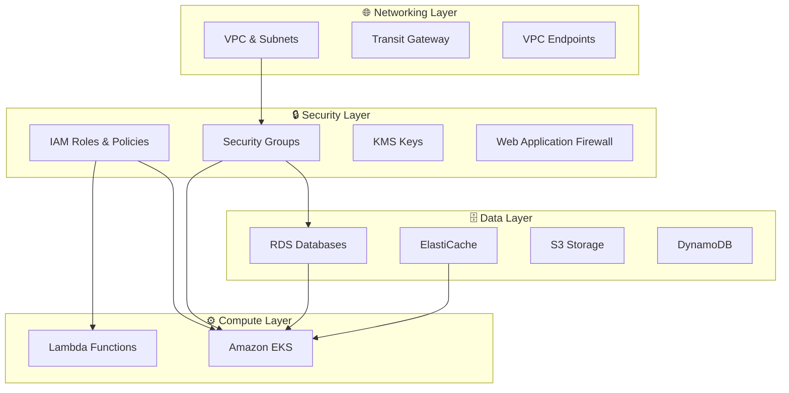

# Terraform Infrastructure as Code - AWS Multi-Layer Architecture

This repository contains a comprehensive Terraform infrastructure setup following AWS best practices, designed for multi-environment deployments across different layers.

## 🏗️ Architecture Overview

The infrastructure is organized into **4 distinct layers**, each with **4 environments** (dev, qa, uat, prod):

```
# Terraform Infrastructure

## 🚀 Overview

This repository provides a comprehensive, enterprise-grade **Multi-Layer Terraform Infrastructure** designed for AWS cloud deployments. The architecture follows Infrastructure as Code (IaC) best practices with a modular, scalable, and maintainable approach.

### 🎯 **Key Features**

- **🏗️ Layered Architecture**: 4-tier structure (Networking, Security, Data, Compute)
- **🌍 Multi-Environment**: Support for dev, qa, uat, and production environments
- **⚡ Latest Technology Stack**: Terraform >= 1.6.0, AWS Provider ~> 5.70
- **🐳 Container Orchestration**: Full EKS implementation with marketplace add-ons
- **💰 Cost Optimization**: SPOT instances, right-sizing, and resource optimization
- **🔒 Security First**: IAM least privilege, encryption at rest/in transit
- **📈 Auto Scaling**: Horizontal and vertical scaling capabilities
- **📚 Comprehensive Documentation**: Detailed README for each component

## 🏛️ Architecture Overview

### **Infrastructure Layers**



### **Technology Stack**

| Component | Version | Purpose |
|-----------|---------|---------|
| **Terraform** | >= 1.6.0 | Infrastructure as Code |
| **AWS Provider** | ~> 5.70 | AWS Resource Management |
| **Kubernetes** | 1.30 | Container Orchestration |
| **EKS Add-ons** | Latest | Marketplace Components |

## 🗂️ Repository Structure

```
terraform-infra/
├── 📋 README.md                    # This documentation
├── ⚙️ Makefile                     # Automation commands
├── 🔧 terraform-manager.ps1        # PowerShell deployment script
├── 🌍 global/                      # Account-wide shared resources
│   └── 📖 README.md               # Global resources documentation
├── 🏗️ layers/                      # Infrastructure layers
│   ├── 🌐 networking/             # VPC, Subnets, Transit Gateway
│   │   ├── 📖 README.md           # Networking documentation
│   │   ├── 🔧 main.tf
│   │   └── 📁 environments/
│   ├── 🔒 security/               # IAM, Security Groups, KMS
│   │   ├── 📖 README.md           # Security documentation  
│   │   ├── 🔧 main.tf
│   │   └── 📁 environments/
│   ├── 🗄️ data/                   # RDS, ElastiCache, S3, DynamoDB
│   │   ├── 📖 README.md           # Data services documentation
│   │   ├── 🔧 main.tf
│   │   └── 📁 environments/
│   └── ⚙️ compute/                # EKS, Lambda
│       ├── 📖 README.md           # Compute services documentation
│       ├── 🔧 main.tf
│       └── 📁 environments/
└── 🧩 modules/                    # Reusable Terraform modules
    ├── 🐳 eks/                    # Amazon EKS module (NEW!)
    ├── 🌐 api-gateway/            # API Gateway REST API module (NEW!)
    ├── ⚡ lambda/                 # AWS Lambda module

    ├── 🗄️ rds/                    # RDS Database module
    └── ... (15+ additional modules)
```

## ✨ Recent Updates

### 🆕 **What's New** 
- **🐳 EKS Module**: Complete Kubernetes cluster implementation with best practices
- **🌐 API Gateway Module**: Enterprise-grade REST API with authentication, throttling, and monitoring
- **📦 Marketplace Add-ons**: AWS Load Balancer Controller, Cluster Autoscaler, Metrics Server  
- **⬆️ Version Updates**: All components updated to latest stable versions
- **📚 Documentation**: Comprehensive README files for all layers and components
- **💰 Cost Optimization**: SPOT instances, right-sizing recommendations

### 🔧 **Technical Improvements**
- Terraform upgraded from 1.13.0 to **>= 1.6.0** (latest stable LTS)
- AWS Provider updated to **~> 5.70** (October 2024)
- EKS cluster version updated to **1.30** with latest add-ons
- Enhanced security configurations and best practices
- Improved monitoring and observability features

## 🚀 Quick Start

### **Prerequisites**
- AWS CLI configured with appropriate permissions
- Terraform >= 1.6.0 installed
- PowerShell (for Windows users) or Bash (for Linux/Mac users)

### **1. Clone Repository**
```bash
git clone <repository-url>
cd terraform-infra
```

### **2. Deploy Infrastructure Layers**
```bash
# Option 1: Use PowerShell script (Recommended)
./terraform-manager.ps1 -Layer networking -Environment dev -Action plan
./terraform-manager.ps1 -Layer networking -Environment dev -Action apply

# Option 2: Manual deployment
cd layers/networking/environments/dev
terraform init -backend-config=backend.conf
terraform plan -var-file=terraform.auto.tfvars
terraform apply -var-file=terraform.auto.tfvars
```

### **3. Layer Deployment Order**
```bash
# Deploy in this specific order due to dependencies:
1. 🌐 networking    # VPC, Subnets, Gateways
2. 🔒 security      # IAM Roles, Security Groups  
3. 🗄️ data          # Databases, Storage
4. ⚙️ compute       # EKS, Lambda
```

### **4. EKS Post-Deployment Setup**
```bash
# Configure kubectl access
aws eks update-kubeconfig --region us-east-1 --name myproject-dev

# Verify cluster
kubectl get nodes
kubectl get pods --all-namespaces

# View marketplace add-ons
kubectl get pods -n kube-system
```

## 🏗️ Layer Documentation

### **📖 Comprehensive Guides**

| Layer | Documentation | Key Components |
|-------|---------------|----------------|
| **🌍 Global** | [global/README.md](global/README.md) | Shared resources, account-wide configurations |
| **🌐 Networking** | [layers/networking/README.md](layers/networking/README.md) | VPC, Subnets, Transit Gateway, VPC Endpoints |
| **🔒 Security** | [layers/security/README.md](layers/security/README.md) | IAM Roles, Security Groups, KMS, WAF |
| **🗄️ Data** | [layers/data/README.md](layers/data/README.md) | RDS, ElastiCache, S3, DynamoDB |
| **⚙️ Compute** | [layers/compute/README.md](layers/compute/README.md) | EKS, Lambda |

### **🧩 Module Documentation**

Each module includes detailed documentation:
- `main.tf` - Resource definitions
- `variables.tf` - Input parameters with descriptions
- `outputs.tf` - Export values for other modules
- Examples and usage patterns

## 🐳 EKS Features

### **🎯 Production-Ready Kubernetes**

#### **Core Features**
- **📦 Managed Control Plane**: AWS-managed Kubernetes API server
- **🔄 Node Groups**: Multiple instance types with auto-scaling
- **☁️ Fargate Support**: Serverless container execution
- **🔐 Security**: IAM integration, encryption, network policies
- **📊 Observability**: CloudWatch integration, container insights

#### **Marketplace Add-ons**
- **🌐 AWS Load Balancer Controller** v1.8.1 - ALB/NLB Ingress
- **📈 Cluster Autoscaler** v9.37.0 - Automatic node scaling  
- **📊 Metrics Server** v3.12.1 - Resource utilization metrics

#### **Cost Optimization**
- **💰 SPOT Instances**: Up to 90% cost reduction for non-critical workloads
- **📏 Right Sizing**: Automated recommendations and scaling
- **⚡ Fargate**: Pay-per-pod serverless model
- **🔄 Auto Scaling**: Scale to zero during idle periods

### **🚀 EKS Quick Deploy Example**

```hcl
# Enable EKS with marketplace add-ons
enable_eks = true
eks_cluster_version = "1.30"

# Cost-optimized node groups
eks_node_groups = {
  general = {
    instance_types = ["t3.medium", "t3.large"]
    capacity_type  = "SPOT"      # 90% cost savings
    desired_size   = 2
    max_size      = 10
    min_size      = 1
  }
}

# Enable marketplace add-ons
enable_aws_load_balancer_controller = true
enable_cluster_autoscaler          = true  
enable_metrics_server              = true
```

## 💰 Cost Optimization

### **🎯 Multi-Level Cost Management**

#### **Infrastructure Level**
- **SPOT Instances**: 70-90% cost reduction for fault-tolerant workloads
- **Reserved Instances**: 30-50% savings for predictable workloads  
- **Right Sizing**: Continuous optimization recommendations
- **Resource Scheduling**: Auto-scaling and scheduled shutdown

#### **Service Level**
- **EKS**: Fargate for variable workloads, SPOT for batch processing
- **Lambda**: ARM processors, optimal memory allocation
- **RDS**: Aurora Serverless for variable database workloads
- **S3**: Intelligent tiering and lifecycle policies

#### **Environment Level**
- **Development**: Single AZ, smaller instances, SPOT usage
- **QA/UAT**: Scheduled on/off, shared resources
- **Production**: Reserved instances, multi-AZ for critical services

## 🔒 Security Features

### **🛡️ Multi-Layer Security**

#### **Network Security**
- **Private Subnets**: Compute resources isolated from internet
- **Security Groups**: Least-privilege network access
- **NACLs**: Additional network-level protection  
- **VPC Endpoints**: Private AWS service access

#### **Identity & Access**
- **IAM Least Privilege**: Minimal required permissions
- **Service Roles**: Dedicated roles per service
- **Cross-Account Access**: Secure multi-account patterns
- **MFA Requirements**: Multi-factor authentication enforcement

#### **Data Protection**
- **Encryption at Rest**: All storage encrypted with KMS
- **Encryption in Transit**: TLS 1.2+ for all communications
- **Key Management**: Customer-managed KMS keys
- **Secrets Management**: AWS Secrets Manager integration

## 📊 Monitoring & Observability

### **📈 Comprehensive Monitoring**

#### **Infrastructure Monitoring**
- **CloudWatch Metrics**: CPU, memory, network, disk utilization
- **CloudWatch Logs**: Centralized log aggregation and analysis
- **AWS Config**: Resource configuration compliance
- **CloudTrail**: API call auditing and compliance

#### **Application Monitoring**
- **EKS**: Container insights, Prometheus metrics
- **Lambda**: Execution metrics, error rates, cold starts
- **RDS**: Database performance insights
- **Custom Metrics**: Application-specific monitoring

#### **Alerting & Notifications**
- **CloudWatch Alarms**: Threshold-based alerting
- **SNS Integration**: Multi-channel notifications
- **Auto-Remediation**: Lambda-based automatic responses
- **Escalation Policies**: Tiered alert management

## 🚀 Automation Features

### **⚙️ Infrastructure Automation**

#### **Deployment Automation**
- **terraform-manager.ps1**: PowerShell deployment orchestration
- **Makefile**: Cross-platform automation commands
- **GitHub Actions**: CI/CD pipeline integration (optional)
- **Validation**: Automated testing and validation

#### **Operational Automation**
- **Auto Scaling**: CPU/memory-based scaling
- **Patch Management**: Automated OS and security updates
- **Backup Automation**: Scheduled database and volume backups
- **Cost Monitoring**: Automated budget alerts and recommendations

## 🌍 Environment Management

### **📁 Environment Structure**

Each layer supports multiple environments with isolated configurations:

```
environments/
├── dev/                    # Development environment
│   ├── backend.conf       # S3 backend configuration  
│   └── terraform.auto.tfvars  # Environment-specific variables
├── qa/                     # Quality assurance
├── uat/                    # User acceptance testing
└── prod/                   # Production environment
```

### **🔄 Environment Promotion**

```bash
# Promote configuration from dev → qa → uat → prod
cp environments/dev/terraform.auto.tfvars environments/qa/
# Review and modify qa-specific settings
terraform plan -var-file=environments/qa/terraform.auto.tfvars
```

## 🛠️ Development Workflow

### **👥 Team Collaboration**

#### **Branch Strategy** (Recommended)
```bash
main              # Production deployments
├── develop       # Integration branch  
├── feature/*     # Feature development
└── hotfix/*      # Emergency fixes
```

#### **Code Review Process**
1. **Feature Branch**: Develop in isolated feature branches
2. **Pull Request**: Submit for peer review
3. **Validation**: Automated testing and linting
4. **Approval**: Required approvals before merge
5. **Deployment**: Automated deployment pipeline

#### **Testing Strategy**
- **Unit Tests**: Terraform validate and plan
- **Integration Tests**: Multi-layer deployment testing
- **Security Scans**: Automated security scanning
- **Performance Tests**: Load testing for critical components

## 📚 Additional Resources

### **🔗 External Documentation**
- [Terraform Best Practices](https://www.terraform.io/docs/cloud/guides/recommended-practices/index.html)
- [AWS Well-Architected Framework](https://aws.amazon.com/architecture/well-architected/)
- [EKS Best Practices Guide](https://aws.github.io/aws-eks-best-practices/)
- [AWS Security Best Practices](https://aws.amazon.com/architecture/security-identity-compliance/)

### **🆘 Support & Troubleshooting**
- Review layer-specific README files for detailed troubleshooting
- Check CloudWatch logs for deployment and runtime issues
- Use AWS Config for compliance and configuration validation
- Leverage AWS Support for complex technical issues

---

> 🏗️ **Infrastructure Excellence**: This repository represents enterprise-grade infrastructure patterns with security, scalability, and cost optimization built-in from day one. Happy building! 🚀
```
├── layers/
│   ├── networking/     # VPC, subnets, gateways, networking components
│   ├── security/       # IAM, KMS, security groups, WAF
│   ├── compute/        # ECS, Lambda
│   └── data/          # RDS, ElastiCache, DynamoDB, S3
├── modules/           # Reusable Terraform modules
│   └── vpc/          # VPC module with best practices
├── global/           # Global resources (if any)
├── Makefile          # Automation for Unix/Linux/macOS
└── terraform-manager.ps1  # PowerShell script for Windows
```

## 🚀 Quick Start

### Prerequisites

1. **AWS CLI** - [Installation Guide](https://docs.aws.amazon.com/cli/latest/userguide/getting-started-install.html)
2. **Terraform** >= 1.5.0 - [Installation Guide](https://learn.hashicorp.com/tutorials/terraform/install-cli)
3. **AWS Credentials** configured (`aws configure`)

### Initial Setup

1. **Clone and configure the project:**
   ```bash
   git clone <your-repo>
   cd terraform-infra
   ```

2. **Update project configuration:**
   
   Edit the following files to match your project:
   - `Makefile`: Update `PROJECT_NAME` variable
   - `terraform-manager.ps1`: Update `$ProjectName` variable
   - Update `backend.conf` files to replace `PROJECT_NAME` with your actual project name

3. **Bootstrap AWS infrastructure (creates S3 bucket and DynamoDB table for state management):**
   
   **Using Makefile (Linux/macOS):**
   ```bash
   make bootstrap ENV=dev
   make bootstrap ENV=qa
   make bootstrap ENV=uat
   make bootstrap ENV=prod
   ```
   
   **Using PowerShell (Windows):**
   ```powershell
   .\terraform-manager.ps1 -Action bootstrap -Environment dev
   .\terraform-manager.ps1 -Action bootstrap -Environment qa
   .\terraform-manager.ps1 -Action bootstrap -Environment uat
   .\terraform-manager.ps1 -Action bootstrap -Environment prod
   ```

### Deployment

Deploy layers in the following order (dependencies matter):

1. **Networking Layer** (VPC, subnets)
2. **Security Layer** (IAM, KMS, Security Groups)
3. **Compute Layer** (EKS, Lambda, ECS)
4. **Data Layer** (RDS, ElastiCache, DynamoDB)

**Example deployment for dev environment:**

```bash
# Using Makefile
make init ENV=dev LAYER=networking
make plan ENV=dev LAYER=networking
make apply ENV=dev LAYER=networking

make init ENV=dev LAYER=security
make plan ENV=dev LAYER=security
make apply ENV=dev LAYER=security

# Continue with compute and data layers...
```

**Or deploy all layers at once:**
```bash
make deploy-all ENV=dev
```

## 📁 Layer Details

### 🌐 Networking Layer
- **VPC** with configurable CIDR
- **Public/Private/Database subnets** across multiple AZs
- **Internet Gateway** and **NAT Gateways**
- **Route tables** and associations
- **VPC Endpoints** (optional)
- **Transit Gateway** (optional, for multi-VPC connectivity)

### 🔒 Security Layer
- **IAM roles and policies** for applications and services
- **KMS keys** for encryption (RDS, S3, general purpose)
- **Security Groups** with configurable rules
- **AWS WAF** (optional)
- **AWS Secrets Manager** integration


### 💻 Compute Layer

- **ECS Cluster** (optional)
- **Lambda Functions** (optional)
- Health checks and monitoring integration

### 📊 Data Layer
- **RDS** with Multi-AZ support for production
- **ElastiCache Redis** for caching
- **DynamoDB tables** with encryption
- **S3 buckets** with versioning and encryption
- Automated backups and snapshots

## 🛠️ Usage Examples

### Initialize and Plan
```bash
# Linux/macOS
make init ENV=dev LAYER=networking
make plan ENV=dev LAYER=networking

# Windows
.\terraform-manager.ps1 -Action init -Environment dev -Layer networking
.\terraform-manager.ps1 -Action plan -Environment dev -Layer networking
```

### Apply Changes
```bash
# Linux/macOS
make apply ENV=dev LAYER=networking

# Windows
.\terraform-manager.ps1 -Action apply -Environment dev -Layer networking
```

### View Outputs
```bash
# Linux/macOS
make output ENV=dev LAYER=networking

# Windows
.\terraform-manager.ps1 -Action output -Environment dev -Layer networking
```

### Destroy Resources
```bash
# Linux/macOS
make destroy ENV=dev LAYER=networking

# Windows
.\terraform-manager.ps1 -Action destroy -Environment dev -Layer networking
```

## 🎯 Environment-Specific Configuration

Each environment has its own configuration in `layers/{layer}/environments/{env}/terraform.auto.tfvars`:

- **Dev**: Minimal resources for development
- **QA**: Testing environment with moderate resources
- **UAT**: Production-like environment for user acceptance testing
- **Prod**: Full production configuration with high availability

## 🔐 State Management

- **Remote State**: Stored in S3 with versioning enabled
- **State Locking**: DynamoDB table prevents concurrent modifications
- **Encryption**: State files are encrypted at rest
- **Separation**: Each layer and environment has its own state file

## 📊 Addressing Plan

The infrastructure uses a carefully planned IP addressing scheme:

| Environment | VPC CIDR      | Public Subnets | Private Subnets | Database Subnets |
|-------------|---------------|----------------|-----------------|------------------|
| Dev         | 10.10.0.0/16  | 10.10.0.0/24   | 10.10.128.0/24  | 10.10.240.0/28   |
| QA          | 10.20.0.0/16  | 10.20.0.0/24   | 10.20.128.0/24  | 10.20.240.0/28   |
| UAT         | 10.30.0.0/16  | 10.30.0.0/24   | 10.30.128.0/24  | 10.30.240.0/28   |
| Prod        | 10.40.0.0/16  | 10.40.0.0/24   | 10.40.192.0/24  | 10.40.240.16/28  |

## 🎨 Customization

### Adding New Environments
1. Create new directories in each layer: `layers/{layer}/environments/{new_env}/`
2. Add `backend.conf` and `terraform.auto.tfvars` files
3. Update validation rules in variables.tf files
4. Update automation scripts

### Adding New Resources
1. Create new modules in the `modules/` directory
2. Reference modules in the appropriate layer's `main.tf`
3. Add variables to `variables.tf`
4. Add outputs to `outputs.tf`

### Modifying Existing Resources
1. Update the relevant module or layer configuration
2. Run `terraform plan` to review changes
3. Apply changes using the automation scripts

## 🧪 Validation and Testing

```bash
# Validate Terraform syntax
make validate ENV=dev LAYER=networking

# Format Terraform files
make format

# Lint Terraform files (requires tflint)
make lint

# Clean up temporary files
make clean
```

## 🔍 Troubleshooting

### Common Issues

1. **State Lock Errors**: Use `terraform force-unlock <LOCK_ID>` if needed
2. **Resource Conflicts**: Check if resources already exist in AWS
3. **Permission Errors**: Ensure AWS credentials have sufficient permissions
4. **Backend Errors**: Verify S3 bucket and DynamoDB table exist

### Debug Mode
Add `-var debug=true` to enable additional logging and outputs.

## 📚 Best Practices Implemented

- ✅ **Layered Architecture**: Separation of concerns across networking, security, compute, and data
- ✅ **Environment Separation**: Isolated state and resources per environment  
- ✅ **Remote State**: S3 backend with DynamoDB locking
- ✅ **Encryption**: All data encrypted at rest and in transit
- ✅ **Tagging Strategy**: Consistent tagging for cost tracking and management
- ✅ **High Availability**: Multi-AZ deployments for production
- ✅ **Security**: Least privilege IAM, security groups, and network segmentation
- ✅ **Automation**: Scripts for common operations
- ✅ **Documentation**: Comprehensive documentation and examples

## 🤝 Contributing

1. Fork the repository
2. Create a feature branch
3. Make changes following the existing patterns
4. Test changes in a dev environment
5. Submit a pull request

## 📄 License

This project is licensed under the MIT License - see the LICENSE file for details.

## 📞 Support

For questions or issues:
1. Check this README and documentation
2. Review Terraform and AWS documentation
3. Open an issue in the repository
4. Contact the DevOps team

---

**Note**: Always test changes in development environments before applying to production!